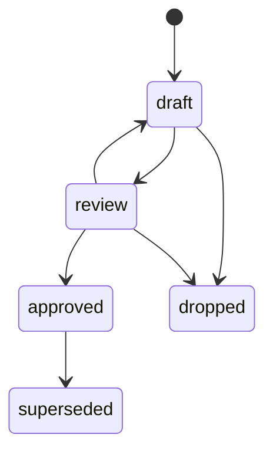
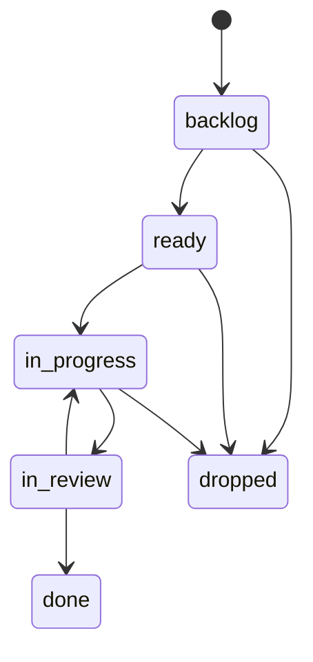

# Контракт файлов проекта · `docdd.workspace/1`

Формат, ради которого написано приложение. Здесь он изложен целиком: репозиторий
инструмента обязан быть самодостаточным, а не отсылать к проекту, который
случайно оказался первым.

Проверяющие схемы лежат рядом: [schemas/](schemas/).

## Корень проекта

Пользователь указывает путь к проекту. Приложение ищет
`docs/development/project.yaml`:

```yaml
contract: docdd.workspace/1
project:
  id: fishforecast
  name: FishForecast
  description: Офлайн-первый помощник рыболова
paths:
  requirements: requirements
  design: design
  decisions: decisions
  contracts: contracts
  tasks: tasks
  phases: phases
  tests: tests
  diagrams: diagrams
sources:
  code: [app/src]
  docs: [app/docs]
roles:
  - id: architect
    name: Архитектор
policy:
  require_approved_docs_before_dev: true
  require_verification_before_done: true
  stale_in_progress_days: 14
```

Пути — относительно `docs/development`. Имена папок не зашиваются в код:
приложение читает манифест. Отсутствующий ключ в `paths` означает, что такого
раздела в проекте нет, а не ошибку.

Поколение контракта проверяется до всего остального. `docdd.workspace/2` —
отказ с понятной причиной, а не попытка прочитать половину.

Схема: [schemas/project.schema.json](schemas/project.schema.json).

## Запись

Каждая запись — markdown-файл с YAML front matter:

```markdown
---
id: T-0007
type: task
title: Вынести веса модели клёва в документ знаний
status: ready
owner: dev
created: 2026-08-30
updated: 2026-08-30
phase: P-0007
links:
  implements: [R-0004]
  documents: [D-0003]
  verified_by: [V-0004]
tags: [client, bite-model]
---

# Вынести веса модели клёва в документ знаний

Текст: зачем, что делаем, чего не делаем, как понять, что готово.

## Журнал

- 2026-08-30 · в разработку · architect
```

Правила, которые приложение обязано соблюдать при записи:

1. Front matter — первый блок файла между двумя строками `---`.
2. Тело файла принадлежит человеку. Приложение меняет только front matter и
   добавляет строки в раздел «Журнал».
3. Порядок ключей front matter сохраняется, незнакомые поля остаются на месте.
4. Перевод строки в файле остаётся таким, каким был: смена CRLF на LF даёт
   бессмысленный дифф на весь файл.
5. Кодировка UTF-8.
6. **Даты** (`created`, `updated`) пишутся без кавычек: `2026-08-30`. И `js-yaml`,
   и питоновский `yaml` разбирают такой скаляр в объект даты, а не в строку,
   поэтому перед проверкой по схеме его надо привести к строке ISO-8601. Мелочь,
   которая ломает валидатор на первом же файле, если про неё не знать.

Схема: [schemas/frontmatter.schema.json](schemas/frontmatter.schema.json).

### Сторож тела документа

Правила выше — обещание, и обещание надо проверять машиной, а не аккуратностью
того, кто писал код. Перед сохранением приложение перечитывает то, что
собирается записать, и убеждается:

1. Тело документа совпадает с исходным **байт в байт** после изъятия ровно одной
   вставленной строки в разделе «Журнал». Не «изменилось не сильно» — совпадает.
   Мягкая мера здесь не нужна: приложение не имеет права переписать ни абзаца.
2. Перевод строки тот же, что был в файле.
3. Незнакомые поля front matter на месте, порядок ключей не переставлен.
4. Изменились только те поля, которые действию разрешено менять:
   `status` — сменой статуса, `owner`, `phase`, `tags`, `links` — правкой полей.
   `id`, `type` и `created` не меняются никогда: на идентификатор уже кто-то
   ссылается, а дата создания — факт, а не мнение.

Не сошлось — запись не происходит, и человек видит, что именно разошлось.
Отказ записать лучше, чем испорченный документ: документ у человека один, а
попыток записать — сколько угодно.

## Ссылки на документы

Ссылка одного документа на другой — обычная markdown-ссылка на файл `.md`
внутри `docs/development`:

```markdown
[Устройство клиента](../design/D-0001-architecture.md)
```

Путь нормализуется относительно файла записи. Если результат остаётся внутри
`docs/development`, файл обязан существовать — иначе `doc_link_missing`. Якорь
`#раздел` отбрасывается: заголовки переписывают чаще, чем файлы переносят.

Связи между записями этим не задаются: для них есть `links` и идентификаторы.
Ссылка в тексте — удобство для читателя, и проверяется она как удобство —
предупреждением, а не ошибкой.

## Типы записей

| Тип | Префикс | Что это | Папка |
|---|---|---|---|
| `requirement` | `R-` | Чего система обязана достичь | `requirements/` |
| `design` | `D-` | Проектный документ | `design/` |
| `decision` | `A-` | Решение с причинами и отвергнутым | `decisions/` |
| `contract` | `C-` | Контракт обмена: OpenAPI, формат файла | `contracts/` |
| `task` | `T-` | Единица работы | `tasks/` |
| `phase` | `P-` | Группа задач | `phases/` |
| `verification` | `V-` | Способ проверки | `tests/` |
| `map` | `M-` | Изменение устройства проекта в трёх структурах | `maps/` |

Идентификатор: префикс, дефис, четыре цифры. Номера не переиспользуются —
удалённая запись оставляет дыру, и ссылка на неё не должна вдруг указать на
другое.

Имя файла: `<id>-<слаг>.md`. Слаг для человека, идентификатор для машины;
переименование слага ничего не ломает.

Слаг приложение составляет латиницей, транслитерируя заголовок: `Вынести веса
модели клёва` → `vynesti-vesa-modeli-kleva`. Кириллица в имени файла работает не
везде одинаково — в URL, в чужих инструментах, в архивах, — а имя файла ничего
не значит для процесса. Слаг, написанный человеком, приложение не трогает.

## Связи

Задаются только в `links`, только идентификаторами и только в одну сторону.
Обратные строит приложение.

| Связь | От | К | Смысл |
|---|---|---|---|
| `implements` | task | requirement | Задача выполняет требование |
| `refines` | design, task | design, requirement | Уточняет, не отменяя |
| `decided_by` | design, task | decision | Опирается на решение |
| `supersedes` | любой | тот же тип | Заменяет прежнюю запись |
| `depends_on` | task | task | Не начинать раньше той |
| `verified_by` | requirement, task | verification | Чем проверяется |
| `verifies` | verification | requirement, task | Что проверяет |
| `documents` | task | design, contract | Какой документ правится задачей |
| `covers` | phase | task | Состав фазы |
| `affects` | task | map | Какую карту меняет задача |

Ссылка на несуществующий идентификатор — ошибка. Цикл в `depends_on` — ошибка.

## Что за изменение

У задачи есть поле `change` со значениями `feature`, `fix`, `rename`, `format`.

`feature` требует подтверждённой карты изменения: задача не уйдёт в `ready`, пока
она не `approved` ([07-maps.md](07-maps.md)). Остальные три — исключения из
правила, те же, что и у документов: починка дефекта, переименование внутреннего,
форматирование.

Исключение записано в самой задаче и видно в дифф и в журнале. Правило, которое
нельзя обойти, обходят мимо инструмента; правило, обход которого записан,
остаётся правилом.

## Ссылки на код

Связи между записями — только идентификаторы. Ссылка на исходники — обычная
markdown-ссылка в теле документа на относительный путь:

```markdown
[Разбор front matter](../../../server/lib/parse.ts#L12-L40)
```

Путь нормализуется относительно файла записи. Если результат лежит внутри
одного из каталогов `sources.code`, файл обязан существовать — иначе
`code_link_missing`. Якорь вида `#L12` или `#L12-L40` отбрасывается: строки
съезжают, файл остаётся.

Ссылки наружу `sources.code`, а также на `.md` и `.mmd` внутри
`docs/development`, кодом не считаются и не проверяются: инструмент не берётся
судить о чужих путях.

## Статусы

Документы (`requirement`, `design`, `contract`) и решения:



У решений вместо `dropped` — `rejected`: смысл тот же, слово принятое в ADR.

Задачи:



| Переход | Условие |
|---|---|
| `backlog → ready` | Все записи из `documents` и `refines` в статусе `approved`; есть хотя бы одна `implements` |
| `ready → in_progress` | Ручное действие человека — это и есть «запустить в разработку» |
| `in_review → done` | Все `verified_by` имеют `passed` в последнем отчёте, если включена политика |

Фазы: `planned → active → done`, считаются приложением по задачам из `covers`,
вручную не ставятся.

У проверок статуса нет — есть последний результат из отчётов: `passed`, `failed`
или `unknown`. Это факт, его нельзя поставить.

## Запуск в разработку

Действие меняет статус `ready → in_progress`, обновляет `updated` и добавляет
строку в журнал:

```markdown
## Журнал

- 2026-08-30 · в разработку · architect
```

Больше ничего не происходит: ни веток, ни коммитов, ни запуска агентов. Если
задача не в `ready`, переход запрещён, и причина называется прямо — какой
документ не подтверждён или какого требования не хватает.

## Диаграммы

Два способа, оба обязательны к поддержке:

- блок ` ```mermaid ` внутри документа;
- отдельный файл `diagrams/<имя>.mmd`, вставленный ссылкой вида
  ``.

Ошибка разбора диаграммы — предупреждение у документа, а не отказ его показать.

## Отчёты прогонов

`tests/reports/<дата>-<runner>.json`:

```json
{
  "contract": "docdd.workspace/1",
  "runner": "gradle",
  "started_at": "2026-08-30T10:00:00Z",
  "total": 161,
  "failed": 0,
  "verifications": { "V-0004": "passed", "V-0007": "failed" }
}
```

Схема: [schemas/report.schema.json](schemas/report.schema.json). Отчёты кладёт
сборка проекта или человек; приложение их только читает.

## Совместимость

- Незнакомые поля front matter сохраняются при записи и игнорируются при чтении.
- Незнакомый тип записи — предупреждение, файл показывается как есть.
- Смена поколения контракта требует явной миграции.
