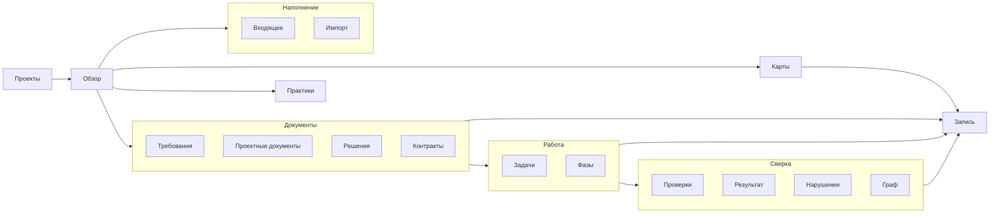

# Экраны

Интерфейс подчинён трём вопросам из [00-overview.md](00-overview.md): в каком
состоянии работа, что нарушает процесс, что можно брать сейчас. Всё, что не
отвечает ни на один из них, на экран не попадает.

## Навигация

Шапка устроена по той же цепочке, по которой живёт проект: **документ →
работа → сверка**. Группа — шаг цепочки, пункт — экран, и у каждого типа
записи из контракта ([02-workspace-contract.md](02-workspace-contract.md))
есть свой список, до которого можно дойти из шапки. Запись, до которой
добираются только по чужой ссылке или узлом графа, всё равно что спрятана:
подтвердить её забудут.

- **Обзор** — прямая кнопка, первый экран проекта: что делать сейчас.
- **Документы** — Требования, Проектные документы, Решения, Контракты. То,
  что человек подтверждает **до** кода: у всех четырёх одна схема статусов
  (`draft → review → approved`), и задача не уйдёт в работу, пока то, на что
  она опирается, не подтверждено. Требования — первыми: с них работа
  начинается, остальные три объясняют, как их выполнить.
- **Работа** — Задачи, Фазы. Сам код: единица работы и этап, сложенный из
  таких единиц.
- **Сверка** — Проверки, Результат, Нарушения, Граф. Всё, что отвечает на
  «сходится ли»: чем требование проверяется, что показал прогон, где процесс
  разошёлся с правилами, что ни с чем не связано. Нарушения и Граф стоят
  рядом: это два взгляда на одно и то же состояние — список и картинка.
- **Карты** — прямая кнопка: устройство кода, сложенное из подтверждённых
  карт, и сами записи карт (раздел «Карты»).
- **Наполнение** — Входящее, Импорт. Как в `docs/development` попадает
  новое: разбор сырых заметок и перенос уже существующей документации. Ни то
  ни другое не про устройство проекта — про его рост.
- **Практики** — прямая кнопка: чужие `decision`/`design` для чтения.

Прямая кнопка — там, где назначение одно: выпадающий список ради одного
пункта ничего не добавляет. Порядок слева направо — сама цепочка: Документы
→ Работа → Сверка. Карты, Наполнение и Практики — после неё: ни одна из них
не шаг процесса, а опора ему — устройство, приток нового, чужой опыт.

Справа — то, что к проекту не относится и доступно всегда, даже когда проект
не выбран: «Как пользоваться», «Все проекты» и переключатель темы (раздел
«Тема»).

Где список каждого типа:

| Тип | Где |
|---|---|
| `requirement` | Документы → Требования |
| `design` | Документы → Проектные документы |
| `decision` | Документы → Решения |
| `contract` | Документы → Контракты |
| `task` | Работа → Задачи |
| `phase` | Работа → Фазы |
| `verification` | Сверка → Проверки |
| `map` | Карты — записи над картиной |

Незнакомый тип своего списка не получает: он виден предупреждением в
Нарушениях и колонкой «Прочее» в Графе. Контракт обещает показать такой файл,
а не завести под него экран.

До этого устройства «Работа» держала всё сразу — требования, задачи,
проверки, прогоны, нарушения, граф, — а проектных документов, решений,
контрактов, фаз и записей карт в шапке не было вовсе: найти их можно было
только по ссылке из другой записи или узлом графа. Дыра была ровно там, где
она дороже всего: документы, без подтверждения которых задача не уходит в
работу, из шапки не находились.

**Практики — не в «Наполнении»**, хотя тоже смотрит наружу проекта. Входящее
и Импорт заводят записи в этом проекте; Практики ничего не заводит — только
показывает чужие `decision`/`design` для чтения
([11-shared-sources.md](11-shared-sources.md)). Разное действие — разное
место, не общая тема «внешнее».

**Граф — не то же самое, что Карты**, хотя оба рисуют узлы и рёбра. Граф —
про требования, задачи и решения: какая запись на какую ссылается, что
осталось ни с чем не связано. Карты — про устройство кода: модули, потоки
данных, пользовательские пути. Первое время Граф лежал в одной группе с
Картами по внешнему сходству картинки, а не по смыслу содержимого — это было
ошибкой навигации, а не описанием. Теперь Граф стоит в «Сверке», рядом с
Нарушениями, — по смыслу, а не по виду.

Рядом с названием пункта, где есть что считать, — число незакрытых:
неподтверждённых (`draft`, `review`) у Требований, Проектных документов,
Решений, Контрактов и Карт; открытых задач; незакрытых фаз; проверок без
пройденного прогона; суммы ошибок и предупреждений у Нарушений. У
«Результата» и «Графа» счётчика нет: одно — журнал прогонов, другое —
картинка, а не список элементов со своим статусом.

## Проекты

Список добавленных проектов: имя, путь, когда открывали, состояние последнего
разбора. Кнопка добавления просит путь к корню. Если формата там нет — экран
объясняет, что нужен `docs/development/project.yaml`, и предлагает создать.

## Обзор

Первый экран проекта. Сверху — счётчики задач по статусам и число нарушений
крупно: это то, ради чего инструмент открывают.

Ниже три колонки:

- **Можно брать** — задачи в `ready`, отсортированные по фазе.
- **В работе** — `in_progress` и `in_review`, с числом дней в этом состоянии;
  зависшие подсвечены.
- **Мешает** — ошибки процесса, по одной строке, с переходом к записи.

Кнопка «Перечитать» пересобирает индекс.

## Задачи

Список с фильтрами по статусу, фазе, исполнителю и тегам. У каждой строки видно,
что она выполняет (`implements`) и чем проверяется. Задача без требования
помечена — это и есть работа, которая никому не понадобилась.

## Запись

Одна карточка на любой тип. Сверху — заголовок, тип, статус и действия; ниже —
текст документа с диаграммами; сбоку — связи в обе стороны и журнал.

Действия зависят от типа и статуса:

| Тип | Действия |
|---|---|
| Документ, решение, контракт | Отдать на подтверждение, подтвердить, вернуть, заменить, отменить — и обратно в черновик из подтверждённого, заменённого или отменённого ([adr/0012-status-reopening.md](adr/0012-status-reopening.md)) |
| Задача | Пометить готовой к работе, запустить в разработку, отправить на проверку, закрыть, отменить — и на шаг назад из любого из этих статусов |
| Проверка | Ничего: результат приходит из отчётов |

Недоступное действие показано неактивным **с причиной рядом** — «документ D-0004
не подтверждён». Пустая серая кнопка без объяснения бесполезна: человек должен
понимать, что именно чинить.

**Текст документа редактируется прямо здесь** ([adr/0011-body-editing.md](adr/0011-body-editing.md)).
Кнопка «Сохранить» пишет тело файла и строку в журнал — «текст
отредактирован», с ролью и датой. Правится текст **до** раздела «Журнал»:
сам раздел неприкосновенен, как и остальные поля front matter, кроме
`updated`.

Запись в статусе `approved`, `done`, `superseded`, `rejected` или `dropped`
не редактируется: содержание подтверждено, и менять его в обход этого факта
нельзя — путь для нужной правки такой подтверждённой записи прежний —
`supersedes` у преемника. Кнопка неактивна и говорит, почему.

Файл снаружи не заперт: пока открыт редактор, кто-то может поправить его в
своём редакторе или руками. Сохранение это ловит — сравнивает текст, с
которого редактор начал правку, с содержимым файла на диске, и отказывает,
если они разошлись, а не переписывает поверх чужой правки.

Путь к файлу виден рядом всегда — большой кусок текста, таблицу или диаграмму
по-прежнему удобнее править во внешнем редакторе, открыв тот же файл напрямую.

## Требования

Таблица покрытия: требование, статус, задачи, проверки, последний результат.
Строка без проверки видна сразу — это главный дефект, который экран ищет.

## Документы

Проектные документы, решения и контракты — один экран с вкладками по типу:
Все, Проектные документы, Решения, Контракты. Пункт шапки открывает сразу
свою вкладку, и вкладка живёт в адресе (`?type=decision`): ссылка на
«Решения» ведёт на решения, а не на экран, где их ещё надо выбрать.

Один экран, а не три: вопрос к ним один — подтверждено ли то, на что
опирается работа, — и схема статусов одна. Три копии одной таблицы разошлись
бы на второй правке. У Требований экран свой, как и был: их вопрос другой —
покрытие проверками, — и таблица другая.

Таблица: документ, статус, кто на него опирается, когда изменён. «Кто
опирается» — обратные связи `documents`, `refines` и `decided_by`: задачи,
которые документ правят, и записи, которые его уточняют или стоят на
решении. Не опирается никто — так и написано, а не пустая клетка: документ,
который ничему не служит, — тот же висящий узел, что и в Графе.

Порядок — сперва то, что ждёт подтверждения (`review`), потом черновики,
потом подтверждённое, в конце — заменённое, отменённое и отклонённое.
Экран открывают, чтобы найти неподтверждённое, и оно наверху; внутри
статуса — по номеру.

Заменённый документ называет преемника ссылкой (обратная `supersedes`): от
устаревшего решения до действующего — один щелчок, а не поиск по номерам.

На вкладке типа — кнопка «Новая запись» этого типа. На «Все» её нет: тип
выбирается вкладкой, а не отдельным полем в форме.

## Проверки

Список записей типа `verification` — тот же приём, что у Задач и Требований:
таблица, а не карточки. Проверка, что проверяет (`verifies`), последний
результат и когда он получен. Строка без единого прогона видна сразу — как в
Требованиях, только здесь взгляд от проверки, а не от требования.

Экран не запускает проверки и не пишет отчёты — он их только читает
([adr про способ проверки](02-workspace-contract.md)). Прогнать проверку
и положить отчёт в `docs/development/tests/reports/` — дело человека или его
инструментов вне приложения.

## Результат

История прогонов: список отчётов из `docs/development/tests/reports/`, новые
сверху. Каждая строка — один прогон целиком: когда, кем (`runner`), сколько
проверок всего и сколько провалилось. Разворачивается в список: какая
проверка что показала — `passed`, `failed` или `skipped`.

Отличие от Проверок: та вкладка — про **проверку** («когда её в последний раз
гоняли и что вышло»), эта — про **прогон** («что вообще произошло в этом
запуске, по всем проверкам разом»). Один отчёт покрывает много проверок; одна
проверка встречается во многих отчётах — это две разные оси одного и того же
факта, и валидатор их не путает.

## Фазы

Список фаз: фаза, её состав, полоса готовности, что мешает закрыть.

Состав — задачи из `covers` фазы и задачи, у которых в поле `phase` стоит её
номер. Связь ставят с любой из двух сторон, и показывается она одним
множеством — как «что проверяет» у Проверок.

Статус считается сам по задачам состава и вручную не ставится
([02-workspace-contract.md](02-workspace-contract.md), «Статусы»). Статус из
файла фазы этот экран не показывает: поставленный руками, он мнение, а не
факт.

| Статус | Когда |
|---|---|
| `planned` | Ни одна задача состава не начата — или состава нет |
| `active` | Хотя бы одна задача в работе, на проверке или закрыта, но закрыты не все |
| `done` | Все задачи закрыты или отменены, и хотя бы одна — закрыта |

Полоса готовности — закрытые из всех, кроме отменённых: отменённая задача
работы не прибавляет и не убавляет. «Мешает закрыть» — незакрытые задачи
состава ссылками, со статусом каждой. Состава нет — экран так и говорит и
называет, чем его задать: `covers` у фазы или `phase` у задачи.

## Нарушения

Плоский список ошибок и предупреждений с кодом, записью и объяснением. Ошибки
сверху. Каждая строка ведёт к записи, а не к абстрактному «отчёту».

**У каждого нарушения свой флажок.** Отметили три — чинить будут ровно три, а
не всё, что попало под фильтр. Фильтры сужают список, флажки называют работу:
это разные вещи, и путать их нельзя.

Не отмечено ничего — кнопка неактивна и говорит почему. Чинить «всё сразу»
приложение не предлагает: у нарушений разная цена ошибки, и решать, за какое
браться, — работа человека, а не следствие того, какой фильтр остался включён.

Кнопка **«Исправить»** называет число: «Исправить: 3». Запрос уходит ровно про
отмеченное — и модель разбирает три нарушения внимательно, вместо того чтобы
бегло пройтись по двадцати. Запрос показывается целиком и копируется в буфер:
его можно отдать своему агенту, а можно спросить модель отсюда
([adr/0008-llm-through-claude-code.md](adr/0008-llm-through-claude-code.md)).

Отметить одно и починить одно — обычный, а не крайний случай: так виднее, что
изменилось и от чего.

### Починка

Модель отвечает **планом**: строка на нарушение — какой файл, какое поле, во
что. Не рассуждение, которое надо вычитывать, а список, который читается за
минуту.

Под планом — кнопка **«Принять ответ»**. Это подтверждение, и до него не
происходит ничего: ни ветки, ни правок. Нажали — модель чинит по этому плану в
отдельном рабочем дереве, а приложение показывает дифф и **не сливает его само**
([adr/0010-model-fixes-violations.md](adr/0010-model-fixes-violations.md)).

Дальше — те же три ответа, что и у задачи: принять и слить, вернуть на
доработку, отклонить. Тронула модель файл, которого не было в нарушениях, или
поставила записи `approved` — слияние отклоняется с причиной, и это работа
предохранителя, а не поломка.

Принятая починка оставляет след: в журнале каждой починенной записи появляется
строка — какое нарушение чинили и что стало. Пишет её приложение, из кода
нарушения, а не из пересказа модели.

Не подтверждать план — нормальный исход: план можно перечитать, сузить фильтр и
спросить заново, поправить руками или не чинить вовсе.

## Граф

Записи узлами, связи рёбрами, цвет по типу, форма по статусу. Нужен для одного:
увидеть, что на что опирается, и найти висящие в пустоте узлы.

До фазы 3 граф — это список связей в карточке записи. Рисовать его раньше, чем
станет ясно, какие вопросы к нему задают, — потратить время на украшение.

## Входящее

**«Записать наработку»** — заголовок и текст, кнопка «Сохранить заметку».
Никакого markdown и файловой системы: человек без навыков программирования
пишет обычным текстом, приложение само кладёт файл на склад
([10-inbox.md](10-inbox.md), «Что кладёт человек»). Форма видна всегда, не
только когда заметок ещё нет — записывать можно в любой момент.

Ниже — сырые заметки со склада, названного в манифесте (`sources.inbox`),
списком: заголовок и путь. Строка выключается щелчком; не выбрано ничего —
разбираются все. Заметка из формы ничем не отличается от заметки, положенной
файлом руками или моделью, — тот же список, тот же разбор.

**«Разобрать входящее»** отдаёт заметки модели и получает **список**
предлагаемых записей: тип, заголовок, тело, связи. У записи-карты вместо
тела (или вместе с ним) видны предложенные возможности — то, что попадёт в
функциональную карту; у записи с несколькими источниками под связями видно,
из каких заметок она собрана. Список правится тут же — лишнее выключается,
— а кнопка **«Завести записи»** создаёт их. Заводит приложение: номера,
front matter и имена файлов — его работа ([10-inbox.md](10-inbox.md)).

Всё заведённое — черновики, и это сказано рядом с кнопкой: разбор избавляет от
переписывания, а не от чтения.

Склад не назван в манифесте — экран говорит об этом и не предлагает ничего
разбирать: догадываться, где у проекта склад, приложение не станет.

Ниже, свёрнутым по умолчанию, — **«Разобранное»**: заметки, уже переехавшие в
`принятое`. Разбор — не разовое действие с исчезающим следом: список остаётся
доступным, и рядом с каждой заметкой видно, что из неё выросло — ссылки на
записи, чей журнал назвал её источником, либо прямое указание, что ни одна
запись явно не сослалась на эту заметку ([10-inbox.md](10-inbox.md), «След»).

## Заведение и импорт

Экран открывается двумя путями: из списка проектов, когда в папке нет манифеста,
и ссылкой из обзора, когда рядом с форматом лежит ещё не размеченная
документация.

**Пустой проект.** Форма спрашивает имя и идентификатор проекта; кнопка создаёт
манифест, папки разделов и первую запись. Больше ничего: наполнение — работа
человека.

**Импорт.** Таблица найденного: путь, заголовок, размер, предполагаемый тип и
почему он предположен. Тип в каждой строке правится списком, строка выключается
галочкой. Предположение — это подсказка, и она обязана выглядеть подсказкой, а
не решением.

Кнопка применения говорит, что произойдёт: сколько файлов переедет и куда. После
применения экран показывает, что перенесено и что пропущено — с причиной.

Текст документов не меняется: приложение добавляет front matter и переносит
файл. Это же написано на экране рядом с кнопкой — человек должен понимать, на
что соглашается.

## Новая запись

Кнопка на экранах требований, задач, проверок и документов (там — на вкладке
своего типа): тип записи задаёт экран. Форма спрашивает заголовок и
исполнителя, у задачи — ещё что за изменение и какое требование она
выполняет; идентификатор выдаёт сервер — следующий свободный. Номера не
переиспользуются, поэтому выбрать его вручную нельзя.

## Карты

Четыре структуры одного изменения — на экране записи карты: кодовая база,
потоки данных, пользовательские пути, функциональная карта. У первых трёх
каждое ребро показывает своё свидетельство, и видно, сошлось ли оно с файлом
— не сошлось, строка помечена, а не спрятана. У функциональной карты
свидетельства нет вовсе — она подтверждается человеком, как обычная запись
(docs/07-maps.md, «Функциональная карта»).

Общая карта проекта собирается из подтверждённых изменений и показывается
подвкладками — по одной на вид (`app/pages/projects/[id]/maps.vue`): модули и
связи, источники и потоки, экраны и переходы, возможности предметной области.

**Записи карт видны всегда**, а не только когда картина пуста. Над картиной
— ссылками: из каких карт она сложена, какие ждут подтверждения (`draft`,
`review`) и какие выведены из суммы (`superseded` и прочие закрытые); пустая
строка не показывается. Карта — такой же документ под подтверждение, как
проектный, и черновик от «Обновить карты» не должен находиться только по
номеру, мелькнувшему в ответе.

**Узел ведёт к коду.** Клик открывает карточку сбоку (не уводит с диаграммы —
картина остаётся под рукой). В ней: имя и слой; `summary` карты — что модуль
делает; `api` карты — список того, что из него импортируют, с сигнатурами;
и содержимое файла тем же способом, что и по ссылке из тела записи
(`GET /api/projects/[id]/file`, 512 КБ — предел тот же), с подсветкой
синтаксиса (Shiki, тема под светлый и тёмный интерфейс; язык — по расширению,
незнакомое показывается без подсветки). Кнопка в шапке разворачивает карточку
почти на весь экран — читать код в узкой колонке неудобно; кнопка у заголовка
«Файл» переносит длинные строки, чтобы не гонять горизонтальный скроллбар.

Обычно карточка живёт поверх всей страницы (портал в `<body>`) — так она
выше панелей диаграммы. Но на весь экран разворачивается **общий контейнер**
(`app/pages/projects/[id]/maps.vue`), и на это время карточка переезжает в
него: иначе Fullscreen API показывает только своё поддерево, и карточка,
живущая в портале рядом, из полноэкранного режима пропала бы
(`MapInspector.vue`).

Какой файл открывать: `path` у модуля кодовой базы, `file` у экрана, `where` у
источника данных с `kind: file`. Если `path` не задан, но сам `id` — это путь к
файлу (есть `/` и расширение), берётся он: путь написала модель, не приложение,
а сервер либо отдаст файл, либо честно ответит «нет такого». Догадки из
dotted-имени (`a.b.c` → `a/b/c.py`) не строятся — там приложение не знает, где
граница пакета. Ничего из этого нет — карточка показывает только `summary` и
`api`, если они есть, а без них — что модуль вообще есть и в каком слое.
У функциональной карты узел ведёт только к своему месту в дереве возможностей —
она про смысл, не про файл.

**Ребро ведёт к свидетельству** (кроме функциональной карты, где рёбер с
собственным смыслом нет вовсе): клик показывает путь, строку и фрагмент, из
которого сделан вывод (`docs/07-maps.md`, «Свидетельство»), и сошлось ли это с
файлом сейчас — тем же расчётом, что уже красит нарушение `map_evidence_stale`
в общем списке, просто рядом с самим ребром, а не в отдельном списке, который
нужно сопоставлять руками.

**Пусто — это тоже ответ, и он обязан назвать причину.** Карт нет вовсе — так и
сказано. А вот если карты есть, но все они черновики или помечены заменёнными,
экран говорит именно это, с числами и ссылкой на записи: «шесть карт помечены
заменёнными, и картина от этого пуста». Разница важная: в первом случае работу
не делали, во втором — сделали и вычли из суммы.

Карта — это **изменение**, а не снимок: картина складывается из суммы
подтверждённых карт. Пометить прежнюю заменённой стоит только тогда, когда новая
её и правда заменяет, ссылаясь через `supersedes`. Карты, дополняющие друг
друга, остаются подтверждёнными — иначе сумма схлопывается в ноль.

Две кнопки. **«Перечитать»** пересобирает картину из файлов: карту могли
подтвердить в соседнем окне. **«Обновить карты»** собирает запрос по описи —
какие файлы новые, какие изменились, какие исчезли — и отдаёт его модели. Ответ
ложится черновиком записи `map` и ждёт подтверждения.

Рядом с кнопкой — состояние описи: **сколько файлов описано, сколько ждёт
очереди, сколько изменилось после описания**. Цифра всегда с причиной: за ней
список файлов, а не общее ощущение.

**«Пересчитать опись»** возвращает файлы, застрявшие под утратившей силу
картой, — карту пометили `superseded`, а её файлы опись по-прежнему считает
описанными. После пересчёта описанным остаётся только то, что покрыто
**действующими** подтверждёнными картами; остальное — снова в очереди
([07-maps.md](07-maps.md)).

Файлов кода нет вовсе — приложение говорит это прямо и кнопку не даёт:
описывать нечего, а запрос к модели стоит времени и денег. То же, если описывать
нечего потому, что всё уже описано и ничего не менялось.

На экране задачи её карта видна рядом: открываете задачу — под ней то, что она
меняет в устройстве, и кнопка подтверждения. Два файла, один экран.

Диаграмма (`app/components/MermaidDiagram.vue`) — не просто картинка: колесо
мыши масштабирует от точки под курсором, перетаскивание двигает вид,
двухпальцевая прокрутка на трекпаде панорамирует, а щипок (`ctrlKey` у
события — так браузер сообщает о жесте, не называя устройство) — масштабирует
как колесо. Кнопки сверху — приблизить, отдалить, сбросить вид, развернуть на
весь экран (Fullscreen API). Плотный граф — россыпь узлов и импортов, где
иначе не разглядеть ни одной подписи — тем и оправдан: раздвинуть и приблизить
можно то, что не читается целиком на маленьком экране.

**Слои кодовой базы** — чипы над диаграммой (только у кодовой базы: у
остальных видов узел слоя не несёт). Клик по чипу не прячет один слой сам по
себе, а изолирует: остаётся виден только он, все прочие слои и их связи
прячутся разом. Повторный клик по тому же чипу возвращает всех. Скрытие не
перерисовывает диаграмму — раскладка одна на все слои, чипы только
показывают и прячут уже отрисованные узлы и рёбра; полная пересборка mermaid
на каждый клик подвешивала интерфейс на плотных картинах.

**2D и 3D** — переключатель над диаграммой (кроме функциональной карты — она
дерево, не граф связей, силовая раскладка ему не подходит). 2D — основной
режим: слои читаются колонками, раскладка одна и та же между перерисовками.
3D (`app/components/MermaidDiagram3D.vue`, силовая раскладка `3d-force-graph`
поверх three.js/WebGL) — режим обзора: перетаскивание вращает сцену, колесо
масштабирует, правая кнопка панорамирует. Раскладка здесь не детерминирована
и слоёв колонками не показывает, поэтому это дополнительный вид для беглого
обзора связности, а не замена основному.

Голый граф из одноцветных точек ничего не говорит без подписи, что есть
что, — поэтому у 3D-узла своя подпись рядом со сферой (не всплывающая
подсказка, а всегда видимый текст, `three-spritetext`), размер сферы растёт
с числом связей (крупный узел — на нём многое завязано), а легенда в углу
называет, какой цвет какому слою принадлежит — тот же `colorOf()`, что красит
слои и в 2D. Вид сам подгоняется под весь граф при открытии (`zoomToFit`),
не заставляя сначала отдалять руками.

**Полупрозрачность — не совпадает с кодом.** Узел или ребро, объявленное
картой, которая ещё не устоялась (`docs/07-maps.md`, «На экране:
полупрозрачность вместо тишины»), рисуется с прозрачностью 0.5 — в обоих
режимах. Карточка при клике называет причину словами, а не оставляет
догадываться по одной лишь бледности.

**Функциональная карта — не диаграмма, а дерево.** У неё свой читатель —
часто не из IT, — и своя причина не быть диаграммой: переключателя 2D/3D у
неё нет, вместо mermaid — сворачиваемое дерево (`app/components/FunctionalTree.vue`,
`docs/07-maps.md`, «Экран: дерево, а не mindmap»). Ветки глубже второго
уровня свёрнуты по умолчанию — раскрыть можно кликом. У каждой возможности —
кнопки добавить (себе или подпункт), переименовать, убрать; заполняется
формой, а не JSON, и без похода к модели: у вида нет свидетельства, значит
нет и причины требовать модельный ответ ради одной строки. Каждое действие
заводит новый черновик карты и ждёт подтверждения — как и везде.

Кнопка **«Проверить по коду»** над деревом отправляет модели список
возможностей; код модель читает сама. Ответ — текст под деревом, а не
галочки на самих возможностях: это мнение модели, а не сверка (`docs/07-maps.md`).

## Практики

Decision и design из источников, названных в `sources.shared` манифеста
([11-shared-sources.md](11-shared-sources.md)). Записи здесь не заводятся и
не подтверждаются — источник открывают своим отдельным проектом. А вот
какие теги подключены, экран меняет сам — этим он отличается от остальных
экранов «Наполнения», которые вообще ничего не пишут в манифест.

Источников не названо — сказано прямо, без пустого списка без объяснения.
Каждый названный источник — своим блоком: заголовок с меткой (`id` того
проекта), галочка на каждый тег, найденный у подтверждённых `decision`/
`design` источника (не только на уже подключённые — иначе нечем было бы
подключить то, что ещё не выбрано), и под ними — список того, что галочки
сейчас подключают, с меткой `[метка] D-0007` у каждой записи, а не голым
номером: не должно выглядеть так, будто решение приняли в этом проекте.

Галочки — столбцом, по одной на строку (подпись тега — рядом с ней, на той
же строке), а не строкой с переносом: тегов бывает больше десятка, и в
несколько горизонтальных рядов подряд их не разобрать на глаз. Справа от
подписи — id записей, которые этот тег подключает (`A-0001, A-0007`): не
дожидаясь клика, видно, что именно даст галочка.

Метка ведёт на саму запись — если источник и сам открыт в приложении своим
проектом. Не открыт — вместо ссылки короткая подсказка с путём: добавить его
на экране проектов, чтобы читать записи целиком, а не только заголовки.

Ни одной галочки не отмечено — блок так и говорит: подключение выбором
тегов, а не «взять всё» по умолчанию. Тегов у источника вовсе нет (ни одного
подтверждённого `decision`/`design`) — подключать пока нечем, тоже сказано
прямо. Путь не открылся как DocDD-проект (не найден, не тот формат) —
ошибка тут же, рядом с этим источником, а не вместо всего экрана: один
плохой источник не должен прятать остальные.

Источник несёт типы вроде `requirement`/`task` — заметное предупреждение над
его блоком: список `decision`/`design` всё равно показан (правило фильтра не
знает исключений), но источник, похоже, не то, чем задуман — обычный рабочий
проект, а не общие практики.

Под списком — скрытый по умолчанию предпросмотр «Что уйдёт в запрос
модели»: раскрыв его, видно точный текст (заголовок, id, тело записи без
журнала) каждой подключённой сейчас практики — тот же текст и в том же виде,
что попадёт в раздел «Общие практики» запроса на выполнение задачи
(09-execution.md). Не пересказ и не сокращение: то же самое место в коде
(`connectedPractices`), что собирает запрос, отдаёт и то, что видно здесь —
предпросмотру нечем разойтись с тем, что уходит на самом деле. Ничего не
подключено — предпросмотра нет вовсе, как и раздела в самом запросе.

Ниже всех источников — кнопка **«Сверить код с практиками»** (09-execution.md,
«Сверка кода с практиками»): разовый read-only запрос, отвечающий предложенной
записью `type: verification`, которую подтверждает человек тем же порядком,
что и любую запись из «Входящего». Источников с непустыми тегами нет ни
одного — кнопка отвечает отказом сразу, не уходя к модели.

## Запрос к модели

Модель думает минутами, и всё это время экран обязан отвечать на один вопрос:
запрос ещё идёт или уже отвалился. Молчащий кружок на кнопке на него не
отвечает — человек не знает, ждать ему или перезапускать.

Пока запрос идёт, на месте кнопки стоит строка хода:

- **сколько прошло** — счётчик тикает каждую секунду, и по нему видно, что
  ожидание живо, а не замерло;
- **«Отменить»** — прекращает ожидание и снимает запущенную программу. Отмена,
  оставляющая работать процесс на машине, обманывает: человек считает, что
  остановил, а модель продолжает.

Срока приложение не назначает. Большая задача идёт десятками минут, и
отменённая на полпути работа — потеря, а не защита: кто ждёт, тот и решает,
сколько ждать. Остановка — кнопка, а не таймер.

### Что модель делает прямо сейчас

Счётчик отвечает только на «живо ли». Под ним идёт лента работы модели — то же,
что человек увидел бы в её чате, слово за словом:

- **текст ответа** — по мере того, как он пишется, а не целиком в конце;
- **обращения к файлам и командам** — «читает `server/lib/parse.ts`», «запускает
  `npm run test`»: по ним видно, что модель делает и не ушла ли она не туда;
- **чем кончилось обращение** — счётом, а не первой строкой ответа: «прочитано
  40 строк», «найдено 12 файлов», «ничего не найдено». Первая строка файла
  («1 package com.example») не говорит ничего, сколько нашлось — говорит. Там,
  где счёт бессмыслен (команда), берётся первая строка вывода.

Лента прокручивается сама, пока человек её не тронул: тронул — остаётся там,
где он читает. Дочитывать наперегонки с моделью никто не обязан.

Лента — не ответ. Ответ показывается там же, где и раньше, и решает по нему
человек; лента лишь показывает, как он получился, и остаётся рядом с ним, когда
запрос кончился. Кончился неудачей — по ленте видно, на чём именно.

Ленту можно свернуть. Свёрнутая показывает последнюю строку: чем модель занята
сейчас.

Кончился запрос — строка хода уступает место итогу:

| Чем кончилось | Что видно |
|---|---|
| Ответ | «Ответ за 2 мин 22 с» и сам ответ |
| Отказ в доступе | Причина текстом и чем её проверить — приложение тут ни при чём |
| Срок вышел | Сколько прождали и что запрос отменён |
| Отменён человеком | «Отменено» — без ошибки: это не поломка |

Итог не пропадает при следующем нажатии молча: новый запрос стирает прошлый
ответ, и это видно.

Всё это одинаково на всех трёх местах, откуда зовут модель: «Исправить» на
экране нарушений, «Обновить карты» на экране карт и «Отдать модели» на экране
задачи. Один вид ожидания на всё приложение — иначе человек каждый раз заново
гадает, что значит эта картинка.

## Как пользоваться

Отдельный экран, доступный всегда — и когда проект не выбран. Показывает
[08-usage.md](08-usage.md) тем же способом, что и документы проекта: разметкой,
с диаграммами.

Текст берётся из файла репозитория, а не пишется в разметке экрана. Инструкция,
которая живёт в двух местах, расходится на второй правке — а тут она ещё и о том,
как не давать документу расходиться с делом.

## Тема

Переключатель в шапке справа: **Как в системе**, **Светлая**, **Тёмная**. По
умолчанию — как в системе: приложение следует настройке ОС и своего не
навязывает. Два положения «светлая/тёмная» не годятся: однажды нажав, к
системной из них уже не вернуться.

Кнопка — значок текущей темы; по нажатию — список из трёх пунктов, выбранный
отмечен. Подписи — по-русски: готовый переключатель Nuxt UI берёт их из
локали библиотеки, а она в приложении английская.

Выбор запоминается в браузере (`@nuxtjs/color-mode`, который Nuxt UI уже
подключает) — это настройка вида, а не данные: ни в проект, ни в `.data` она
не пишется ([ADR-0001](adr/0001-files-are-the-truth.md)).

Смена темы — без перезагрузки и целиком: диаграммы mermaid перерисовываются
в новой теме, подсветка кода в карточке узла пересчитывается. Иначе после
переключения на экране остался бы прямоугольник, нарисованный в старой, — и
тема была бы переключена наполовину.

## Правила интерфейса

- **Цифра всегда с причиной.** Рядом с «12 нарушений» — переход к списку.
- **Нет модальных подтверждений на обратимое.** Смена статуса откатывается
  сменой статуса.
- **Пустое состояние объясняет, что сделать**, а не сообщает «нет данных».
- **Долгое действие показывает, сколько идёт, и даёт себя отменить.**
  Ожидание без счётчика неотличимо от зависшего.
- **Ошибка сервера показывается текстом ответа**, а не «что-то пошло не так»:
  сообщения написаны по-русски и для человека.
- Оформление минимальное: списки, карточки, таблицы. Инструмент открывают на
  минуту, а не любуются им.
- Компоненты берутся из Nuxt UI ([adr/0005-nuxt-ui.md](adr/0005-nuxt-ui.md)).
  Правила этого раздела сильнее её умолчаний: неактивная кнопка обязана назвать
  причину, а пустое состояние — сказать, что сделать.
