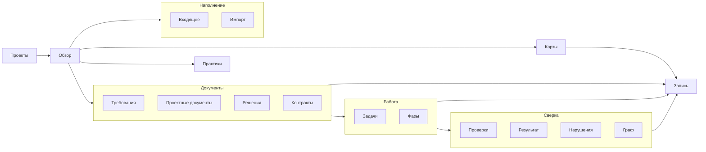

# Экраны

Интерфейс подчинён трём вопросам из [00-overview.md](00-overview.md): в каком
состоянии работа, что нарушает процесс, что можно брать сейчас. Всё, что не
отвечает ни на один из них, на экран не попадает.

## Навигация

Шапка устроена по той же цепочке, по которой живёт проект: **документ →
работа → сверка**. Группа — шаг цепочки, пункт — экран, и у каждого типа
записи из контракта ([02-workspace-contract.md](02-workspace-contract.md))
есть свой список, до которого можно дойти из шапки. Запись, до которой
добираются только по чужой ссылке или узлом графа, всё равно что спрятана:
подтвердить её забудут.

- **Обзор** — прямая кнопка, первый экран проекта: что делать сейчас.
- **Документы** — Требования, Проектные документы, Решения, Контракты. То,
  что человек подтверждает **до** кода: у всех четырёх одна схема статусов
  (`draft → review → approved`), и задача не уйдёт в работу, пока то, на что
  она опирается, не подтверждено. Требования — первыми: с них работа
  начинается, остальные три объясняют, как их выполнить.
- **Работа** — Задачи, Фазы. Сам код: единица работы и этап, сложенный из
  таких единиц.
- **Сверка** — Проверки, Результат, Нарушения, Граф. Всё, что отвечает на
  «сходится ли»: чем требование проверяется, что показал прогон, где процесс
  разошёлся с правилами, что ни с чем не связано. Нарушения и Граф стоят
  рядом: это два взгляда на одно и то же состояние — список и картинка.
- **Карты** — прямая кнопка: устройство кода, сложенное из подтверждённых
  карт, и сами записи карт (раздел «Карты»).
- **Наполнение** — Входящее, Импорт. Как в `docs/development` попадает
  новое: разбор сырых заметок и перенос уже существующей документации. Ни то
  ни другое не про устройство проекта — про его рост.
- **Практики** — прямая кнопка: чужие `decision`/`design` для чтения.

Прямая кнопка — там, где назначение одно: выпадающий список ради одного
пункта ничего не добавляет. Порядок слева направо — сама цепочка: Документы
→ Работа → Сверка. Карты, Наполнение и Практики — после неё: ни одна из них
не шаг процесса, а опора ему — устройство, приток нового, чужой опыт.

Справа — то, что к проекту не относится и доступно всегда, даже когда проект
не выбран: «Как пользоваться», «Все проекты» и переключатель темы (раздел
«Тема»).

Где список каждого типа:

| Тип | Где |
|---|---|
| `requirement` | Документы → Требования |
| `design` | Документы → Проектные документы |
| `decision` | Документы → Решения |
| `contract` | Документы → Контракты |
| `task` | Работа → Задачи |
| `phase` | Работа → Фазы |
| `verification` | Сверка → Проверки |
| `map` | Карты — записи над картиной |

Незнакомый тип своего списка не получает: он виден предупреждением в
Нарушениях и колонкой «Прочее» в Графе. Контракт обещает показать такой файл,
а не завести под него экран.

До этого устройства «Работа» держала всё сразу — требования, задачи,
проверки, прогоны, нарушения, граф, — а проектных документов, решений,
контрактов, фаз и записей карт в шапке не было вовсе: найти их можно было
только по ссылке из другой записи или узлом графа. Дыра была ровно там, где
она дороже всего: документы, без подтверждения которых задача не уходит в
работу, из шапки не находились.

**Практики — не в «Наполнении»**, хотя тоже смотрит наружу проекта. Входящее
и Импорт заводят записи в этом проекте; Практики ничего не заводит — только
показывает чужие `decision`/`design` для чтения
([11-shared-sources.md](11-shared-sources.md)). Разное действие — разное
место, не общая тема «внешнее».

**Граф — не то же самое, что Карты**, хотя оба рисуют узлы и рёбра. Граф —
про требования, задачи и решения: какая запись на какую ссылается, что
осталось ни с чем не связано. Карты — про устройство кода: модули, потоки
данных, пользовательские пути. Первое время Граф лежал в одной группе с
Картами по внешнему сходству картинки, а не по смыслу содержимого — это было
ошибкой навигации, а не описанием. Теперь Граф стоит в «Сверке», рядом с
Нарушениями, — по смыслу, а не по виду.

Рядом с названием пункта, где есть что считать, — число незакрытых:
неподтверждённых (`draft`, `review`) у Требований, Проектных документов,
Решений, Контрактов и Карт; открытых задач; незакрытых фаз; проверок без
пройденного прогона; суммы ошибок и предупреждений у Нарушений. У
«Результата» и «Графа» счётчика нет: одно — журнал прогонов, другое —
картинка, а не список элементов со своим статусом.

```mermaid
flowchart LR
    projects["Проекты"] --> overview["Обзор"]
    subgraph documents["Документы"]
      reqs["Требования"]
      design["Проектные документы"]
      decisions["Решения"]
      contracts["Контракты"]
    end
    subgraph work["Работа"]
      tasks["Задачи"]
      phases["Фазы"]
    end
    subgraph verify["Сверка"]
      checks["Проверки"]
      results["Результат"]
      issues["Нарушения"]
      graphview["Граф"]
    end
    subgraph intake["Наполнение"]
      inbox["Входящее"]
      importing["Импорт"]
    end
    overview --> documents --> work --> verify
    overview --> maps["Карты"]
    overview --> intake
    overview --> shared["Практики"]
    documents --> record["Запись"]
    work --> record
    verify --> record
    maps --> record
```

## Проекты

Список добавленных проектов: имя, путь, когда открывали, состояние последнего
разбора. Кнопка добавления просит путь к корню. Если формата там нет — экран
объясняет, что нужен `docs/development/project.yaml`, и предлагает создать.

## Обзор

Первый экран проекта. Сверху — счётчики задач по статусам и число нарушений
крупно: это то, ради чего инструмент открывают.

Ниже три колонки:

- **Можно брать** — задачи в `ready`, отсортированные по фазе.
- **В работе** — `in_progress` и `in_review`, с числом дней в этом состоянии;
  зависшие подсвечены.
- **Мешает** — ошибки процесса, по одной строке, с переходом к записи.

Кнопка «Перечитать» пересобирает индекс.

## Решение и факт: «подтверждено» и «проверено»

У записи две разные вещи, и экран не смеет называть их одним словом.

| Ось | Что это | Кто ставит | Слова на экране |
|---|---|---|---|
| **Решение** | Статус записи | Человек, кнопкой | «черновик», «на подтверждении», «подтверждён»; у задачи — «в очереди» … «закрыта» |
| **Факт** | Результат прогона из отчёта | Отчёт, не человек | «проверено», «не прошла», «не проверено», «не проверяется» |

**«Подтверждён» — только о решении, «проверено» — только о факте.** Раньше
требование писало «подтверждено прогоном» — а «подтверждён» уже стоял в
колонке статуса, и два слова об одном и том же читались как одно.
«Подтверждён, но не проверен» — обычное, честное состояние: человек
согласился с требованием, а прогона ещё не было. Слитые в одно слово, эти
состояния выглядят одинаково хорошо, и непроверенное проходит за проверенное.

Колонки называются по осям: статус — **«Решение»**, результат — **«Факт»**.
На каждом из списков (Требования, Проверки, Задачи) они стоят порознь и не
склеены в один общий значок: общий значок снова прятал бы, какая ось что
сказала.

Расхождения между осями подсвечены, а не оставлены на чтение:

| Где | Что видно | Почему это расхождение |
|---|---|---|
| Требование | Подтверждено, а факт не «проверено» — значок факта тёплого цвета | Человек согласился, а по чему судить, что выполнено, — нет |
| Проверка | Результат есть, а сама проверка не `approved` — рядом пометка «сама проверка не подтверждена» | Прогон пошёл по способу, с которым человек ещё не согласился |
| Задача | Закрыта, а проверки нет — «закрыта без проверки»; есть, но не все пройдены — «закрыта, не проверена» | Закрытая без проверки — обещание, а не факт |

**Результат прогона засчитывается независимо от статуса самой проверки** —
как и правило `task_done_unverified`, которое смотрит на результат в
отчёте. Пометка «сама проверка не подтверждена» его не обнуляет, а показывает,
что под фактом стоит неподтверждённый способ. Если практика покажет, что
прогон от черновой проверки лучше не считать фактом до подтверждения, это
отдельное решение с правкой правил, а не оттенок подписи.

## Задачи

Список с вкладками статусов ([«Списки по статусам»](#списки-по-статусам)) и
фильтрами по фазе, исполнителю и тегам. У каждой строки видно,
что она выполняет (`implements`) и чем проверяется. Задача без требования
помечена — это и есть работа, которая никому не понадобилась.

У каждой строки — флажок, над списком — «выбрать всё» и панель массовых
действий ([«Массовые действия»](#массовые-действия)): «Вперёд» и «Назад» на
один этап. Рядом — кнопка **«Разбить на фазы»** ([«Фазы»](#фазы)): по отмеченным
задачам, а не отмечено ничего — по всем, что ещё ни в какой фазе.

Над списком — две общие шкалы готовности, те же, что на экране фаз
([«Общие шкалы»](#общие-шкалы)). Фильтры и отметки на них не влияют.

## Запись

Одна карточка на любой тип. Сверху — заголовок, тип, статус и действия; ниже —
текст документа с диаграммами; сбоку — связи в обе стороны и журнал.

Действия зависят от типа и статуса:

| Тип | Действия |
|---|---|
| Документ, решение, контракт | Отдать на подтверждение, подтвердить, вернуть, заменить, отменить — и обратно в черновик из подтверждённого, заменённого или отменённого ([adr/0012-status-reopening.md](adr/0012-status-reopening.md)) |
| Задача | Пометить готовой к работе, запустить в разработку, отправить на проверку, закрыть, отменить — и на шаг назад из любого из этих статусов |
| Проверка | Ничего: результат приходит из отчётов |

Недоступное действие показано неактивным **с причиной рядом** — «документ D-0004
не подтверждён». Пустая серая кнопка без объяснения бесполезна: человек должен
понимать, что именно чинить.

**Текст документа редактируется прямо здесь** ([adr/0011-body-editing.md](adr/0011-body-editing.md)).
Кнопка «Сохранить» пишет тело файла и строку в журнал — «текст
отредактирован», с ролью и датой. Правится текст **до** раздела «Журнал»:
сам раздел неприкосновенен, как и остальные поля front matter, кроме
`updated`.

Запись в статусе `approved`, `done`, `superseded`, `rejected` или `dropped`
не редактируется: содержание подтверждено, и менять его в обход этого факта
нельзя — путь для нужной правки такой подтверждённой записи прежний —
`supersedes` у преемника. Кнопка неактивна и говорит, почему.

Файл снаружи не заперт: пока открыт редактор, кто-то может поправить его в
своём редакторе или руками. Сохранение это ловит — сравнивает текст, с
которого редактор начал правку, с содержимым файла на диске, и отказывает,
если они разошлись, а не переписывает поверх чужой правки.

Путь к файлу виден рядом всегда — большой кусок текста, таблицу или диаграмму
по-прежнему удобнее править во внешнем редакторе, открыв тот же файл напрямую.

## Массовые действия

Подтверждать записи по одной — на двадцати требованиях и сорока задачах это
ровно та скука, из-за которой человек начинает подтверждать не читая. Поэтому
на четырёх списках — **Требования, Документы** (все вкладки, включая Решения и
Контракты), **Проверки** и **Задачи** — у каждой строки есть флажок, а в
заголовке таблицы (у задач — над списком) — флажок **«выбрать всё»**.

- «Выбрать всё» отмечает то, что **сейчас на экране**: под фильтром или на
  вкладке — только оно. Отмечено часть — флажок в промежуточном положении;
  нажатие в нём отмечает всё, а из полностью отмеченного — снимает.
- Отметки живут до следующего действия или смены фильтра. Запись, ушедшая из
  списка (другой фильтр, другая вкладка), из отмеченных выпадает: переводить
  то, чего человек не видит, приложение не станет.

### Списки по статусам

«Выбрать всё» на списке, где вперемешку черновики, подтверждённое и заменённое,
— это «двинуть лишнее»: подтвердить то, что ещё не читали, или откатить то, что
уже принято. Поэтому над каждым из четырёх списков — **вкладки статусов** с
числами: «Все · 26», «Черновик · 20», «На подтверждении · 4», «Подтверждён · 2».
Показываются только статусы, которые в списке есть, в порядке процесса:

| Список | Порядок вкладок |
|---|---|
| Требования, Документы, Проверки | `draft`, `review`, `approved`, `superseded`, `dropped`, `rejected` |
| Задачи | `backlog`, `ready`, `in_progress`, `in_review`, `done`, `dropped` |

Вкладка — один статус, и «выбрать всё» на ней отмечает записи **одного
статуса**: «Вперёд» на «Черновиках» двигает именно черновики, и ничего
другого под него не попадёт. Вкладка «Все» остаётся — смотреть список целиком
нужно, — но **двигать с неё можно только отмеченное в одном статусе**:

- Отмечены записи **разных** статусов — кнопки панели неактивны и называют
  причину словами: «Отмечены записи в разных статусах (черновик, на
  подтверждении) — откройте вкладку одного статуса». Отметку можно снять с
  лишнего или перейти на вкладку статуса.
- Все отмеченные в одном статусе — панель говорит это рядом с числом:
  «Выбрано: 3 из 26 — все на подтверждении».

Вкладка живёт в адресе (`?status=draft`), как вкладка типа на «Документах»:
ссылка на «черновики требований» ведёт на них. На «Документах» две оси —
тип и статус: вкладки типа остаются как были, статус — вторым рядом под ними,
и «выбрать всё» отмечает пересечение. Список статусов у Задач — тот же ряд
вкладок вместо прежнего выпадающего фильтра «Любой статус»: два органа
управления одним и тем же — лишний.

Смена вкладки снимает отметки: переходя на другой статус, человек не должен
унести с собой выбор из прежнего.

Над списком — панель: «Выбрано: 3 из 26» и кнопки. Пока ничего не отмечено,
кнопки неактивны и **говорят почему** — «Отметьте записи флажками», а не
молча серые.

| Кнопка | Где | Что делает |
|---|---|---|
| **Вперёд** | везде | Каждую отмеченную запись — на один шаг вперёд по её схеме статусов |
| **Назад** | везде | Каждую — на один шаг назад ([adr/0012-status-reopening.md](adr/0012-status-reopening.md)) |
| **Подтвердить** | документы, требования, проверки | Каждую — до `approved`: из черновика через `review`, из `review` сразу |

Шаг считает сервер, а не экран, — по тем же таблицам, что и у кнопок на
экране записи ([03-server-api.md](03-server-api.md)). Запись идёт **своим**
путём: в одной выборке у разных записей разные статусы, и каждая двигается из
своего.

| Тип | Вперёд | Назад |
|---|---|---|
| Документ, требование, контракт, проверка, карта, решение | `draft → review → approved` | `review`, `approved`, `superseded`, `dropped`/`rejected` → `draft` |
| Задача | `backlog → ready → in_progress → in_review → done` | `ready → backlog`, `in_progress → ready`, `in_review → in_progress`, `done → in_review`, `dropped → backlog` |

Из `approved`, `done`, `superseded`, `dropped`, `rejected` «вперёд» нет:
заменить или отменить запись — решение, а не шаг, и оно остаётся за кнопками
на экране записи. «Подтвердить» для задачи не предлагается: у задачи
подтверждение — закрытие фактом, и оно проходит через свой `in_review`.

**Правила процесса не ослабляются.** Каждый шаг проверяется теми же
`checkTransition`, что и одиночное действие: задача без `implements` в `ready`
не уйдёт, закрытая без пройденной проверки — тоже. Запись, которой шаг
запрещён, **пропускается**, а остальные идут дальше: одна заблокированная
строка не должна останавливать сорок других. Каждый успешный шаг — обычная
строка в журнале записи с ролью из списка справа от кнопок, а «Подтвердить»
из черновика оставляет **две** строки — «отдана на подтверждение» и
«подтверждена»: путь через `review` не пропускается, он лишь проходится без
остановки.

**Подтверждение отдельного ответа не требует**, и это не исключение из
правила «подтверждает человек»: нажатие кнопки над выбранными им самим
записями и есть подтверждение. Человек назвал записи флажками, назвал действие
кнопкой — приложение лишь делает то же, что сделал бы он сорок раз подряд. По
правилу «нет модальных подтверждений на обратимое» ([«Правила интерфейса»](#правила-интерфейса))
окна с вопросом нет: всякий шаг откатывается «Назад».

После действия панель показывает **отчёт**, а не молчит: «Переведено 12 из
14». Пропущенные — **сгруппированы по причине**: «49 — `task_maps_unapproved`»,
под ней слова сервера («Задача T-0004 объявлена как `feature`, но не меняет
ни одной карты…») один раз, как пример, и номера записей ссылками. Сорок
девять одинаковых строк не читаются — одна группа с номерами читается. Отметки после
действия снимаются целиком: повторное нажатие двинуло бы уже переведённые
ещё на шаг, а этого человек не просил.

**Массовое действие не должно ломать то, что уже заведено.** Кроме вкладок
статусов ([«Списки по статусам»](#списки-по-статусам)) это держится ещё на
двух вещах:

- **Отчёт называет новые нарушения.** Сервер сверяет список нарушений до
  действия и после; всё, чего до него не было, панель показывает отдельным
  блоком — «Появилось нарушений: 2»: код, запись, объяснение, ссылка. Так
  видно, что «Назад» на трёх подтверждённых документах оставил пять задач в
  `ready` с неподтверждённой опорой (`task_not_ready_docs`) — пока ничего
  не забыто, и откат — обратная кнопка по тем же записям. Ничего не
  нарушено — так и сказано, а не молчание.
- **Порядок работы из черновиков — сверху вниз по опоре.** Сначала требования
  и документы (вкладка «Черновик» → «Подтвердить»), потом задачи («В
  очереди» → «Вперёд»): задача не уйдёт в `ready`, пока опора не
  подтверждена, и запись, которой шаг запрещён, в отчёте названа с причиной,
  а не пропала. Экран подсказывает этот порядок рядом с панелью, когда на
  вкладке задач есть записи, чья опора ещё не подтверждена.

**Карта для `feature`-задач — одной кнопкой.** Если среди пропущенных есть
группа `task_maps_unapproved` с причиной «не меняет ни одной карты», под ней
стоит кнопка **«Завести карту и привязать N задач»**
([07-maps.md](07-maps.md), «Карта-намерение на пачку задач»): одна общая карта
на пачку, черновик, `affects` у задач. Кнопка ничего не подтверждает и никуда
не двигает — после неё в отчёте ссылка на карту: подтвердить её, затем снова
«Вперёд» на вкладке «В очереди». Группа, где причина другая («карта M-0007 —
`draft`»), кнопки не получает: карта уже есть, нужно её подтвердить, и
ссылка на неё — в тексте причины.

Нарушения и Входящее устроены своими флажками и своей кнопкой
(«Исправить», «Завести записи»), а не этой панелью: там действие — не смена
статуса. «Выбрать всё» у них есть по тому же правилу — отмечается то, что на
экране. Фазы панели не получают: их статус считается по задачам и вручную не
ставится.

## Требования

Таблица покрытия: требование, **решение** (статус), задачи, проверки, **факт**
(результат прогонов; [«Решение и факт»](#решение-и-факт-подтверждено-и-проверено)).
Строка без проверки видна сразу — это главный дефект, который экран ищет.

Факт требования — по всем его проверкам сразу: «не проверяется» (проверок нет
вовсе), «не прошла» (хоть одна провалена), «проверено» (все пройдены), иначе —
«не проверено» (проверки объявлены, но прогона нет или он не по всем). Подтверждённое
требование с фактом не «проверено» помечено тёплым цветом.

Первая колонка — флажок, над таблицей — панель массовых действий
([«Массовые действия»](#массовые-действия)).

## Документы

Проектные документы, решения и контракты — один экран с вкладками по типу:
Все, Проектные документы, Решения, Контракты. Пункт шапки открывает сразу
свою вкладку, и вкладка живёт в адресе (`?type=decision`): ссылка на
«Решения» ведёт на решения, а не на экран, где их ещё надо выбрать.

Один экран, а не три: вопрос к ним один — подтверждено ли то, на что
опирается работа, — и схема статусов одна. Три копии одной таблицы разошлись
бы на второй правке. У Требований экран свой, как и был: их вопрос другой —
покрытие проверками, — и таблица другая.

Таблица: документ, статус, кто на него опирается, когда изменён. «Кто
опирается» — обратные связи `documents`, `refines` и `decided_by`: задачи,
которые документ правят, и записи, которые его уточняют или стоят на
решении. Не опирается никто — так и написано, а не пустая клетка: документ,
который ничему не служит, — тот же висящий узел, что и в Графе.

Порядок — сперва то, что ждёт подтверждения (`review`), потом черновики,
потом подтверждённое, в конце — заменённое, отменённое и отклонённое.
Экран открывают, чтобы найти неподтверждённое, и оно наверху; внутри
статуса — по номеру.

Заменённый документ называет преемника ссылкой (обратная `supersedes`): от
устаревшего решения до действующего — один щелчок, а не поиск по номерам.

На вкладке типа — кнопка «Новая запись» этого типа. На «Все» её нет: тип
выбирается вкладкой, а не отдельным полем в форме.

У каждой строки — флажок, над таблицей — панель массовых действий
([«Массовые действия»](#массовые-действия)). Экран открывают, чтобы найти
неподтверждённое, а оно лежит наверху: отметить всё и подтвердить — два
нажатия, а не сорок. «Выбрать всё» отмечает то, что на вкладке, и не касается
двух других типов.

## Проверки

Список записей типа `verification` — тот же приём, что у Задач и Требований:
таблица, а не карточки. Проверка, **решение** (статус самой проверки), что она
проверяет (`verifies`), **факт** — последний результат и когда он получен. Строка без единого прогона видна сразу — как в
Требованиях, только здесь взгляд от проверки, а не от требования.

Экран не запускает проверки и не пишет отчёты — он их только читает
([adr про способ проверки](02-workspace-contract.md)). Прогнать проверку
и положить отчёт в `docs/development/tests/reports/` — дело человека или его
инструментов вне приложения.

Статус у проверки — тот же `draft → review → approved`, что у документа, и
перевод тот же: у каждой строки флажок, над таблицей — панель массовых
действий ([«Массовые действия»](#массовые-действия)). Перевод проверки
в `approved` не делает её «пройденной»: результат по-прежнему приходит только
из отчётов. Обратное тоже бывает: результат есть, а проверка всё ещё черновик —
рядом с результатом тогда пометка «сама проверка не подтверждена»
([«Решение и факт»](#решение-и-факт-подтверждено-и-проверено)).

### Отметка «Проверено»

Ручную проверку (`kind: manual` или `review`) некому прогнать, кроме человека.
У неё есть флажок **«Проверено»**: на экране самой проверки (в карточке
«Действия») и в списке проверок, в колонке «Факт». Поставил — приложение
фиксирует прогон отчётом и строкой в журнале
([02-workspace-contract.md](02-workspace-contract.md), «Ручная отметка
„Проверено“»); роль берётся из списка справа от действий.

- **Видно, кто и когда.** Рядом с флажком: «проверено вручную · Архитектор ·
  2026-10-01». Ручной прогон не выдаёт себя за прогон сборки.
- **Снять можно.** Снятие — не провал, а «не проверено»: факт возвращается к
  «не запускалась», а история (оба отчёта и обе строки журнала) остаётся.
- **Только ручным.** У проверок `unit`, `integration` и `metric` флажка нет;
  вместо него — причина: «факт приходит от сборки — положите отчёт в
  tests/reports». Неактивный элемент без причины бесполезен.
- **Статус проверки не мешает.** Отметить можно и черновик, и подтверждённую
  проверку: отметка — факт, а не правка содержимого. Черновик с отметкой
  получает пометку «сама проверка не подтверждена» — так же, как с любым другим
  результатом.

## Результат

История прогонов: список отчётов из `docs/development/tests/reports/`, новые
сверху. Каждая строка — один прогон целиком: когда, кем (`runner`), сколько
проверок всего и сколько провалилось. Разворачивается в список: какая
проверка что показала — `passed`, `failed` или `skipped`.

Отличие от Проверок: та вкладка — про **проверку** («когда её в последний раз
гоняли и что вышло»), эта — про **прогон** («что вообще произошло в этом
запуске, по всем проверкам разом»). Один отчёт покрывает много проверок; одна
проверка встречается во многих отчётах — это две разные оси одного и того же
факта, и валидатор их не путает.

## Фазы

Список фаз: фаза, её состав, полоса готовности, что мешает закрыть.

Состав — задачи из `covers` фазы и задачи, у которых в поле `phase` стоит её
номер. Связь ставят с любой из двух сторон, и показывается она одним
множеством — как «что проверяет» у Проверок.

Статус считается сам по задачам состава и вручную не ставится
([02-workspace-contract.md](02-workspace-contract.md), «Статусы»). Статус из
файла фазы этот экран не показывает: поставленный руками, он мнение, а не
факт.

| Статус | Когда |
|---|---|
| `planned` | Ни одна задача состава не начата — или состава нет |
| `active` | Хотя бы одна задача в работе, на проверке или закрыта, но закрыты не все |
| `done` | Все задачи закрыты или отменены, и хотя бы одна — закрыта |

Полоса готовности — закрытые из всех, кроме отменённых: отменённая задача
работы не прибавляет и не убавляет. «Мешает закрыть» — незакрытые задачи
состава ссылками, со статусом каждой. Состава нет — экран так и говорит и
называет, чем его задать: `covers` у фазы или `phase` у задачи.

### Общие шкалы

Над списком фаз и над списком задач — две шкалы на весь проект, а не на одну
фазу: **«Задачи»** и **«Фазы»**. Они отвечают на вопрос «сколько сделано
вообще», на который полосы отдельных фаз ответить не могут.

| Шкала | Закрыто | Из скольких |
|---|---|---|
| Задачи | задачи в статусе `done` | все задачи проекта, кроме отменённых, — и те, что в фазах, и те, что вне их |
| Фазы | фазы в расчётном статусе `done` (таблица выше) | все фазы проекта |

Правило то же, что у полосы одной фазы: отменённая задача работы не прибавляет
и не убавляет. Статус фазы берётся расчётный, а не из файла, поэтому фаза без
состава или с полностью отменённым составом закрытой не считается.

Подпись под шкалой — «закрыто 120 из 190» и процент. Нет задач (или фаз) —
шкала пуста, подпись говорит «задач нет» («фаз нет»), а не рисует 0 из 0.

Шкалы **общие**: на экране задач фильтры по статусу, фазе, исполнителю и
тегу, как и отметки у строк, их не меняют — иначе шкала показывала бы долю
выбранного, а не готовность проекта. Считаются из тех же записей, что и
остальной экран, отдельного запроса нет.

### Разбить на фазы

Кнопка **«Разбить на фазы»** — над списком фаз и на экране задач. Фазы руками
заводят долго, и хуже того — их заводят по номерам задач, а не по смыслу.
Кнопка отдаёт задачи модели, а та предлагает **разбиение**: сколько фаз, как
они называются, какие задачи в какую идут.

Что уходит модели: задачи, которые **ещё ни в какой фазе и не отменены** —
либо, на экране задач, только отмеченные из них. Название кнопки называет
число: «Разбить на фазы: 12». Таких задач нет — кнопка неактивна и говорит
почему: «Все задачи уже в фазах или отменены — разбивать нечего». Вместе с
задачами модель получает уже заведённые фазы — чтобы не предлагать второй раз
то, что есть, — и читает сами файлы задач, если заголовка ей мало. Порядок
фаз она выстраивает по `depends_on` и по смыслу: то, от чего зависят, —
раньше.

Дальше — тот же путь, что у «Разобрать входящее» ([10-inbox.md](10-inbox.md)):
запрос показывается целиком и копируется; ответ не применяется сам.
Предложение видно списком: у каждой фазы флажок, правимое название, цель и
состав ссылками на задачи. **Задачи, не попавшие ни в одну фазу, названы
отдельно** — модель не вправе молча потерять задачу, а человек не вправе не
заметить потери. Лишнюю фазу выключают флажком, название правят прямо в
списке.

**«Создать фазы»** заводит записи `phase` — заводит приложение, а не модель:
номера, файлы и front matter — его работа, состав — связью `covers` у новой
фазы. **Файлы задач не меняются вовсе** — ни `phase`, ни статус: состав
задаёт фаза, и правка чужих записей по предложению модели не нужна. Статус
у новых фаз `planned`, дальше он считается по задачам.

Задача, которая уже в какой-то фазе, в предложение не попадает, а если
попала (модель ошиблась или файл поправили, пока шёл запрос) — сервер её в
новую фазу не берёт и говорит об этом словами. Фаза, чей состав после этой
проверки пуст, не заводится.

## Нарушения

Плоский список ошибок и предупреждений с кодом, записью и объяснением. Ошибки
сверху. Каждая строка ведёт к записи, а не к абстрактному «отчёту».

**У каждого нарушения свой флажок.** Отметили три — чинить будут ровно три, а
не всё, что попало под фильтр. Фильтры сужают список, флажки называют работу:
это разные вещи, и путать их нельзя.

Не отмечено ничего — кнопка неактивна и говорит почему. Чинить «всё сразу»
приложение не предлагает: у нарушений разная цена ошибки, и решать, за какое
браться, — работа человека, а не следствие того, какой фильтр остался включён.

Кнопка **«Исправить»** называет число: «Исправить: 3». Запрос уходит ровно про
отмеченное — и модель разбирает три нарушения внимательно, вместо того чтобы
бегло пройтись по двадцати. Запрос показывается целиком и копируется в буфер:
его можно отдать своему агенту, а можно спросить модель отсюда
([adr/0008-llm-through-claude-code.md](adr/0008-llm-through-claude-code.md)).

Отметить одно и починить одно — обычный, а не крайний случай: так виднее, что
изменилось и от чего.

### Починка

Модель отвечает **планом**: строка на нарушение — какой файл, какое поле, во
что. Не рассуждение, которое надо вычитывать, а список, который читается за
минуту.

Под планом — кнопка **«Принять ответ»**. Это подтверждение, и до него не
происходит ничего: ни ветки, ни правок. Нажали — модель чинит по этому плану в
отдельном рабочем дереве, а приложение показывает дифф и **не сливает его само**
([adr/0010-model-fixes-violations.md](adr/0010-model-fixes-violations.md)).

Дальше — те же три ответа, что и у задачи: принять и слить, вернуть на
доработку, отклонить. Тронула модель файл, которого не было в нарушениях, или
поставила записи `approved` — слияние отклоняется с причиной, и это работа
предохранителя, а не поломка.

Принятая починка оставляет след: в журнале каждой починенной записи появляется
строка — какое нарушение чинили и что стало. Пишет её приложение, из кода
нарушения, а не из пересказа модели.

Не подтверждать план — нормальный исход: план можно перечитать, сузить фильтр и
спросить заново, поправить руками или не чинить вовсе.

## Граф

Записи узлами, связи рёбрами, цвет по типу, форма по статусу. Нужен для одного:
увидеть, что на что опирается, и найти висящие в пустоте узлы.

До фазы 3 граф — это список связей в карточке записи. Рисовать его раньше, чем
станет ясно, какие вопросы к нему задают, — потратить время на украшение.

## Входящее

**«Записать наработку»** — заголовок и текст, кнопка «Сохранить заметку».
Никакого markdown и файловой системы: человек без навыков программирования
пишет обычным текстом, приложение само кладёт файл на склад
([10-inbox.md](10-inbox.md), «Что кладёт человек»). Форма видна всегда, не
только когда заметок ещё нет — записывать можно в любой момент.

Ниже — сырые заметки со склада, названного в манифесте (`sources.inbox`),
списком: заголовок и путь. Строка выключается щелчком; не выбрано ничего —
разбираются все. Заметка из формы ничем не отличается от заметки, положенной
файлом руками или моделью, — тот же список, тот же разбор.

**«Разобрать входящее»** отдаёт заметки модели и получает **список**
предлагаемых записей: тип, заголовок, тело, связи. У записи-карты вместо
тела (или вместе с ним) видны предложенные возможности — то, что попадёт в
функциональную карту; у записи с несколькими источниками под связями видно,
из каких заметок она собрана. Список правится тут же — лишнее выключается,
— а кнопка **«Завести записи»** создаёт их. Заводит приложение: номера,
front matter и имена файлов — его работа ([10-inbox.md](10-inbox.md)).

Всё заведённое — черновики, и это сказано рядом с кнопкой: разбор избавляет от
переписывания, а не от чтения.

И у списка заметок, и у предложенных записей есть **«Выбрать всё / Снять
всё»** — одним переключателем над списком: на двадцати пунктах выключать
лишнее по одному не легче, чем включать нужное. Переключатель отмечает ровно
то, что в списке; предложенные записи от него не заводятся — заводит только
«Завести записи».

Склад не назван в манифесте — экран говорит об этом и не предлагает ничего
разбирать: догадываться, где у проекта склад, приложение не станет.

Ниже, свёрнутым по умолчанию, — **«Разобранное»**: заметки, уже переехавшие в
`принятое`. Разбор — не разовое действие с исчезающим следом: список остаётся
доступным, и рядом с каждой заметкой видно, что из неё выросло — ссылки на
записи, чей журнал назвал её источником, либо прямое указание, что ни одна
запись явно не сослалась на эту заметку ([10-inbox.md](10-inbox.md), «След»).

## Заведение и импорт

Экран открывается двумя путями: из списка проектов, когда в папке нет манифеста,
и ссылкой из обзора, когда рядом с форматом лежит ещё не размеченная
документация.

**Пустой проект.** Форма спрашивает имя и идентификатор проекта; кнопка создаёт
манифест, папки разделов и первую запись. Больше ничего: наполнение — работа
человека.

**Импорт.** Таблица найденного: путь, заголовок, размер, предполагаемый тип и
почему он предположен. Тип в каждой строке правится списком, строка выключается
галочкой. Предположение — это подсказка, и она обязана выглядеть подсказкой, а
не решением.

В шапке столбца с галочками — «Выбрать всё / Снять всё»: отмечаются строки,
которые можно перенести (файл с front matter остаётся выключенным — он запись,
а не импорт).

Кнопка применения говорит, что произойдёт: сколько файлов переедет и куда. После
применения экран показывает, что перенесено и что пропущено — с причиной.

Текст документов не меняется: приложение добавляет front matter и переносит
файл. Это же написано на экране рядом с кнопкой — человек должен понимать, на
что соглашается.

## Новая запись

Кнопка на экранах требований, задач, проверок и документов (там — на вкладке
своего типа): тип записи задаёт экран. Форма спрашивает заголовок и
исполнителя, у задачи — ещё что за изменение и какое требование она
выполняет; идентификатор выдаёт сервер — следующий свободный. Номера не
переиспользуются, поэтому выбрать его вручную нельзя.

## Карты

Четыре структуры одного изменения — на экране записи карты: кодовая база,
потоки данных, пользовательские пути, функциональная карта. У первых трёх
каждое ребро показывает своё свидетельство, и видно, сошлось ли оно с файлом
— не сошлось, строка помечена, а не спрятана. У функциональной карты
свидетельства нет вовсе — она подтверждается человеком, как обычная запись
(docs/07-maps.md, «Функциональная карта»).

Общая карта проекта собирается из подтверждённых изменений и показывается
подвкладками — по одной на вид (`app/pages/projects/[id]/maps.vue`):
**возможности предметной области** (она первая и открывается по умолчанию —
это основной источник правды, [07-maps.md](07-maps.md), «Источник правды и
история курса»), модули и связи, источники и потоки, экраны и переходы.

**Записи карт видны всегда**, а не только когда картина пуста. Над картиной
— ссылками: из каких карт она сложена, какие ждут подтверждения (`draft`,
`review`) и какие выведены из суммы (`superseded` и прочие закрытые); пустая
строка не показывается. Карта — такой же документ под подтверждение, как
проектный, и черновик от «Обновить карты» не должен находиться только по
номеру, мелькнувшему в ответе.

**Узел ведёт к коду.** Клик открывает карточку сбоку (не уводит с диаграммы —
картина остаётся под рукой). В ней: имя и слой; `summary` карты — что модуль
делает; `api` карты — список того, что из него импортируют, с сигнатурами;
и содержимое файла тем же способом, что и по ссылке из тела записи
(`GET /api/projects/[id]/file`, 512 КБ — предел тот же), с подсветкой
синтаксиса (Shiki, тема под светлый и тёмный интерфейс; язык — по расширению,
незнакомое показывается без подсветки). Кнопка в шапке разворачивает карточку
почти на весь экран — читать код в узкой колонке неудобно; кнопка у заголовка
«Файл» переносит длинные строки, чтобы не гонять горизонтальный скроллбар.

Обычно карточка живёт поверх всей страницы (портал в `<body>`) — так она
выше панелей диаграммы. Но на весь экран разворачивается **общий контейнер**
(`app/pages/projects/[id]/maps.vue`), и на это время карточка переезжает в
него: иначе Fullscreen API показывает только своё поддерево, и карточка,
живущая в портале рядом, из полноэкранного режима пропала бы
(`MapInspector.vue`).

Какой файл открывать: `path` у модуля кодовой базы, `file` у экрана, `where` у
источника данных с `kind: file`. Если `path` не задан, но сам `id` — это путь к
файлу (есть `/` и расширение), берётся он: путь написала модель, не приложение,
а сервер либо отдаст файл, либо честно ответит «нет такого». Догадки из
dotted-имени (`a.b.c` → `a/b/c.py`) не строятся — там приложение не знает, где
граница пакета. Ничего из этого нет — карточка показывает только `summary` и
`api`, если они есть, а без них — что модуль вообще есть и в каком слое.
У функциональной карты узел ведёт только к своему месту в дереве возможностей —
она про смысл, не про файл.

**Ребро ведёт к свидетельству** (кроме функциональной карты, где рёбер с
собственным смыслом нет вовсе): клик показывает путь, строку и фрагмент, из
которого сделан вывод (`docs/07-maps.md`, «Свидетельство»), и сошлось ли это с
файлом сейчас — тем же расчётом, что уже красит нарушение `map_evidence_stale`
в общем списке, просто рядом с самим ребром, а не в отдельном списке, который
нужно сопоставлять руками.

**Пусто — это тоже ответ, и он обязан назвать причину.** Карт нет вовсе — так и
сказано. А вот если карты есть, но все они черновики или помечены заменёнными,
экран говорит именно это, с числами и ссылкой на записи: «шесть карт помечены
заменёнными, и картина от этого пуста». Разница важная: в первом случае работу
не делали, во втором — сделали и вычли из суммы.

Карта — это **изменение**, а не снимок: картина складывается из суммы
подтверждённых карт. Пометить прежнюю заменённой стоит только тогда, когда новая
её и правда заменяет, ссылаясь через `supersedes`. Карты, дополняющие друг
друга, остаются подтверждёнными — иначе сумма схлопывается в ноль.

Две кнопки. **«Перечитать»** пересобирает картину из файлов: карту могли
подтвердить в соседнем окне. **«Обновить карты»** собирает запрос по описи —
какие файлы новые, какие изменились, какие исчезли — и отдаёт его модели. Ответ
ложится черновиком записи `map` и ждёт подтверждения.

Рядом с кнопкой — состояние описи: **сколько файлов описано, сколько ждёт
очереди, сколько изменилось после описания**. Цифра всегда с причиной: за ней
список файлов, а не общее ощущение.

**«Описать пачками»** — для большой описи, когда хочется запустить один раз и
не нажимать «Обновить карты» на каждый заход ([07-maps.md](07-maps.md), «Описать
всё пачками»). Открывает короткую форму с двумя числами — «файлов в запросе»
(размер одного захода) и «файлов за запуск» (потолок на весь прогон) — и тут же
считает, во сколько запросов это выйдет. Во время прогона видно: «Заход 3 из 5 ·
черновиков 2 · файлов 80 из 200» и время, а рядом — «Остановить». Прогон
останавливается сам на первом отказе (ошибка модели, лимиты, ответ не прошёл
схему, очередь кончилась) и называет причину и итог. Результат — черновики карт
под списком записей, которые человек подтверждает как обычно; пока они не
подтверждены, их файлы из очереди не выходят, о чём экран предупреждает.

**«Пересчитать опись»** возвращает файлы, застрявшие под утратившей силу
картой, — карту пометили `superseded`, а её файлы опись по-прежнему считает
описанными. После пересчёта описанным остаётся только то, что покрыто
**действующими** подтверждёнными картами; остальное — снова в очереди
([07-maps.md](07-maps.md)).

Файлов кода нет вовсе — приложение говорит это прямо и кнопку не даёт:
описывать нечего, а запрос к модели стоит времени и денег. То же, если описывать
нечего потому, что всё уже описано и ничего не менялось.

На экране задачи её карта видна рядом: открываете задачу — под ней то, что она
меняет в устройстве, и кнопка подтверждения. Два файла, один экран.

Диаграмма (`app/components/MermaidDiagram.vue`) — не просто картинка: колесо
мыши масштабирует от точки под курсором, перетаскивание двигает вид,
двухпальцевая прокрутка на трекпаде панорамирует, а щипок (`ctrlKey` у
события — так браузер сообщает о жесте, не называя устройство) — масштабирует
как колесо. Кнопки сверху — приблизить, отдалить, сбросить вид, развернуть на
весь экран (Fullscreen API). Плотный граф — россыпь узлов и импортов, где
иначе не разглядеть ни одной подписи — тем и оправдан: раздвинуть и приблизить
можно то, что не читается целиком на маленьком экране.

**Слои кодовой базы** — чипы над диаграммой (только у кодовой базы: у
остальных видов узел слоя не несёт; на обзоре групп их нет — раздел «Группы
кодовой карты» ниже). Клик по чипу не прячет один слой сам по
себе, а изолирует: остаётся виден только он, все прочие слои и их связи
прячутся разом — диаграмма перерисовывается заново по оставшимся, mermaid
иначе не умеет. Повторный клик по тому же чипу возвращает всех.

Слой есть у каждого модуля: у описанного без `layer` и у названного только в
импорте он берётся **по папке файла** (`modules`, `widgets`, `shared`), а не
сваливается в безымянное «без слоя» ([07-maps.md](07-maps.md), «`layer` не
обязателен»). На экране группы такие модули входят в чипы слоёв наравне с
описанными.

**Слишком большая диаграмма не рисуется целиком по умолчанию.** Больше 150
модулей **на экране** — в открытой группе, а в режиме «Все модули» во всём
проекте (`app/pages/projects/[id]/maps.vue`, `LARGE_CODEMAP`; раздел «Группы
кодовой карты» ниже) — тысячи
пересечений линий подвешивали вкладку ещё до того, как с ней успевали
что-то сделать. При такой картине изоляция на чип-фильтре включается сама,
на самом маленьком слое, с объяснением прямо над чипами — почему выбран
именно один слой, а не всё сразу. Дальше решает человек: другой чип —
другой слой, тот же чип второй раз — снова один слой, а чип, который уже и
так выбран один, — все разом. На проектах меньше порога ничего не
меняется: чипы стартуют показывающими всё, как и раньше.

**2D и 3D** — переключатель над диаграммой (кроме функциональной карты — она
дерево, не граф связей, силовая раскладка ему не подходит). 2D — основной
режим: слои читаются колонками, раскладка одна и та же между перерисовками.
3D (`app/components/MermaidDiagram3D.vue`, силовая раскладка `3d-force-graph`
поверх three.js/WebGL) — режим обзора: перетаскивание вращает сцену, колесо
масштабирует, правая кнопка панорамирует. Раскладка здесь не детерминирована
и слоёв колонками не показывает, поэтому это дополнительный вид для беглого
обзора связности, а не замена основному.

Голый граф из одноцветных точек ничего не говорит без подписи, что есть
что, — поэтому у 3D-узла своя подпись рядом со сферой (не всплывающая
подсказка, а всегда видимый текст, `three-spritetext`), размер сферы растёт
с числом связей (крупный узел — на нём многое завязано), а легенда в углу
называет, какой цвет какому слою принадлежит — тот же `colorOf()`, что красит
слои и в 2D. Вид сам подгоняется под весь граф при открытии (`zoomToFit`),
не заставляя сначала отдалять руками.

**Полупрозрачность — не совпадает с кодом.** Узел или ребро, объявленное
картой, которая ещё не устоялась (`docs/07-maps.md`, «На экране:
полупрозрачность вместо тишины»), рисуется с прозрачностью 0.5 — в обоих
режимах. Карточка при клике называет причину словами, а не оставляет
догадываться по одной лишь бледности.

**Функциональная карта — по умолчанию дерево, не диаграмма.** У неё свой
читатель — часто не из IT — и своя причина не начинать с диаграммы: вместо
2D/3D у неё свой переключатель, **«Дерево» / «Граф»** — сворачиваемое дерево
(`app/components/FunctionalTree.vue`, `docs/07-maps.md`, «Экран: дерево, граф
состояния») по умолчанию и граф состояния вторым режимом (ниже). Переключение
ничего не пересчитывает — оба режима читают одни и те же данные карты, просто
по-разному их показывают. Прежний круговой `mindmap` убран.

**Сводка и фильтр** — над деревом и графом. Полоска «Реализовано 4 · Частично
3 · Не реализовано 6 · Не оценено 2» с долей по цветам; клик по любому счёту
оставляет в дереве и в графе только возможности в этом состоянии (вместе с их
родителями — иначе потеряется место в иерархии), повторный клик снимает.
Цвета везде одни: реализовано — зелёный, частично — жёлтый, не реализовано —
красный, приглушённый, не оценено — серый и пунктирная рамка. Цвет не
единственный признак: у каждого есть слово и значок, чтобы различать их можно
было и без цвета.

**Вектор проекта** — карточка в самом верху экрана «Карты», над списком карт и
описью, а не внутри вкладки: это якорь проекта ([07-maps.md](07-maps.md), «Вектор
проекта»). Это аккордеон: заголовок сворачивает и разворачивает её, выбор
помнится в браузере, а правка или неподтверждённый черновик раскрывают её сами.
Содержимое: проблема, для кого, что считается успехом, чего продукт не делает;
под ней — «объявлено картой M-0007 · 2026-10-01 · architect». Вектора нет —
вместо карточки приглашение его записать, а не пустое место: от него зависит,
чему служит каждая возможность ниже. Правится кнопкой «Изменить вектор» — формой
из четырёх полей; как и любая правка карты, она заводит **новый черновик** и
ждёт подтверждения человеком, а не переписывает подтверждённое.

**История курса** — раскрывающийся список под сводкой: по строке на карту с
функциональным блоком, от новых к старым — дата, роль подтвердившего (нет — «не
указан»), заголовок карты и счёт («+3 возможности, −1, у 5 сменилось
состояние, +2 связи», пометка «изменён вектор»). Клик по строке открывает
запись карты. Это ответ на вопрос «как мы пришли к этому курсу» без отдельного
журнала: он собирается из записей.

В карточке возможности и вектора — тот же след: «объявлено картой M-0007 ·
дата · роль».

**В дереве** у строки — значок состояния (кнопка), `note` под названием
мелким текстом, а у родителя — производное состояние и счёт «5 из 8» по его
нижним возможностям. Ветки глубже второго уровня свёрнуты по умолчанию —
раскрыть можно кликом. Бейдж «ещё не устоялось» не повторяется на каждой
строке, когда он стоит у всех: тогда одна строка над деревом — «Карта ещё не
подтверждена, поэтому всё помечено как план» — и без бейджей, иначе он
перестаёт отличать что-либо от чего-либо. Возможность, которая **«ждёт»**
(зависимость не реализована, `docs/07-maps.md`, «Связи между возможностями»),
помечена и называет, чего ждёт; пара, зависящая друг от друга по кругу, —
подсвечена.

Рядом с состоянием — то, что стоит за возможностью ([07-maps.md](07-maps.md),
«Покрытие процессом: что стоит за отметкой»): счёт «задачи 3/5», значок проверки
(✓ прошла, ✕ падает, · не запускалась; нет значка — проверки нет) и, у
возможности без единого требования и задачи, мелкая пометка «нет следа».
Приоритет и горизонт — чипами («Обязательно», «Сейчас»); унаследованные от
родителя приглушены. Возможность, которую заменяют, помечена «заменяется на
…». Значки не отменяют цвет состояния, а говорят о другом: цвет — что
отметил человек, значки — что на самом деле стоит в процессе за этой отметкой, и
расхождение между ними видно глазом. У родителя значки суммируются по его нижним
возможностям.

У каждой возможности — кнопки добавить (себе или подпункт), переименовать
(вместе с названием правятся описание `summary`, состояние, `note`, приоритет и
горизонт; их показывает карточка возможности), связать (форма: с какой
возможностью, каким из пяти видов связи и одной фразой — чем именно), убрать.
Заполняется формой, а не JSON, и без похода к модели: у вида нет свидетельства,
значит нет и причины требовать модельный ответ ради одной строки. Добавить,
переименовать и убрать заводят новый черновик карты и ждут подтверждения — как и
везде; «связать» откладывает связь в пачку (ниже), как клик по значку состояния.

**Отметки состояния — пачкой.** Клик по значку состояния открывает короткое
меню — «Реализовано», «Частично», «Не реализовано», «Не оценено» (последнее
снимает отметку) — и откладывает выбор на экране: строка помечена точкой
«не сохранено». Над деревом появляется полоса «Отметок: 4 · Сохранить отметки ·
Сбросить»; «Сохранить» заводит **одну** запись `map` в `draft`
(`action: "status"`), «Сбросить» — выбрасывает всё. Полосы видны и в режиме «Граф»: несохранённые отметки и связи рисуются и на
схеме, и сохранить их надо оттуда же, где они видны. Закрыть вкладку или уйти со
страницы при несохранённых отметках — браузер предупредит о потере.

**Связи — тоже пачкой.** «Связать» в строке дерева открывает форму (с какой
возможностью, каким из пяти видов, одной фразой) и откладывает связь на экране,
а не заводит черновик: рядом с ней стоит пометка «не сохранено». Над деревом —
вторая полоса, рядом с полосой отметок: «Связей: +7 −1 · Сохранить связи ·
Сбросить»; «Сохранить связи» заводит **один** черновик `map`
(`action: "relations"`) на всё сразу. Связь, которую отложили и тут же убрали,
просто исчезает из пачки; убрать уже сохранённую — тоже отложенное действие
(«−1»), а не немедленное. Отметки и связи — две независимые пачки со своими
кнопками, а не одна общая: у них разный смысл и им нужны разные подтверждения.
Закрыть вкладку при несохранённых связях браузер предупредит так же, как при
несохранённых отметках.

**Граф состояния.** Возможности — прямоугольники цвета своего состояния; у
родителей — рамка вокруг подпунктов с названием и счётом («Граф знаний · 1 из
3»). Связи — стрелки пяти видов: сплошная — `depends`, пунктирная — `uses`,
толстая — `feeds`, с кружком на конце и фиолетовая — `triggers`, с крестом на
конце и серая — `replaces`; подпись — `summary` связи, если есть. Подписи на
узлах — только то, что помогает читать (состояние и, где есть, «задачи 3/5»):
всё остальное в карточке.

**Легенда — над схемой, вне холста.** Рамка внутри диаграммы занимала место на
холсте и закрывала саму схему, поэтому легенда — полоса прямо над диаграммой, под
панелью режимов и фильтров. (Раньше она рисовалась внутри схемы и уходила в SVG
и «Скопировать mermaid»; теперь в них её нет — функция `functionalMermaid`
по-прежнему умеет рисовать её в тексте, экран этим не пользуется.) Устроена она
по одному правилу — **в ней только то, что есть на схеме, и с числом**:

- по значку на каждое состояние (или класс режима окраски), которое встретилось
  («Реализовано · 4»), цветом самого узла, а не словом о цвете;
- по образцу стрелки на каждый вид связи, который нарисован («зависит от · 3»,
  «пользуется · 1»), стилем самой стрелки;
- жёлтая «ждёт зависимость» и красная «ждут друг друга» — только когда такие
  связи есть;
- связей на схеме нет — единственная строка «Связей между возможностями пока
  нет» вместо обещания видов, которых не увидеть. Состояния не поставлены ни у
  одной возможности — «Не оценено · 35», и только оно.

Легенда меняется вместе со схемой: фильтры и режим окраски убирают из неё то,
что спрятано. Она строится из тех же данных, что и схема, — второй легенды,
которая могла бы разойтись с первой, нет. Клик по возможности
открывает карточку (ниже). В этом режиме правки нет — это чтение, как у остальных
трёх видов; масштаб, перетаскивание и «развернуть на весь экран» — те же, что
у всех диаграмм.

**Карточка возможности** — открывается кликом (на схеме и в дереве). В ней:
состояние и `note`; приоритет и горизонт (свои или унаследованные — с пометкой
откуда); `summary`; связи в обе стороны («от кого зависит» и «кто зависит от
неё»), каждая со своим видом и фразой; след «объявлено картой M-0007 · дата ·
роль»; и **то, что стоит за возможностью в процессе** — требования, задачи со
статусами, проверки с результатом последнего прогона, группы кодовой карты с
числом модулей, всё ссылками на запись или группу
([07-maps.md](07-maps.md), «Покрытие процессом»). Там же — «Освободит N»,
«опирается на N · на неё опираются N» и кнопка «Влияние». Следа в процессе нет —
так и сказано: «Требований и задач нет», а не пустой блок и не выдуманное
покрытие.

**Уровни графа.** Как у кодовой карты (ниже, «Группы кодовой карты»), а не одна
стена узлов: возможности верхнего уровня — это группы, нижние — их содержимое.

1. **Обзор.** Узел — возможность верхнего уровня: название, счёт «5 из 8» и
   полоса состояния. Стрелка — свёрнутые связи между потомками двух групп;
   подпись — их число, стиль и цвет — вид связи (разных видов между группами
   несколько — по стрелке на вид). Группы, ждущие друг друга, подсвечены. Клик по
   узлу открывает карточку, двойной клик — или «Открыть группу» в карточке — саму
   группу.
2. **Группа.** Её подпункты и все связи между ними — тот же граф состояния, что
   раньше был всем проектом, но один раздел. Над диаграммой путь «Все группы ›
   Оплата» и сводка «Опирается на: 3 группы · На неё опираются: 5», каждая — ссылка
   в соответствующую группу.
3. **Выбранная возможность.** Пока она выбрана, её соседи из **других групп**
   появляются на диаграмме «призраками» — со связями к ней: пунктирная рамка,
   прозрачность 0.65, подпись «из группы X». Клик по призраку открывает его
   карточку со ссылкой «Открыть группу X». Больше 12 внешних соседей
   сворачиваются в узлы-группы — как у кодовой базы.

Обзор открывается сам, когда нижних возможностей больше 25 (`GROUPED_FUNCTIONAL`
в `maps.vue`) и верхних хотя бы две; на маленьком проекте обзор из трёх узлов
только отнимает клик. Переключатель «Группы» / «Всё» работает всегда. Режим и
открытая группа живут в адресе (`?capview=`, `?capgroup=`), чтобы ссылкой можно
было поделиться. Дерево от уровней не меняется — оно и так иерархия.

**Режимы окраски** — переключатель над графом. Состав узлов и связи те же,
красится по-разному, и каждый режим отвечает на один вопрос. Легенда в схеме
(выше) говорит только о том режиме, что нарисован.

| Режим | Вопрос | Цвет узла | Что дописано на узле |
|---|---|---|---|
| «Состояние» | Что есть сейчас? | реализовано / частично / не реализовано / не оценено — как раньше | «задачи 3/5», если есть |
| «Покрытие» | Что стоит за отметкой? | уровень покрытия: подтверждено фактом / проверено не всё / без проверки / нет следа / проверка падает | число требований, задач и проверок |
| «Риски» | Где опасно? | худший признак: цикл или падающая проверка — красный; отметка расходится с задачами — оранжевый; «ждёт» — жёлтый; признаков нет — серый | сам признак словом |
| «Порядок» | С чего начинать? | «Можно начинать» — зелёная рамка; «ждёт» — жёлтый; «готово» — приглушённый зелёный; остальное — серый | приоритет и горизонт, «освободит N» |

«Порядок» читается слева направо: то, на чём остальное стоит, — слева (раскладка
в этом режиме обратная, а стрелки по-прежнему идут от зависящего к тому, от
кого он зависит). Остальные режимы раскладываются, как прежде. Выбранный режим
— в адресе (`?capmode=`).

**Фильтры** — над графом, рядом с фильтром по состоянию (выше): по виду связи
(чипы пяти видов с числом; клик скрывает вид вместе со стрелками, и из легенды он
уходит тоже), по приоритету и по горизонту. «Только риски» оставляет возможности с
признаком из режима «Риски» и их родителей. Все фильтры только читают: ничего не
пишут и не меняют карту.

**Что дальше и влияние.** Над графом и деревом — полоса «Можно начинать»
([07-maps.md](07-maps.md), «Что дальше и что заденет»): три-пять первых
возможностей в порядке приоритета, горизонта и «освободит N»; клик по строке
выбирает возможность на схеме, а «и ещё 5 не оценено» ведёт к тем, кому не
поставили оценку. Кнопка «Влияние» в карточке выбранной возможности подсвечивает
цепочку «опирается на» (синяя рамка) и цепочку «на неё опираются» (фиолетовая);
остальное приглушено до 0.35. Повторное нажатие или клик по пустому месту снимают.
Числа «опирается на 4 · на неё опираются 7» в карточке видны и без включения.

**«Проверить по коду»** — над обоими режимами — отправляет модели список
возможностей; код модель читает сама. Ответ с блоком `docdd-functional-check`
приложение показывает таблицей под деревом: возможность, состояние **сейчас**,
состояние **по мнению модели** и её `note`; галочка у каждой строки (у строк,
где мнение совпадает с отметкой, она снята). «Занести отметки» кладёт
отмеченные строки в несохранённые отметки дерева — то же, что сделал бы
клик по значку, — а в карту они не попадают, пока человек не нажмёт
«Сохранить отметки» и не подтвердит черновик. Модель оценивает только нижние
возможности и не обязана ответить за каждую: что не назвала — остаётся как
было. Ответ, не разобравшийся как блок, показывается текстом — таблицы и
отметок из него нет (`docs/07-maps.md`, «Ответ „Проверить по коду“»).

**«Предложить связи»** — рядом с «Проверить по коду», тот же ход: запрос по
шаблону уходит модели, а ответ с блоком `docdd-functional-relations` показывается
таблицей под деревом — «от», «вид», «к», фраза и галочка у каждой строки. Связи,
которые в карте уже стоят, в таблицу не попадают, а считаются в «пропущено: уже
есть». «Занести связи» кладёт отмеченные в пачку связей на экране (выше) — не в
карту: между мнением модели и записью стоит человек, который правит пачку и
сохраняет. Ответ, не разобравшийся как блок, показывается текстом
(`docs/07-maps.md`, «Связи — тоже пачкой, и модель может их предложить»).

### Группы кодовой карты

Большой проект не читается одной диаграммой: сотни модулей — стена линий
(`docs/07-maps.md`, «Группы: уровень над модулями»). Поэтому у «Кодовой базы»
и «Потоков данных» три уровня экрана, а не один.

**Переключатель «Группы» / «Все модули»** — над диаграммой, рядом с 2D/3D.
Когда модулей больше 40 (`GROUPED_CODEMAP` в `maps.vue`) и групп хотя бы две,
открывается «Группы»; иначе — «Все модули», то есть как раньше: на маленьком
проекте обзор из четырёх узлов только отнимает клик. Переключить можно в любую
сторону всегда. Режим и открытая группа живут в адресе (`?view=all`,
`?group=<id>`), чтобы ссылкой можно было поделиться.

1. **Обзор.** Узел — группа: название, число модулей, «авто» у
   автоматической. Стрелка — свёрнутые импорты, подпись — их число. Группы,
   зависящие друг от друга по кругу, и стрелки цикла подсвечены. Клик по узлу
   открывает карточку группы (ниже), двойной клик — или кнопка «Открыть
   группу» в карточке — саму группу. Чипов слоёв на обзоре нет: в группе
   слои перемешаны.
2. **Группа.** Её модули и импорты между ними — та самая диаграмма, что
   раньше была всей картой, с чипами слоёв и порогом 150 модулей (но теперь он
   действует **на группу**, а не на весь проект). Над диаграммой — путь «Все
   группы › Граф знаний» и сводка «Зависит от: 3 групп · Используют: 5
   групп», каждая — ссылка в соответствующую группу. Модули, у которых есть
   связи за пределами группы (**порты**), обведены толстой рамкой — сразу
   видно, где группа соприкасается с остальным проектом.
3. **Выбранный модуль.** Клик по модулю, как и прежде, открывает карточку; и
   пока он выбран, его соседи из **других групп** появляются на диаграмме
   «призраками» — со связями к нему: пунктирная рамка, прозрачность 0.65 и
   подпись «из группы X». Они показывают, куда уходят связи модуля, и не
   претендуют на то, чтобы быть частью открытой группы. Клик по призраку
   открывает его карточку со ссылкой «Открыть группу X». Больше 12 внешних
   соседей — они сворачиваются в узлы-группы с числом модулей, чтобы выбор не
   возвращал ту же стену линий. Выбор снимает клик по пустому месту,
   по другому модулю или закрытие карточки.

Призрак — не «карта не устоялась»: тот случай рисуется прозрачностью 0.5 без
пунктира (абзац «Полупрозрачность» выше). Призрак, который ещё и `pending`,
выглядит как оба признака разом — 0.5 и пунктир.

**Карточка группы** (тот же боковой блок, что у модуля): название и пометка
«авто»/«объявлена картой M-0007»; `summary`; возможность функциональной карты
ссылкой (нет такой — «такой возможности нет», как есть); число модулей и их
слои чипами с числом; **публичная поверхность** — модули группы, на которые
ссылаются снаружи, с числом групп-импортёров (фактическая, а не объявленная:
правила границы нет — `docs/07-maps.md`); зависимости в обе стороны
с числом импортов. Карточка **связи** между группами — список исходных
импортов с путём, строкой, фрагментом и вердиктом сверки, как у обычного
ребра; общий вердикт — по самому плохому из них.

**Потоки данных.** Тот же приём, и группы те же. Обзор — группы кода и
виды источников («базы», «очереди», «HTTP») со свёрнутыми потоками; стрелки
по направлению `read`/`write`/`both`. Открыв группу, видишь её модули и
конкретные источники, которых они касаются; источник и есть содержание
потока, поэтому призраками он не становится. Открыв вид источников — сами
источники этого вида и группы кода, что их трогают — по узлу на группу, а не
на каждый модуль. Выбор и призраки работают как у кодовой базы: выберите
модуль (или сам источник) — чужие модули, которые трогают тот же источник,
показываются призраками, а больше двенадцати сворачиваются в узлы-группы.
Режим и открытая группа — в адресе: `?fview=` (`groups` / `all`), `?fgroup=`
(группа кода), `?fkind=` (вид источников). Обзор открывается сам, когда узлов
(модули «откуда» и источники) больше сорока и групп кода хотя бы две;
переключатель «Группы» / «Все потоки» — как у кодовой базы.

**В 3D** уровни те же. Пунктира у сферы нет, поэтому призрака выдают
прозрачность и подпись «из группы X».

**Сгруппировать модули.** Кнопка в панели над диаграммой кодовой базы (там же,
где «Обновить карты») собирает запрос по [prompts/groups.md](prompts/groups.md)
и копирует его в буфер — как «Разбить на фазы»; ответ вставляется туда же и
ложится черновиком карты. Без модулей кнопки нет: группировать нечего.

## Практики

Decision и design из источников, названных в `sources.shared` манифеста
([11-shared-sources.md](11-shared-sources.md)). Записи здесь не заводятся и
не подтверждаются — источник открывают своим отдельным проектом. А вот
какие теги подключены, экран меняет сам — этим он отличается от остальных
экранов «Наполнения», которые вообще ничего не пишут в манифест.

Источников не названо — сказано прямо, без пустого списка без объяснения.
Каждый названный источник — своим блоком: заголовок с меткой (`id` того
проекта), галочка на каждый тег, найденный у подтверждённых `decision`/
`design` источника (не только на уже подключённые — иначе нечем было бы
подключить то, что ещё не выбрано), и под ними — список того, что галочки
сейчас подключают, с меткой `[метка] D-0007` у каждой записи, а не голым
номером: не должно выглядеть так, будто решение приняли в этом проекте.

Галочки — столбцом, по одной на строку (подпись тега — рядом с ней, на той
же строке), а не строкой с переносом: тегов бывает больше десятка, и в
несколько горизонтальных рядов подряд их не разобрать на глаз. Справа от
подписи — id записей, которые этот тег подключает (`A-0001, A-0007`): не
дожидаясь клика, видно, что именно даст галочка.

Метка ведёт на саму запись — если источник и сам открыт в приложении своим
проектом. Не открыт — вместо ссылки короткая подсказка с путём: добавить его
на экране проектов, чтобы читать записи целиком, а не только заголовки.

Ни одной галочки не отмечено — блок так и говорит: подключение выбором
тегов, а не «взять всё» по умолчанию. Тегов у источника вовсе нет (ни одного
подтверждённого `decision`/`design`) — подключать пока нечем, тоже сказано
прямо. Путь не открылся как DocDD-проект (не найден, не тот формат) —
ошибка тут же, рядом с этим источником, а не вместо всего экрана: один
плохой источник не должен прятать остальные.

Источник несёт типы вроде `requirement`/`task` — заметное предупреждение над
его блоком: список `decision`/`design` всё равно показан (правило фильтра не
знает исключений), но источник, похоже, не то, чем задуман — обычный рабочий
проект, а не общие практики.

Под списком — скрытый по умолчанию предпросмотр «Что уйдёт в запрос
модели»: раскрыв его, видно точный текст (заголовок, id, тело записи без
журнала) каждой подключённой сейчас практики — тот же текст и в том же виде,
что попадёт в раздел «Общие практики» запроса на выполнение задачи
(09-execution.md). Не пересказ и не сокращение: то же самое место в коде
(`connectedPractices`), что собирает запрос, отдаёт и то, что видно здесь —
предпросмотру нечем разойтись с тем, что уходит на самом деле. Ничего не
подключено — предпросмотра нет вовсе, как и раздела в самом запросе.

Ниже всех источников — кнопка **«Сверить код с практиками»** (09-execution.md,
«Сверка кода с практиками»): разовый read-only запрос, отвечающий предложенной
записью `type: verification`, которую подтверждает человек тем же порядком,
что и любую запись из «Входящего». Источников с непустыми тегами нет ни
одного — кнопка отвечает отказом сразу, не уходя к модели.

## Запрос к модели

Модель думает минутами, и всё это время экран обязан отвечать на один вопрос:
запрос ещё идёт или уже отвалился. Молчащий кружок на кнопке на него не
отвечает — человек не знает, ждать ему или перезапускать.

Пока запрос идёт, на месте кнопки стоит строка хода:

- **сколько прошло** — счётчик тикает каждую секунду, и по нему видно, что
  ожидание живо, а не замерло;
- **«Отменить»** — прекращает ожидание и снимает запущенную программу. Отмена,
  оставляющая работать процесс на машине, обманывает: человек считает, что
  остановил, а модель продолжает.

Срока приложение не назначает. Большая задача идёт десятками минут, и
отменённая на полпути работа — потеря, а не защита: кто ждёт, тот и решает,
сколько ждать. Остановка — кнопка, а не таймер.

### Легенда кодовой базы, потоков и путей

На схеме без подписи «что значит цвет» и «что значит эта стрелка» читателю остаётся
гадать, поэтому у каждой вкладки карт, как у функциональной, есть **легенда — полоса
над схемой, вне холста** (`app/components/MapLegendBar.vue`). Правило то же: **в
ней только то, что есть на схеме, и с числом** — слой, которого на экране нет, в
легенду не попадает. Строится из тех же данных, что и схема, поэтому разойтись с ней не
может; на выгрузку SVG и «Скопировать mermaid» она не влияет.

| Вкладка и уровень | Узлы | Стрелки |
|---|---|---|
| **Кодовая база — обзор групп** | прямоугольник — группа (цифра внутри — число модулей, «авто» — группа выведена из путей, а не объявлена картой); цвет группы ничего не значит, он только отличает группы друг от друга | подпись — число импортов из одной группы в другую; оранжевая толстая — группы зависят друг от друга по кругу; красная — хоть один из импортов не сошёлся с файлом |
| **Кодовая база — модули** | прямоугольник — модуль; цвет и рамка-колонка — слой («слой» · число модулей); толстая рамка — порт, у модуля есть связи за пределами группы; пунктирный полупрозрачный — сосед из другой группы | стрелка — импорт («кто → кого импортирует»); красная — свидетельство не сошлось с файлом |
| **Потоки данных — обзор** | слева — группы кода, справа — виды источников; цилиндр — база данных или файл, прямоугольник — остальное (очередь, http, переменная окружения, память) | подпись — число потоков; сплошная — чтение (идёт от источника), пунктир — запись (идёт к источнику), толстая — и то и другое; красная — свидетельство не сошлось |
| **Потоки данных — модули** | цилиндр и цвет — источник, цвет зависит от вида; прямоугольник без цвета — тот, кто читает или пишет | те же: чтение, запись, оба; подпись — направление |
| **Пользовательские пути** | синий прямоугольник — экран; фиолетовый «стадион» — маршрут API | сплошная с подписью — переход по действию (подпись — что его вызывает); пунктир к экрану — переход, чем он вызывается, карта не говорит; пунктир к маршруту API — вызов |

Общее для всех: **полупрозрачный** (0,5) узел или стрелка — карта, которая их
объявила, ещё не устоялась (документ «На экране: полупрозрачность вместо тишины»,
[07-maps.md](07-maps.md)); красная стрелка — свидетельство не сходится с файлом.
Эти строки легенды появляются, только когда такие узлы или стрелки на схеме есть.
Один клик по строке легенды ничего не делает: это подпись, а не фильтр.

### Архитектура на карте кода

Нарушение правил архитектуры ([07-maps.md](07-maps.md), «Модули и публичный
вход») — **фиолетовая толстая** стрелка на вкладке «Кодовая база» (красная
остаётся за не сошедшимся свидетельством, оранжевая — за циклом групп); в
легенде строка «нарушение архитектуры · N». Карточка стрелки называет правило
словами («импорт в обход входа модуля `knowledge`: нужно `from knowledge import …`»),
а карточка файла — модуль, которому он принадлежит, и вход этого модуля; у модуля, внутренностью которого пользуются из двух веток, — подсказка «поднять к `<предок>`» (`arch_promote`, стрелкой не рисуется). Каталоги `kernel` на схеме обведены отдельно от `shared`. Рядом с
«Сгруппировать модули» — кнопка **«Аудит архитектуры»** (запрос по
[prompts/architecture-audit.md](prompts/architecture-audit.md)): ответ с блоком
`docdd-architecture` показывается таблицей «путь — вид — что не так» и ничего не
пишет; в шапке вкладки — «проверено 412 из 479 импортов», чтобы тишина не
выглядела как «всё хорошо». Нет секции `architecture` в манифесте — вместо
этого приглашение её добавить.

### Что модель делает прямо сейчас

Счётчик отвечает только на «живо ли». Под ним идёт лента работы модели — то же,
что человек увидел бы в её чате, слово за словом:

- **текст ответа** — по мере того, как он пишется, а не целиком в конце;
- **обращения к файлам и командам** — «читает `server/lib/parse.ts`», «запускает
  `npm run test`»: по ним видно, что модель делает и не ушла ли она не туда;
- **чем кончилось обращение** — счётом, а не первой строкой ответа: «прочитано
  40 строк», «найдено 12 файлов», «ничего не найдено». Первая строка файла
  («1 package com.example») не говорит ничего, сколько нашлось — говорит. Там,
  где счёт бессмыслен (команда), берётся первая строка вывода.

Лента прокручивается сама, пока человек её не тронул: тронул — остаётся там,
где он читает. Дочитывать наперегонки с моделью никто не обязан.

Лента — не ответ. Ответ показывается там же, где и раньше, и решает по нему
человек; лента лишь показывает, как он получился, и остаётся рядом с ним, когда
запрос кончился. Кончился неудачей — по ленте видно, на чём именно.

Ленту можно свернуть. Свёрнутая показывает последнюю строку: чем модель занята
сейчас.

Кончился запрос — строка хода уступает место итогу:

| Чем кончилось | Что видно |
|---|---|
| Ответ | «Ответ за 2 мин 22 с» и сам ответ |
| Отказ в доступе | Причина текстом и чем её проверить — приложение тут ни при чём |
| Срок вышел | Сколько прождали и что запрос отменён |
| Отменён человеком | «Отменено» — без ошибки: это не поломка |

Итог не пропадает при следующем нажатии молча: новый запрос стирает прошлый
ответ, и это видно.

Всё это одинаково на всех местах, откуда зовут модель: «Исправить» на
экране нарушений, «Обновить карты» на экране карт, «Отдать модели» на экране
задачи и «Разбить на фазы» на экранах фаз и задач. Один вид ожидания на всё
приложение — иначе человек каждый раз заново гадает, что значит эта картинка.

## Как пользоваться

Отдельный экран, доступный всегда — и когда проект не выбран. Показывает
[08-usage.md](08-usage.md) тем же способом, что и документы проекта: разметкой,
с диаграммами.

Текст берётся из файла репозитория, а не пишется в разметке экрана. Инструкция,
которая живёт в двух местах, расходится на второй правке — а тут она ещё и о том,
как не давать документу расходиться с делом.

## Тема

Переключатель в шапке справа: **Как в системе**, **Светлая**, **Тёмная**. По
умолчанию — как в системе: приложение следует настройке ОС и своего не
навязывает. Два положения «светлая/тёмная» не годятся: однажды нажав, к
системной из них уже не вернуться.

Кнопка — значок текущей темы; по нажатию — список из трёх пунктов, выбранный
отмечен. Подписи — по-русски: готовый переключатель Nuxt UI берёт их из
локали библиотеки, а она в приложении английская.

Выбор запоминается в браузере (`@nuxtjs/color-mode`, который Nuxt UI уже
подключает) — это настройка вида, а не данные: ни в проект, ни в `.data` она
не пишется ([ADR-0001](adr/0001-files-are-the-truth.md)).

Смена темы — без перезагрузки и целиком: диаграммы mermaid перерисовываются
в новой теме, подсветка кода в карточке узла пересчитывается. Иначе после
переключения на экране остался бы прямоугольник, нарисованный в старой, — и
тема была бы переключена наполовину.

## Правила интерфейса

- **Цифра всегда с причиной.** Рядом с «12 нарушений» — переход к списку.
- **Нет модальных подтверждений на обратимое.** Смена статуса откатывается
  сменой статуса.
- **Массовое действие называет число до и отчёт после.** «Выбрано: 3 из 26» —
  до нажатия, «переведено 12 из 14, вот два пропущенных и почему» — после.
  Кнопка, которая двигает сорок записей и молчит, хуже сорока нажатий.
- **Пустое состояние объясняет, что сделать**, а не сообщает «нет данных».
- **Долгое действие показывает, сколько идёт, и даёт себя отменить.**
  Ожидание без счётчика неотличимо от зависшего.
- **Ошибка сервера показывается текстом ответа**, а не «что-то пошло не так»:
  сообщения написаны по-русски и для человека.
- Оформление минимальное: списки, карточки, таблицы. Инструмент открывают на
  минуту, а не любуются им.
- Компоненты берутся из Nuxt UI ([adr/0005-nuxt-ui.md](adr/0005-nuxt-ui.md)).
  Правила этого раздела сильнее её умолчаний: неактивная кнопка обязана назвать
  причину, а пустое состояние — сказать, что сделать.
