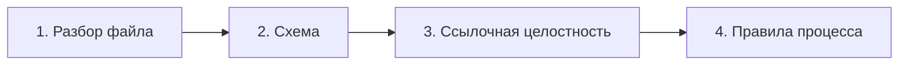

# Проверки и нарушения

То, ради чего инструмент существует. Проверки идут в четыре слоя, и каждый
следующий имеет смысл только если прошёл предыдущий.

Ошибка на файле не останавливает разбор остальных: негодный файл попадает в
индекс со своей ошибкой и виден в списке нарушений.

## Серьёзность

| Уровень | Что означает | Что делает приложение |
|---|---|---|
| `error` | Формат или процесс нарушены | Блокирует связанные действия, показывает первым |
| `warning` | Похоже на недосмотр, но работать можно | Показывает списком, ничего не блокирует |

Кнопкой ошибку обойти нельзя. Это осознанно: правило, которое можно
проигнорировать одним нажатием, перестаёт быть правилом.

## Коды нарушений

### Разбор и схема

| Код | Уровень | Когда |
|---|---|---|
| `parse_failed` | error | Файл не разбирается: нет front matter, битый YAML |
| `schema_invalid` | error | Front matter не проходит схему; в сообщении — поле и причина |
| `id_mismatch` | error | Идентификатор не соответствует типу или папке |
| `id_duplicate` | error | Один идентификатор в двух файлах |
| `title_mismatch` | warning | Заголовок первого уровня не совпадает с `title` |
| `unknown_type` | warning | Тип записи не из списка контракта |

Слои не дублируют друг друга. Незнакомый тип не активирует ни одну из
привязанных к типу ветвей схемы, поэтому запись проверяется только общей
частью: выдаётся `unknown_type`, а ошибка схемы на поле `type` подавляется —
иначе обещание «файл показывается как есть» невыполнимо. Запись остаётся узлом
графа: ссылки на неё не ломаются, но её собственные связи на допустимость типов
не проверяются.

Несоответствие «префикс ↔ тип ↔ папка» — это `id_mismatch`, и ошибка схемы на
поле `id` при этом подавляется. Идентификатор, не похожий на идентификатор
вовсе (`T-12`), остаётся `schema_invalid`: чинить надо форму, а не тип.

### Связи

| Код | Уровень | Когда |
|---|---|---|
| `link_broken` | error | Ссылка на несуществующий идентификатор |
| `link_cycle` | error | Цикл в `depends_on` |
| `link_wrong_type` | error | Связь ведёт к записи неподходящего типа: `implements` не на требование |
| `superseded_without_successor` | error | Статус `superseded`, но никто не ссылается `supersedes` |
| `code_link_missing` | warning | Ссылка на файл кода, которого нет: код переехал |

### Процесс

| Код | Уровень | Когда |
|---|---|---|
| `task_not_ready_docs` | error | Задача `ready` или `in_progress`, а её `documents` или `refines` не подтверждены |
| `task_no_requirement` | error | Задача `ready` и дальше без единой `implements` |
| `task_done_unverified` | error | Задача `done`, а её проверки не `passed`; при включённой политике |
| `transition_forbidden` | error | Запрошен переход, которого нет в схеме статусов |
| `requirement_unverified` | warning | Требование `approved` без единой `verified_by` |
| `requirement_unimplemented` | warning | Требование `approved`, на которое не ссылается ни одна задача |
| `doc_changed_after_task` | warning | Документ изменён позже, чем закрыта задача, которая его правила |
| `task_stale` | warning | Задача в `in_progress` дольше `stale_in_progress_days` |
| `verification_never_run` | warning | Проверка есть, прогонов не было |

## Сообщения

Каждое нарушение несёт: код, уровень, идентификатор записи, путь к файлу и
объяснение по-русски — что именно не так и что сделать.

Плохо: «Ошибка валидации T-0002».
Хорошо: «Задача T-0002 не может уйти в разработку: документ D-0004 в статусе
`review`. Подтвердите документ или снимите связь».

Разница не косметическая: первое сообщение заставляет искать, второе — чинить.

## Тестируемость

Правила — чистые функции, поэтому всё внешнее приходит параметром: сегодняшняя
дата, политика из манифеста, раздел, к которому отнесён файл, результаты
последних прогонов картой `V-0001 → passed|failed|skipped` и список
существующих файлов кода. Ни часов, ни файловой системы внутри правил нет —
иначе тест на `task_stale` начнёт зависеть от календаря.

`task_stale` считает срок от поля `updated`, `doc_changed_after_task` сравнивает
`updated` документа с `updated` закрытой задачи. `transition_forbidden` отвечает
не на «что не так в наборе записей», а на «можно ли выполнить запрошенный
переход», поэтому это отдельная функция от записи и целевого статуса; вызывает
её действие процесса, а не общий проход.

Правила живут в `server/lib/rules.ts` чистыми функциями над списком записей.
Тест выглядит так: набор записей на входе — ожидаемый список кодов на выходе.
Файловой системы в этих тестах нет.

Для каждого кода из таблиц выше обязателен хотя бы один тест — и на срабатывание,
и на отсутствие ложного срабатывания. Правило, у которого нет теста на второе,
рано или поздно начинает мешать работать.
