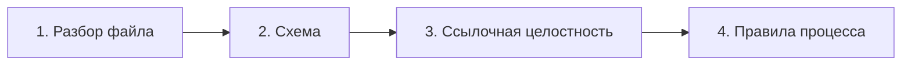

# Проверки и нарушения

То, ради чего инструмент существует. Проверки идут в четыре слоя, и каждый
следующий имеет смысл только если прошёл предыдущий.

```mermaid
flowchart LR
    l1["1. Разбор файла"] --> l2["2. Схема"]
    l2 --> l3["3. Ссылочная целостность"]
    l3 --> l4["4. Правила процесса"]
```

Ошибка на файле не останавливает разбор остальных: негодный файл попадает в
индекс со своей ошибкой и виден в списке нарушений.

Разбор трогает не всё подряд. Файл в `docs/development`, который не начинается
с `---`, — не запись, а справочный текст рядом: README папки, вендоренная
копия документации формата, что угодно ещё. Такой файл не разбирается и не
попадает в нарушения вовсе — ему нечего чинить, потому что он не пытался быть
записью. Начал с `---`, но дальше не разобрался — это уже `parse_failed`:
такой файл заявил о себе как о записи и не смог.

## Серьёзность

| Уровень | Что означает | Что делает приложение |
|---|---|---|
| `error` | Формат или процесс нарушены | Блокирует связанные действия, показывает первым |
| `warning` | Похоже на недосмотр, но работать можно | Показывает списком, ничего не блокирует |

Кнопкой ошибку обойти нельзя. Это осознанно: правило, которое можно
проигнорировать одним нажатием, перестаёт быть правилом.

## Коды нарушений

### Разбор и схема

| Код | Уровень | Когда |
|---|---|---|
| `parse_failed` | error | Файл начинается с `---`, но дальше не разбирается: битый YAML, front matter — не набор полей |
| `schema_invalid` | error | Front matter не проходит схему; в сообщении — поле и причина |
| `id_mismatch` | error | Идентификатор не соответствует типу или папке |
| `id_duplicate` | error | Один идентификатор в двух файлах |
| `title_mismatch` | warning | Заголовок первого уровня не совпадает с `title` |
| `unknown_type` | warning | Тип записи не из списка контракта |

Слои не дублируют друг друга. Незнакомый тип не активирует ни одну из
привязанных к типу ветвей схемы, поэтому запись проверяется только общей
частью: выдаётся `unknown_type`, а ошибка схемы на поле `type` подавляется —
иначе обещание «файл показывается как есть» невыполнимо. Запись остаётся узлом
графа: ссылки на неё не ломаются, но её собственные связи на допустимость типов
не проверяются.

Несоответствие «префикс ↔ тип ↔ папка» — это `id_mismatch`, и ошибка схемы на
поле `id` при этом подавляется. Идентификатор, не похожий на идентификатор
вовсе (`T-12`), остаётся `schema_invalid`: чинить надо форму, а не тип.

`schema_invalid` молчит на записи в статусе `dropped`, `superseded` или
`rejected`: содержание отставленной записи не читается как текущее, и
недостающее поле — не дело, которое кому-то доделывать. Та же запись,
дошедшая до отставленного статуса со сломанной схемой (заводили вручную, в
обход приложения), остаётся видимой через `supersedes` у преемника — просто
не соревнуется за внимание с тем, что действительно ждёт правки. То же самое
у `map_invalid` — ниже.

### Связи

| Код | Уровень | Когда |
|---|---|---|
| `link_broken` | error | Ссылка на несуществующий идентификатор |
| `link_cycle` | error | Цикл в `depends_on` |
| `link_wrong_type` | error | Связь ведёт к записи неподходящего типа: `implements` не на требование |
| `superseded_without_successor` | error | Статус `superseded`, но никто не ссылается `supersedes` |
| `code_link_missing` | warning | Ссылка на файл кода, которого нет: код переехал |
| `doc_link_missing` | warning | Ссылка на документ, которого нет: файл переименован или удалён |

### Карты

| Код | Уровень | Когда |
|---|---|---|
| `map_invalid` | error | Блок карты не разбирается или не проходит свою схему; молчит на `dropped`/`superseded`/`rejected` — см. выше |
| `map_evidence_missing` | error | В свидетельстве указан файл, которого нет |
| `map_evidence_stale` | error | Файл есть, а фрагмента в нём нет: код уехал из-под карты |
| `map_drift` | error | Задача закрыта, но код разошёлся с утверждённой картой |
| `task_maps_unapproved` | error | Задача с `change: feature` в `ready` и дальше, а её карта не подтверждена |
| `map_capability_missing` | warning | Задача с `change: feature` в `in_review` и дальше, а ни одна из её карт не объявляет возможность функциональной карты (`capabilities` в `added`): функция сделана, а в источнике правды её нет ([08-usage.md](08-usage.md), «Правила реализации»). Раньше `in_review` не срабатывает — карта-намерение на пачку задач пуста по замыслу |
| `capability_ahead` | warning | Нижняя возможность помечена «Реализовано», а **ни одна** из связанных с ней задач не закрыта: отметка опередила факт. Связь — через `affects` ([07-maps.md](07-maps.md), «Покрытие процессом»). Задач нет вовсе — молчит: отметку нечем проверять, и это не расхождение, а «нет следа» на экране |
| `capability_behind` | warning | У нижней возможности есть связанные задачи, и **все** закрыты, а она «Не реализовано» или не оценена: сделали и не отметили ([08-usage.md](08-usage.md), «Правила реализации»: закрыта задача — отметь возможность) |
| `capability_verification_failed` | warning | Нижняя возможность «Реализовано» или «Частично», а связанная проверка по последнему отчёту провалена |
| `change_missing` | warning | У задачи в `ready` и дальше не указано `change`. Тем же условием держится переход в `ready`: задача без `change` дальше `backlog` не уходит, а не уходит и получает нарушение |

Три `capability_*` читают только **подтверждённые** карты: отметка из черновика в
общую картину не входит, и спорить с ней рано. Висят они на карте, в которой
возможность объявлена последней (`declaredBy`), — именно там стоит отметка,
которую надо поправить или подтвердить. «Ни одна» и «все» выбраны не случайно:
связь возможности с задачей идёт через карту и точна только до неё, поэтому
правило срабатывает на очевидном — когда расходятся все связанные задачи, а не
одна из десятка. Родителей эти правила не касаются: у них состояние производное.

### Архитектура

Проверка по подтверждённой карте кода, без модели; висят на карте, объявившей
импорт (`declaredBy`). Правила — в [07-maps.md](07-maps.md), «Модули и публичный
вход». Включаются секцией `architecture` манифеста; нет секции — нет проверки.

| Код | Уровень | Когда |
|---|---|---|
| `arch_entry_bypassed` | warning | Импорт снаружи модуля идёт в его внутренность, а не во вход |
| `arch_parent_import` | warning | Подмодуль импортирует своего родителя |
| `arch_sibling_import` | warning | Соседние модули обращаются друг к другу при `siblings: via-parent` |
| `arch_cycle` | warning | Модули одного уровня зависят друг от друга по кругу |
| `arch_shared_imports_domain` | warning | `shared` импортирует `kernel` или доменный модуль |
| `arch_kernel_imports_domain` | warning | `kernel` импортирует доменный модуль |
| `arch_layer_up` | warning | Слои: импорт вверх |
| `arch_slice_cross` | warning | Слои при `slices: isolated`: срез импортирует соседний срез своего слоя (кроме `@x`) |
| `arch_promote` | warning | Внутренность модуля используется из двух веток: пора поднять к ближайшему общему предку. Самый тихий: на карточке модуля, в счёт нарушений не входит |

Покрытие называется числом: «проверено 412 из 479 импортов» — файлы языков без
входа и не попавшие в карту в проверку не входят, и экран об этом говорит.

### Выполнение

| Код | Уровень | Когда |
|---|---|---|
| `work_unreviewed` | warning | Задача отдана модели, а дифф не разобран |
| `work_branch_orphan` | warning | Задача закрыта или отменена, а её ветка осталась |

### Процесс

| Код | Уровень | Когда |
|---|---|---|
| `task_not_ready_docs` | error | Задача `ready` или `in_progress`, а её `documents` или `refines` не подтверждены |
| `task_no_requirement` | error | Задача `ready` и дальше без единой `implements` |
| `task_done_unverified` | error | Задача `done`, а её проверки не `passed`; при включённой политике |
| `code_sources_empty_after_feature` | warning | `feature`-задача дошла до `in_review`/`done`, а `sources.code` в манифесте пуст |
| `transition_forbidden` | error | Запрошен переход, которого нет в схеме статусов |
| `requirement_unverified` | warning | Требование `approved` без единой `verified_by` |
| `requirement_unimplemented` | warning | Требование `approved`, на которое не ссылается ни одна задача |
| `doc_changed_after_task` | warning | Документ изменён позже, чем закрыта задача, которая его правила |
| `task_stale` | warning | Задача в `in_progress` дольше `stale_in_progress_days` |
| `verification_never_run` | warning | Проверка есть, прогонов не было |

## Сообщения

Каждое нарушение несёт: код, уровень, идентификатор записи, путь к файлу и
объяснение по-русски — что именно не так и что сделать.

Плохо: «Ошибка валидации T-0002».
Хорошо: «Задача T-0002 не может уйти в разработку: документ D-0004 в статусе
`review`. Подтвердите документ или снимите связь».

Разница не косметическая: первое сообщение заставляет искать, второе — чинить.

## Тестируемость

Правила — чистые функции, поэтому всё внешнее приходит параметром: сегодняшняя
дата, политика из манифеста, раздел, к которому отнесён файл, результаты
последних прогонов картой `V-0001 → passed|failed|skipped` и список
существующих файлов — и кода, и документов. Ни часов, ни файловой системы внутри правил нет —
иначе тест на `task_stale` начнёт зависеть от календаря.

`task_stale` считает срок от поля `updated`, `doc_changed_after_task` сравнивает
`updated` документа с `updated` закрытой задачи. `transition_forbidden` отвечает
не на «что не так в наборе записей», а на «можно ли выполнить запрошенный
переход», поэтому это отдельная функция от записи и целевого статуса; вызывает
её действие процесса, а не общий проход.

Правила живут в `server/lib/rules.ts` чистыми функциями над списком записей.
Тест выглядит так: набор записей на входе — ожидаемый список кодов на выходе.
Файловой системы в этих тестах нет.

Для каждого кода из таблиц выше обязателен хотя бы один тест — и на срабатывание,
и на отсутствие ложного срабатывания. Правило, у которого нет теста на второе,
рано или поздно начинает мешать работать.
