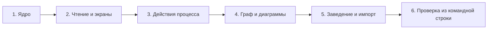

# Фазы реализации

Порядок выбран так, чтобы польза появилась до интерфейса. Ядро — разборщик,
валидатор и правила — и есть продукт; экраны над ним тонкие.

## Фаза 1. Ядро

Разбор, проверка, граф, правила — чистые функции без Nuxt и без файловой
системы.

- `parse.ts`: front matter и тело, сохранение порядка ключей и переводов строк.
- `schema.ts`: Ajv и три схемы из [schemas/](schemas/); приведение дат к строке
  до проверки.
- `graph.ts`: обратные связи, поиск циклов.
- `rules.ts`: все коды из [05-validation.md](05-validation.md).
- `reports.ts`: свёртка отчётов прогонов в «последний результат проверки» —
  правилам он нужен параметром, чтение файлов остаётся фазе 4.
- `analyze.ts`: сборка прохода над содержимым файлов, переданным снаружи.

**Готово, когда:** на наборе файлов-примеров получается ожидаемый список
нарушений, у каждого кода есть тест на срабатывание и на молчание. Интерфейса
ещё нет — и это нормально.

## Фаза 2. Чтение и экраны

- Каркас: Nuxt 4 и Nuxt UI как дизайн-система
  ([adr/0005-nuxt-ui.md](adr/0005-nuxt-ui.md)).
- Nitro: `paths.ts` с проверкой корня, чтение проекта, сборка индекса, кэш в
  `.docdd/index.json`.
- Маршруты чтения из [03-server-api.md](03-server-api.md).
- Экраны: проекты, обзор, задачи, требования, запись, нарушения.

**Готово, когда:** на реальном проекте видно состояние работы и список
нарушений, и по ним можно кликать. Кнопок изменения ещё нет.

## Фаза 3. Действия процесса

- Запись front matter с сохранением незнакомых полей и переводов строк.
- Сторож тела документа перед каждой записью
  ([02-workspace-contract.md](02-workspace-contract.md)): не сошлось — не пишем.
- Журнал: строка о смене статуса.
- Проверка переходов на сервере, отказ с перечнем блокирующего.
- Кнопки на экране записи, неактивные — с причиной рядом.

**Готово, когда:** задачу можно провести от `backlog` до `done`, а запрещённый
переход объясняет, что мешает. Дифф в git после смены статуса — две-три строки.

## Фаза 4. Граф и диаграммы

- Отрисовка mermaid из документов и из `.mmd`-файлов.
- Граф записей: цвет по типу, форма по статусу, поиск висящих узлов.
- Чтение отчётов прогонов, покрытие требований фактом.

**Готово, когда:** по графу видно, что на что опирается, а в требованиях —
какие подтверждены прогоном, а какие только объявлены.

## Фаза 5. Заведение и импорт

- Создание формата в пустом проекте: манифест, папки, первая запись.
- Обзор существующей документации: что нашли, какого типа, есть ли front matter.
- План переноса таблицей, который человек правит перед применением.
- Применение плана: перемещение файлов и добавление front matter. Текст не
  меняется.

**Готово, когда:** проект с готовой документацией заводится в формате за один
проход, и после этого не остаётся ошибок разбора.

Разметку предлагает человек в своём инструменте — приложение не обращается к
языковым моделям ([ADR-0003](adr/0003-no-llm-in-app.md)). Его дело — показать,
что найдено, и аккуратно применить утверждённый план.

## Фаза 6. Проверка из командной строки

Вторая точка входа в то же ядро: `docdd check <путь>` проходит проект и печатает
список нарушений.

- Код возврата `1` — если есть хотя бы одна **ошибка**. Предупреждения выводятся
  и на код возврата не влияют: правило, которое валит сборку, обязано быть
  правилом, а не мнением ([05-validation.md](05-validation.md)).
- Вывод в двух видах: для человека и `--json` для сборки.
- Ничего не пишет: ни файлов, ни кэша.

**Готово, когда:** сборка проекта падает на нарушении процесса раньше, чем
кто-нибудь откроет браузер.

Это не отход от «браузерного приложения»: ядро одно, а командная строка —
единственный способ вставить проверку в чужой конвейер, у которого нет экрана.

## Чего в планах нет

- Совместной работы и синхронизации между машинами.
- Правки текста документов.
- Запуска сборок, тестов и агентов.
- Веб-размещения с аутентификацией.

Каждый пункт — отдельное решение, а не «руки не дошли».
