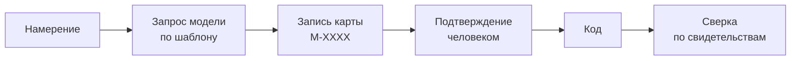

# Карты проекта

Три карты отвечают на вопросы, которых нет в записях процесса: из чего состоит
кодовая база, откуда и куда текут данные, какими путями ходит человек по
экранам. Вместе они дают разрез — от клика до модуля.

Решение и его границы: [adr/0007-maps-lead-code.md](adr/0007-maps-lead-code.md).

## Порядок



Запрос собирает приложение и отдаёт его модели через Claude Code на этой же
машине ([adr/0008-llm-through-claude-code.md](adr/0008-llm-through-claude-code.md)).
Ответ ложится **черновиком** записи и ждёт человека: карта, которую никто не
читал, ничего не подтверждает.

## Опись файлов

Карта строится не «за один взгляд на проект», а по описи — списку файлов кода
из `sources.code`, у каждого из которых приложение считает отпечаток
содержимого.

Опись отвечает на три вопроса, и все три раньше висели в воздухе:

| Вопрос | Ответ описи |
|---|---|
| Есть ли что описывать | Файлов нет — проект пуст, и приложение говорит это, не тратя ни одного запроса |
| Что ещё не описано | Файл, которого нет ни в одной подтверждённой карте |
| Что описано неправдой | Файл, чей отпечаток изменился после того, как карта была подтверждена |

**Запрос называет файлы поимённо** — только новые и изменившиеся, а не «разбери
проект». Уже описанное не переописывается: это и есть экономия, ради которой
опись заведена. Удалённые файлы называются отдельно: их надо объявить убранными,
иначе карта останется помнить то, чего нет.

Файлов к описанию больше **порции** — берётся первая порция. Размер порции
задаёт проект: `policy.map_portion_files` в манифесте, по умолчанию 40. Больше —
меньше заходов, но выше риск, что ответ не поместится и модель начнёт частить;
у каждого проекта это по-своему, поэтому число не зашито в код.
Остальное описывается следующим заходом, и на экране видно, сколько осталось:
большой проект описывается за несколько подходов, а не одним ответом, который
всё равно не поместится.

**Отпечатки записываются при подтверждении карты, а не при получении ответа.**
Неподтверждённый черновик не должен «съедать» файлы из очереди: иначе отклонили
черновик — и файлы считаются описанными, хотя их не описал никто.

### Отпечаток считается не всегда

Рядом с отпечатком опись держит размер файла и время изменения. Совпали оба —
содержимое не читается вовсе, берётся прошлый отпечаток: перечитывать тысячу
файлов ради ответа «ничего не изменилось» — та самая лишняя работа, которой
опись и должна избегать.

Размер и время — **ориентир, а не доказательство**: их можно подделать, и при
переносе проекта они меняются сами. Решает всё равно отпечаток — просто
считается он только там, где ориентир разошёлся.

Проход сохраняет посчитанное сразу, а не в конце: прервали на середине —
уцелеет то, что успели, и следующий проход продолжит, а не начнёт заново.

## Ответ не прошёл схему

Схема закрыта, и это правильно: карта, собранная из полей «на вкус модели»,
перестаёт быть общим языком. Но выбрасывать разбор сорока файлов из-за одного
лишнего ключа — расточительство, а не строгость.

Поэтому у неудачи есть второй ход: **«Попросить поправить»**. Приложение
отправляет модели её же ответ и претензии схемы дословно — и просит вернуть
исправленные блоки. Файлы заново не разбираются: работа уже сделана, чинится
только форма.

Правка формы — не смягчение проверки. Ответ проверяется той же схемой и так же
отвергается, если снова не сошёлся. Приложение по-прежнему не переписывает ответ
само: правит модель, проверяет приложение, подтверждает человек.

Не помогло и со второго раза — значит дело не в опечатке: сузьте порцию или
опишите руками. Ответ никуда не девается, он на экране.

## Опись теряет силу вместе с картой

Опись копится добавлением: подтвердили карту — файлы отметились описанными
навсегда. Если карту потом пометили `superseded`, отметка не снимается сама —
опись продолжает считать эти файлы описанными, хотя их описание больше не
входит ни в какую картину.

Так файл может застрять: он не в картине (карта, которая его описывала,
заменена), но и не в очереди (опись всё ещё помнит его описанным). Без починки
такой файл не попадёт модели на глаза никогда снова.

Кнопка **«Пересчитать опись»** возвращает файлам честное состояние: описанным
считается только то, что покрыто **действующими** подтверждёнными картами.
Всё остальное возвращается в очередь — как будто описания и не было.

Это не удаление данных: сами карты остаются в `docs/development` без
изменений, пересчитывается только опись — расходный кэш в `.docdd`. Файл,
который какая-то другая подтверждённая карта по-прежнему покрывает,
описанным и останется.

## Не всё попадает в карту

Картинка, файл ресурсов, тема, заготовка теста — не модули. Модель их в карту
не кладёт, и правильно делает: `colors.xml` ничего не описывает, а PNG тем
более.

Но опись раньше знала только два состояния — «описан» и «ждёт очереди», — и
такой файл возвращался в очередь бесконечно: приложение называло его, модель
молча пропускала, в карте его не было, опись ставила его обратно. Круг замыкался
и не размыкался ничем.

Поэтому у ответа есть четвёртый блок:

````
```docdd-skipped
{ "files": [ { "path": "app/src/main/res/values/colors.xml", "why": "ресурс, не модуль" } ] }
```
````

**Причина обязательна.** Файл уходит из очереди не потому, что его пропустили, а
потому, что по нему принято решение — и решение это записано словами, которые
человек читает вместе с картой.

Отметка ставится **при подтверждении карты**, как и у описанного: пока карту не
приняли, ничьё мнение о файлах ничего не меняет.

Файл потом изменился — возвращается в очередь, как и описанный: содержимое
другое, и прежнее решение могло устареть.

На экране это третья цифра: **описано / не в карте / ждут очереди**. За каждой —
список, а у «не в карте» ещё и причина.

### Что лежит в описи

```json
{
  "version": 1,
  "files":     { "app/src/a.kt": { "size": 1234, "mtime": 1756718400000, "hash": "9f2c…" } },
  "described": { "app/src/a.kt": "9f2c…" }
}
```

Два раздела с разным смыслом. `files` — кэш отпечатков: ускоряет проход и
больше ни на что не влияет. `described` — что было описано и с каким отпечатком
**на момент подтверждения карты**.

Опись лежит в `.docdd` и потому расходная: удалили — следующий заход перечитает
всё заново. Потеряется только экономия, не правда: правда живёт в подтверждённых
записях.

Прерывания ведут себя по-разному, и путать их нельзя:

| Что прервали | Что уцелело |
|---|---|
| Проход и подсчёт отпечатков | Всё, что успели посчитать: следующий проход продолжит |
| Запрос к модели, отмена, отклонённый черновик | В `described` не попадает ничего — файлы остаются в очереди |
| Приняли карту | Отмечены её файлы, и только они |

## Запись карты

Одно изменение — одна запись типа `map` в папке `maps/`. В ней сразу все три
структуры: читается целиком, подтверждается одним действием, в git даёт один
дифф.

```markdown
---
id: M-0007
type: map
title: Вынести веса модели клёва в документ знаний
status: review
created: 2026-08-31
updated: 2026-08-31
---

# Вынести веса модели клёва в документ знаний

Что меняется в устройстве и почему именно так.

## Кодовая база

```docdd-codemap
{ "added": { "modules": [...], "imports": [...] }, "removed": { "imports": [...] } }
```

## Потоки данных

```docdd-dataflow
{ "added": { "sources": [...], "flows": [...] } }
```

## Пользовательские пути

```docdd-userflow
{ "added": { "screens": [...], "transitions": [...], "calls": [...] } }
```
```

Блок, которого нет, означает «эта структура не меняется». Пустой блок и
отсутствующий — одно и то же; писать `{}` ради полноты не нужно.

Задача объявляет карту связью `affects`. Обратную строит приложение, поэтому на
экране задачи карта видна рядом, а на экране карты — задачи, которые её меняют.

## Свидетельство

Каждое ребро несёт путь, строку и фрагмент текста, из которого сделан вывод:

```json
{ "path": "server/lib/cache.ts", "line": 34, "fragment": "writeFileSync(path" }
```

Утверждение без свидетельства картой не считается — это мнение. Строка
однобайтовая условность, поэтому сверка ищет фрагмент **в указанной строке или в
трёх соседних**: сдвиг на пару строк не должен ронять карту, а переезд в другой
файл — должен.

## Сверка

| Когда | Что проверяется |
|---|---|
| Карта `approved`, задача не закрыта | Ничего. Карта описывает намерение, кода ещё нет — это план, а не расхождение |
| Задача `done` | Объявленное добавленным — есть в коде. Объявленное убранным — отсутствует |

Второе важнее первого: удалить строку и забыть про карту легче, чем добавить.

## Структуры

### Кодовая база

| Что | Поля |
|---|---|
| `modules` | `id` — путь от корня проекта, `title`, `layer` — слой на усмотрение проекта |
| `imports` | `from`, `to`, `evidence` |

Отвечает на: из чего состоит проект, что на что опирается, где циклы и куски, на
которые никто не ссылается.

### Потоки данных

| Что | Поля |
|---|---|
| `sources` | `id`, `kind`: `file`, `http`, `db`, `queue`, `env`, `memory`; `where` — путь или адрес |
| `flows` | `from`, `to`, `direction`: `read`, `write`, `both`; `evidence` |

Отвечает на: откуда данные приходят, где лежат, куда уходят и кто их трогает.

### Пользовательские пути

| Что | Поля |
|---|---|
| `screens` | `id` — маршрут, `title`, `file` |
| `transitions` | `from`, `to`, `trigger`, `evidence` |
| `calls` | `from` — экран, `to` — маршрут API, `evidence` |

Отвечает на: какие экраны есть, как между ними ходят, что каждый дёргает.
`calls` и сшивает пользовательские пути с потоками данных.

Схемы: [schemas/codemap.schema.json](schemas/codemap.schema.json),
[schemas/dataflow.schema.json](schemas/dataflow.schema.json),
[schemas/userflow.schema.json](schemas/userflow.schema.json).

## Общая карта проекта

Утверждается изменение, а не состояние. Текущая картина — **производное**:
приложение складывает подтверждённые карты в порядке подтверждения, применяя
`added` и `removed`. Её можно удалить и пересобрать; своей копии правды не
заводится.

Отсюда требование к каждой карте: называть не только добавленное, но и
**убранное**. Иначе картина будет только расти, и модуль, удалённый полгода
назад, останется на ней навсегда.

Карты в статусах `draft`, `review` и `dropped` в общую картину не входят: пока
человек не подтвердил, это черновик, а не устройство проекта.

## Запуск работы

| `change` у задачи | Что требуется |
|---|---|
| `feature` | Подтверждённая карта. Нет — задача не уходит в `ready` |
| `fix` | Починка дефекта: карта не требуется |
| `rename` | Переименование внутреннего: карта не требуется |
| `format` | Форматирование и опечатки: карта не требуется |

Исключения — те же, что в правиле «документ ведёт код». Разница в том, что здесь
исключение **записано в самой задаче** и видно в дифф и в журнале. Обход остаётся
возможным и перестаёт быть незаметным: правило, которое нельзя обойти, обходят
мимо инструмента.

## Чего карты не делают

- Не считают метрик: техдолга, дублирования, уязвимостей. Это работа SonarQube и
  подобных.
- Не разбирают синтаксис. Приложение сверяет строки, а не строит AST — поэтому
  язык проекта значения не имеет.
- Не строятся приложением. Оно не обращается к языковым моделям
  ([adr/0003-no-llm-in-app.md](adr/0003-no-llm-in-app.md)).
