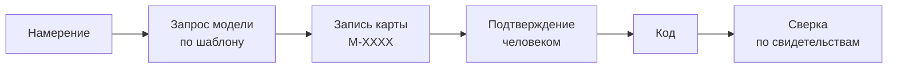

# Карты проекта

Три карты отвечают на вопросы, которых нет в записях процесса: из чего состоит
кодовая база, откуда и куда текут данные, какими путями ходит человек по
экранам. Вместе они дают разрез — от клика до модуля.

Решение и его границы: [adr/0007-maps-lead-code.md](adr/0007-maps-lead-code.md).

## Порядок


```mermaid
flowchart LR
    intent["Намерение"] --> ask["Запрос модели<br/>по шаблону"]
    ask --> record["Запись карты<br/>M-XXXX"]
    record --> approve["Подтверждение<br/>человеком"]
    approve --> code["Код"]
    code --> verify["Сверка<br/>по свидетельствам"]
```

Запрос собирает приложение и отдаёт его модели через Claude Code на этой же
машине ([adr/0008-llm-through-claude-code.md](adr/0008-llm-through-claude-code.md)).
Ответ ложится **черновиком** записи и ждёт человека: карта, которую никто не
читал, ничего не подтверждает.

## Опись файлов

Карта строится не «за один взгляд на проект», а по описи — списку файлов кода
из `sources.code`, у каждого из которых приложение считает отпечаток
содержимого.

Обход уважает `.gitignore` — свой в каждой папке, как и настоящий git: файл
или каталог, который проект сам назвал не своим кодом (`__pycache__/`,
`*.pyc`, `node_modules/`), в опись не попадает вовсе, а не спрашивается у
модели каждый заход только затем, чтобы каждый раз услышать «пропускаю».
`.git/` не видна всегда, даже если о ней никто не написал ни строки. Разбор
`.gitignore` — не полный движок: только имя файла/папки и маска с `*`
(`server/lib/ignore.ts`); правило с путём внутри (`src/generated/`) или
отрицанием (`!keep.txt`) молча пропускается — смолчать безопаснее, чем
исключить не то.

Опись отвечает на три вопроса, и все три раньше висели в воздухе:

| Вопрос | Ответ описи |
|---|---|
| Есть ли что описывать | Файлов нет — проект пуст, и приложение говорит это, не тратя ни одного запроса |
| Что ещё не описано | Файл, которого нет ни в одной подтверждённой карте |
| Что описано неправдой | Файл, чей отпечаток изменился после того, как карта была подтверждена |

**Запрос называет файлы поимённо** — только новые и изменившиеся, а не «разбери
проект». Уже описанное не переописывается: это и есть экономия, ради которой
опись заведена. Удалённые файлы называются отдельно: их надо объявить убранными,
иначе карта останется помнить то, чего нет.

Файлов к описанию больше **порции** — берётся первая порция. Размер порции
задаёт проект: `policy.map_portion_files` в манифесте, по умолчанию 40. Больше —
меньше заходов, но выше риск, что ответ не поместится и модель начнёт частить;
у каждого проекта это по-своему, поэтому число не зашито в код.
Остальное описывается следующим заходом, и на экране видно, сколько осталось:
большой проект описывается за несколько подходов, а не одним ответом, который
всё равно не поместится.

**Отпечатки записываются при подтверждении карты, а не при получении ответа.**
Неподтверждённый черновик не должен «съедать» файлы из очереди: иначе отклонили
черновик — и файлы считаются описанными, хотя их не описал никто.

### Отпечаток считается не всегда

Рядом с отпечатком опись держит размер файла и время изменения. Совпали оба —
содержимое не читается вовсе, берётся прошлый отпечаток: перечитывать тысячу
файлов ради ответа «ничего не изменилось» — та самая лишняя работа, которой
опись и должна избегать.

Размер и время — **ориентир, а не доказательство**: их можно подделать, и при
переносе проекта они меняются сами. Решает всё равно отпечаток — просто
считается он только там, где ориентир разошёлся.

Проход сохраняет посчитанное сразу, а не в конце: прервали на середине —
уцелеет то, что успели, и следующий проход продолжит, а не начнёт заново.

## Ответ не прошёл схему

Схема закрыта, и это правильно: карта, собранная из полей «на вкус модели»,
перестаёт быть общим языком. Но выбрасывать разбор сорока файлов из-за одного
лишнего ключа — расточительство, а не строгость.

Поэтому у неудачи есть второй ход: **«Попросить поправить»**. Приложение
отправляет модели её же ответ и претензии схемы дословно — и просит вернуть
исправленные блоки. Файлы заново не разбираются: работа уже сделана, чинится
только форма.

Правка формы — не смягчение проверки. Ответ проверяется той же схемой и так же
отвергается, если снова не сошёлся. Приложение по-прежнему не переписывает ответ
само: правит модель, проверяет приложение, подтверждает человек.

Не помогло и со второго раза — значит дело не в опечатке: сузьте порцию или
опишите руками. Ответ никуда не девается, он на экране.

## Опись теряет силу вместе с картой

Опись копится добавлением: подтвердили карту — файлы отметились описанными
навсегда. Если карту потом пометили `superseded`, отметка не снимается сама —
опись продолжает считать эти файлы описанными, хотя их описание больше не
входит ни в какую картину.

Так файл может застрять: он не в картине (карта, которая его описывала,
заменена), но и не в очереди (опись всё ещё помнит его описанным). Без починки
такой файл не попадёт модели на глаза никогда снова.

Кнопка **«Пересчитать опись»** возвращает файлам честное состояние: описанным
считается только то, что покрыто **действующими** подтверждёнными картами.
Всё остальное возвращается в очередь — как будто описания и не было.

Это не удаление данных: сами карты остаются в `docs/development` без
изменений, пересчитывается только опись — расходный кэш в `.docdd`. Файл,
который какая-то другая подтверждённая карта по-прежнему покрывает,
описанным и останется.

## Не всё попадает в карту

Картинка, файл ресурсов, тема, заготовка теста — не модули. Модель их в карту
не кладёт, и правильно делает: `colors.xml` ничего не описывает, а PNG тем
более.

Но опись раньше знала только два состояния — «описан» и «ждёт очереди», — и
такой файл возвращался в очередь бесконечно: приложение называло его, модель
молча пропускала, в карте его не было, опись ставила его обратно. Круг замыкался
и не размыкался ничем.

Поэтому у ответа есть четвёртый блок:

````
```docdd-skipped
{ "files": [ { "path": "app/src/main/res/values/colors.xml", "why": "ресурс, не модуль" } ] }
```
````

**Причина обязательна.** Файл уходит из очереди не потому, что его пропустили, а
потому, что по нему принято решение — и решение это записано словами, которые
человек читает вместе с картой.

Отметка ставится **при подтверждении карты**, как и у описанного: пока карту не
приняли, ничьё мнение о файлах ничего не меняет.

Файл потом изменился — возвращается в очередь, как и описанный: содержимое
другое, и прежнее решение могло устареть.

На экране это третья цифра: **описано / не в карте / ждут очереди**. За каждой —
список, а у «не в карте» ещё и причина.

### Что лежит в описи

```json
{
  "version": 1,
  "files":     { "app/src/a.kt": { "size": 1234, "mtime": 1756718400000, "hash": "9f2c…" } },
  "described": { "app/src/a.kt": "9f2c…" }
}
```

Два раздела с разным смыслом. `files` — кэш отпечатков: ускоряет проход и
больше ни на что не влияет. `described` — что было описано и с каким отпечатком
**на момент подтверждения карты**.

Опись лежит в `.docdd` и потому расходная: удалили — следующий заход перечитает
всё заново. Потеряется только экономия, не правда: правда живёт в подтверждённых
записях.

Прерывания ведут себя по-разному, и путать их нельзя:

| Что прервали | Что уцелело |
|---|---|
| Проход и подсчёт отпечатков | Всё, что успели посчитать: следующий проход продолжит |
| Запрос к модели, отмена, отклонённый черновик | В `described` не попадает ничего — файлы остаются в очереди |
| Приняли карту | Отмечены её файлы, и только они |

## Запись карты

Одно изменение — одна запись типа `map` в папке `maps/`. В ней сразу все три
структуры: читается целиком, подтверждается одним действием, в git даёт один
дифф.

```markdown
---
id: M-0007
type: map
title: Вынести веса модели клёва в документ знаний
status: review
created: 2026-08-31
updated: 2026-08-31
---

# Вынести веса модели клёва в документ знаний

Что меняется в устройстве и почему именно так.

## Кодовая база

```docdd-codemap
{ "added": { "modules": [...], "imports": [...] }, "removed": { "imports": [...] } }
```

## Потоки данных

```docdd-dataflow
{ "added": { "sources": [...], "flows": [...] } }
```

## Пользовательские пути

```docdd-userflow
{ "added": { "screens": [...], "transitions": [...], "calls": [...] } }
```
```

Блок, которого нет, означает «эта структура не меняется». Пустой блок и
отсутствующий — одно и то же; писать `{}` ради полноты не нужно.

Задача объявляет карту связью `affects`. Обратную строит приложение, поэтому на
экране задачи карта видна рядом, а на экране карты — задачи, которые её меняют.

## Свидетельство

Каждое ребро несёт путь, строку и фрагмент текста, из которого сделан вывод:

```json
{ "path": "server/lib/cache.ts", "line": 34, "fragment": "writeFileSync(path" }
```

Утверждение без свидетельства картой не считается — это мнение. Строка
однобайтовая условность, поэтому сверка ищет фрагмент **в указанной строке или в
трёх соседних**: сдвиг на пару строк не должен ронять карту, а переезд в другой
файл — должен.

## Сверка

| Когда | Что проверяется |
|---|---|
| Карта `approved`, задача не закрыта | Ничего. Карта описывает намерение, кода ещё нет — это план, а не расхождение |
| Задача `done` | Объявленное добавленным — есть в коде. Объявленное убранным — отсутствует |
| Карту не меняет ни одна задача | Сверяется сразу — то же самое, что и после `done` |

Второе важнее первого: удалить строку и забыть про карту легче, чем добавить.

### Карта нового проекта: намерение без единой задачи

Третья строка таблицы — не про «код уже есть», а про честный пробел: если
задач с `affects` на карту ещё нет вовсе, сверять как будто нечему мешать —
опасное упрощение. Ровно так ловится карта, заведённая заранее для проекта,
которого ещё нет в коде: подтвердили карту раньше первой задачи — и тут же
получили ошибки `map_evidence_missing` по каждому объявленному модулю,
хотя ничего не сломано, просто до кода очередь не дошла.

Для этого случая у записи `map` есть необязательное поле `intent: true`.
Пока оно стоит, сверка не запускается вовсе, независимо от задач — карта
остаётся планом. Убрать поле (или поставить `false`) — значит заявить «код
уже есть, сверяйте»: обычная правка front matter, тем же способом, что и
любая другая. Отдельной кнопки для этого пока нет — правка через внешний
редактор ([04-ui.md](04-ui.md)).

Карта, заведённая через «Обновить карты» по уже существующему коду, поле не
ставит вовсе — она и так описывает то, что уже есть, сверка ей нужна сразу.

### На экране: полупрозрачность вместо тишины

Первые две строки таблицы «Сверка» раньше были видны только по счётчику
`unverified` и списку нарушений — само узлы и рёбра карты на экране
(`app/pages/projects/[id]/maps.vue`) выглядели неотличимо от давно
устоявшихся. Теперь узел или ребро, объявленное картой, которая ещё не
устоялась (стоит `intent: true`, либо задача с `affects` на неё не закрыта),
рисуется с прозрачностью 0.5 — и в 2D, и в 3D режиме диаграммы. Карточка при
клике называет причину словами: «не совпадает с кодовой базой — карта ещё не
устоялась» у узла, «сверка не запущена: карта ещё не устоялась» у ребра
(`MapInspector.vue`). Это то же самое понятие `pending`, что уже несёт
`settled()` в `checkMaps` (server/lib/rules.ts) и в экране одной записи
(server/api/projects/[id]/records/[recordId].get.ts) — здесь оно применено к
сложенной картине всего проекта (`server/lib/maps.ts`, `annotatePending`), а
не к одной карте.

Кнопка **«Завести задачу-реализацию»** рядом с сохранённым черновиком карты
(экран «Карты») заводит задачу того же вида, что уже требует правило
`task_maps_unapproved`: `change: feature`, связь `affects` на новую карту,
статус `draft`. Она не подтверждает ни карту, ни задачу сама — обе ждут
человека порознь, — а только избавляет от похода на экран задач за той же
самой связью, которую иначе пришлось бы набирать руками.

## Структуры

### Кодовая база

| Что | Поля |
|---|---|
| `modules` | `id` — уникальный идентификатор (путь или логическое имя), `title`, `layer` — слой на усмотрение проекта, `path` — файл, где модуль определён, `summary` — что делает, `api` — публичный интерфейс |
| `imports` | `from`, `to`, `evidence` |
| `groups` | `id`, `title`, `summary`, `parent`, `paths`, `modules`, `capability` — необязательные, без `evidence`; см. «Группы» ниже |

Отвечает на: из чего состоит проект, что на что опирается, где циклы и куски, на
которые никто не ссылается.

`id` — не обязательно путь: dotted-имя пакета (`gastrograf.catalog.usda`) читается
не хуже, если проект так называет свои модули. А вот `path`, когда он есть, —
всегда буквальный путь от корня проекта, без исключений: по нему экран открывает
файл (04-ui.md, «Карты»), и придуманный путь откроет не то или ничего.
Агрегату из нескольких файлов, внешнему пакету или модулю, у которого один явный
файл и так следует из `id`, поле не нужно вовсе.

`summary` и `api` — необязательные, но именно они делают узел на диаграмме
полезным без похода в файл: `summary` в двух-трёх предложениях говорит, зачем
модуль в проекте, а `api` — список того, что из него импортируют: `name`, `kind`
(`class`, `function`, `type`, `const`, `component`), `summary` в одну фразу и
`signature` — входы и выход одной строкой. Это не сверяется с кодом построчно,
как `evidence` у связи, — это то же обещание, что и `title`: человек прочитал
файл и записал, за что тот отвечает. Карточка узла (04-ui.md, «Карты»)
показывает `summary` и `api` рядом с файлом.

#### Группы: уровень над модулями

Слой режет проект горизонтально — «ядро», «интерфейс», «маршруты», и в каждом
лежат модули всех подсистем. Читателю же нужна вертикаль: «Граф знаний»,
«Аккаунт», «AI-шлюз» — то, что на языке функциональной карты называется
возможностью. **Группа** — этот уровень: сущность со своим названием и
описанием, из нескольких модулей. На большом проекте экран начинает с групп
и их связей и лишь по клику показывает модули одной группы (04-ui.md,
«Группы кодовой карты»).

Группа — **суждение**, как `layer` и `summary`, а не факт о коде: сверять её со
строкой нечем, поэтому у `groups` нет `evidence`, и подтверждает её человек,
как всю карту. Состав — двумя путями, которые работают вместе.

**Автоматические группы.** Не требуют ничего: на любом проекте и на любой уже
подтверждённой карте обзор строится сразу. Правило одно и считается чистой
функцией (`server/lib/groups.ts`):

| У модуля | Группа |
|---|---|
| Есть `path` (или `id` — путь: есть `/` и расширение) | Первые два сегмента **каталога** файла: `server/lib/maps.ts` → `server/lib`, `app/pages/projects/[id]/maps.vue` → `app/pages` |
| Файл в корне, либо каталог из одного сегмента | Этот сегмент, либо `(корень)` |
| Нет пути, `id` — dotted-имя пакета | Первые два сегмента без последнего: `gastrograf.catalog.usda` → `gastrograf.catalog` |
| Ничего из этого | `Прочее` |

Модуль, названный только в `imports` и не объявленный в `modules`, попадает в
группу по тому же правилу — иначе связь повисла бы на группе без единого
участника.

Название автоматической группы — её ключ, `summary` нет, на экране она
помечена «авто». Это отправная точка, а не результат: каталоги не всегда
совпадают с устройством, поэтому есть вторая часть.

**Объявленные группы.** Поле `groups` в блоке `docdd-codemap`, в `added` и
`removed` — как у модулей:

```json
{ "added": { "groups": [{
  "id": "knowledge",
  "title": "Граф знаний",
  "summary": "Хранит записи и связи между ними и отвечает на вопрос, что от чего зависит.",
  "paths": ["server/lib/graph", "server/lib/links"],
  "modules": ["app/components/GraphView.vue"],
  "capability": "knowledge-graph"
}] } }
```

| Поле | Что значит |
|---|---|
| `id` | Уникальное имя группы. Единственное обязательное поле |
| `title`, `summary` | Название и описание на языке предметной области: зачем группа, а не какие в ней файлы |
| `paths` | Префиксы путей: в группу входят все модули, чей `path` лежит под ними (по границе сегмента: `server/lib` не захватывает `server/library`). Новый файл в каталоге попадает в группу сам — переобъявлять сотни модулей не нужно |
| `modules` | `id` модулей, которые входят в группу поимённо — для тех, кто лежит не там, где живёт по смыслу |
| `parent` | `id` группы-родителя. Формат допускает вложенность любой глубины; **экран пока рисует один уровень** — модули подгруппы относятся к самой верхней группе цепочки |
| `capability` | `id` возможности функциональной карты, которую группа реализует. Только ссылка: возможность может иметь несколько групп, группа — одну возможность |

**Кому принадлежит модуль** — ровно одной группе, по порядку силы правила:
поимённый `modules` → самый длинный подходящий префикс из `paths` → автоматическая
группа. Два равных правила, называющих разные группы, разрешаются в пользу
объявленного позже (`foldMaps` — порядок подтверждения): это единственное
место, где побеждает порядок, а не смысл, — и честнее заявить это, чем
молча выбрать по алфавиту. Модуль, которого не коснулось ни одно объявление,
остаётся в автоматической группе: объявленные группы и автоматические
сосуществуют, и разметку можно вводить постепенно, начав с одной подсистемы.

Лишнее группа переживает, а не ломает: `parent` на несуществующую группу —
она считается верхней; `capability`, которой нет в функциональной карте, —
показывается как есть, с пометкой «такой возможности нет»; пустая группа
(ни одного модуля) на экране не рисуется. Ни то, ни другое новых нарушений не
заводит: это подсказки читателю, а не контракт.

**Связи между группами не объявляются — они считаются.** Все `imports`,
чьи концы лежат в разных группах, сворачиваются в одну связь «группа → группа»
с числом импортов. Сворачивание честное: связь «не сошлась» (`stale`,
`missing`, `still_present`), если не сошёлся хоть один из её импортов, и
`pending` только когда все они такие: расхождение не растворяется в сумме.
Развернув связь, читатель видит исходные
импорты со свидетельствами. Группы, взаимно зависящие друг от друга (цикл на
уровне групп), на обзоре подсвечены: на уровне модулей этот цикл распылён и не
виден, а как раз он говорит о неверной границе.

**Кнопка «Сгруппировать модули»** — тот же путь, что у «Обновить карты»:
приложение подставляет в запрос модули (`id`, `path`, слой, `summary`) и уже
объявленные группы, а ответ модели — блок `docdd-codemap` только с
`groups` — ложится черновиком записи `map` и ждёт подтверждения человеком
([prompts/groups.md](prompts/groups.md)). Модель предлагает границы, человек их
утверждает — а не наоборот.

**Правило границы.** Напрашивающееся продолжение — «между группами ходят только
через публичные модули» и нарушение, когда это не так. Пока его нет: чтобы оно
проверялось, группа должна объявлять свою публичную поверхность отдельно от
фактических импортов, а карточка группы уже показывает фактическую (модули, на
которые ссылаются снаружи). Объявлять второй список раньше, чем первый
проверен на реальных проектах, — риск завести обязательство, которое
расходится с кодом в тот же день. Вернёмся к нему, когда группы устоятся.

#### Крупная кодовая база

Сотни модулей и тысячи связей mermaid и рисует, и раскладывает — но не
бесплатно: полная перерисовка на плотном графе ощутимо подвешивает вкладку,
а результат — стена пересекающихся линий, в которой не разглядеть ни одной
подписи. Основной ответ — группы выше: на большом проекте экран стартует с
их обзора, а целиком показывает только одну группу за раз. Свидетельство и
слой у модуля от этого не перестают быть нужны — меняется только то, что
показано на экране по умолчанию: если группа (или, в режиме «Все модули», весь
проект) всё ещё больше 150 модулей, диаграмма стартует с одним, самым
маленьким слоем, а не со всеми разом (04-ui.md, «Карты»). Это чисто экранное
решение, не про формат: сама карта по-прежнему описывает все модули и связи
целиком, чипы слоёв лишь решают, что из уже подтверждённого показать на
диаграмме сейчас.

### Потоки данных

| Что | Поля |
|---|---|
| `sources` | `id`, `kind`: `file`, `http`, `db`, `queue`, `env`, `memory`; `where` — путь или адрес |
| `flows` | `from`, `to`, `direction`: `read`, `write`, `both`; `evidence` |

Отвечает на: откуда данные приходят, где лежат, куда уходят и кто их трогает.

**Группы и здесь.** Своих групп у потоков данных нет — берутся те, что у
кодовой карты (см. «Группы: уровень над модулями»): конец `from` потока,
являющийся модулем, относится к группе этого модуля; экран (`from` — маршрут) — к
группе `Экраны`; всё прочее — к `Прочее`. Источники сворачиваются по `kind`:
`db`, `queue`, `http`, `file`, `env`, `memory` — «все базы», «все очереди».
Обзор потоков — это «группы кода ↔ виды источников»: кто читает и пишет где,
а источники конкретной базы видны, когда открыта группа (04-ui.md, «Группы
кодовой карты»). Направление свёрнутой связи: `both`, если среди потоков есть
`both` либо и `read`, и `write`.

### Пользовательские пути

| Что | Поля |
|---|---|
| `screens` | `id` — маршрут, `title`, `file` |
| `transitions` | `from`, `to`, `trigger`, `evidence` |
| `calls` | `from` — экран, `to` — маршрут API, `evidence` |

Отвечает на: какие экраны есть, как между ними ходят, что каждый дёргает.
`calls` и сшивает пользовательские пути с потоками данных.

### Функциональная карта

| Что | Поля |
|---|---|
| `capabilities` | `id` — свободный идентификатор, `title`, `parent` — id родительской возможности, `summary` — что возможность значит на языке предметной области, в двух-трёх предложениях, `status` — состояние реализации, `note` — что сделано и чего не хватает |
| `relations` | `from`, `to`, `type` — `depends`, `uses` или `feeds`, `summary` — одна фраза о связи |

Отвечает на: что система умеет на языке предметной области — не код, не поток
данных, — и **как далеко это зашло**. `parent` строит дерево, а не список:
возможность может дробиться на под-возможности сколько угодно уровней вглубь.

`summary` — необязательное описание для читателя не из IT: зачем возможность
в системе и что она даёт пользователю, без слов про файлы и модули. Карточка
возможности показывает его так же, как у модуля кодовой карты. Повторное
объявление возможности в новой карте — уточнение, побеждает последнее
(`foldMaps`), поэтому описания дописывают следующей картой с теми же `id`,
а не правкой подтверждённой.

В отличие от первых трёх видов, здесь нет поля `evidence` — ни у одного
элемента. Сверять утверждение «система умеет X» со строкой кода нечем и не
нужно: эта карта подтверждается человеком, как обычная запись, и вес
подтверждения тот же — не меньше, чем у карты, прошедшей построчную сверку
([Сверка](#сверка) выше).

Схемы: [schemas/codemap.schema.json](schemas/codemap.schema.json),
[schemas/dataflow.schema.json](schemas/dataflow.schema.json),
[schemas/userflow.schema.json](schemas/userflow.schema.json),
[schemas/functional.schema.json](schemas/functional.schema.json).

Из четырёх видов только у функциональной карты нет свидетельства — и поэтому
только её можно предложить из разбора входящего: заметка предметной области
код не читает и путь со строкой назвать не может, а здесь этого и не
требуется ([10-inbox.md](10-inbox.md), docs/06-phases.md, фаза 12).

#### Состояние реализации

Функциональная карта, пока в ней только названия, говорит, что система
**должна** уметь, — а контролю процесса нужно ещё и «что из этого уже есть».
Для этого у возможности необязательное `status`:

| Значение | На экране | Что значит |
|---|---|---|
| `implemented` | «Реализовано» | Всё, что описано в `summary`, работает |
| `partial` | «Частично» | Часть сделана, части нет — что именно, говорит `note` |
| `not_implemented` | «Не реализовано» | Описана, кода нет |
| *(поля нет)* | «Не оценено» | Никто не смотрел. Это не то же самое, что «не реализовано»: первое — отсутствие ответа, второе — ответ |

`note` — одна-две фразы: что сделано и чего не хватает («есть вход по почте,
восстановления пароля нет»). Для «Частично» без неё не понять, сколько осталось.

**У родителя собственного состояния нет — оно производное.** Подпункты есть —
берутся их самые нижние потомки: все «Реализовано» — родитель «Реализовано», все
«Не реализовано» — «Не реализовано», любая смесь — «Частично»; не оценённые
листья в расчёт не идут, но считаются отдельно («5 из 8 реализовано, 2 не
оценено»). Ни одного оценённого — «Не оценено». Если у родителя `status`
записан руками, он сохраняется, как любое незнакомое поле, но экран его не
показывает: двух правд об одном быть не должно.

**Это суждение, не факт.** У состояния, как у остальной функциональной карты,
нет `evidence`: сверить «реализовано» со строкой кода нечем, и сверка его не
трогает. Вес у него тот же, что у всей карты: человек подтвердил запись. Но
пока карта не подтверждена, отметка — предложение: она лежит в черновике и в
общую картину не входит ([Общая карта проекта](#общая-карта-проекта)).
Правится состояние тем же способом, что остальное: новая запись `map` с тем же
`id` возможности (повторное объявление — уточнение, побеждает последнее), а не
правка подтверждённой.

#### Связи между возможностями

Дерево говорит «что из чего состоит», но не «что на что опирается». Для этого
`relations` — связи между возможностями (в любом месте дерева, не только
между соседями), три вида на языке предметной области:

| `type` | Читается | Стрелка |
|---|---|---|
| `depends` | «A зависит от B»: без B возможность A не работает | сплошная |
| `uses` | «A пользуется B»: B упрощает или обогащает A, но A работает и без неё | пунктирная |
| `feeds` | «A передаёт данные в B»: то, что A производит, B потребляет | толстая |

Направление — от того, кто зависит, пользуется или передаёт, к тому, от кого.
`summary` — одна фраза о том, что именно связано («профиль учащегося»), и она
подписывает стрелку. Связь между родителем и его подпунктом не нужна: это уже
сказано деревом.

Связь, у которой нет возможности на одном из концов, не рисуется, а экран
называет, сколько таких пропущено, — нарушения они не заводят. Из связей
считаются две подсказки процессу, и обе — только на экране, не правила:

- **«Ждёт»** — возможность не «Реализовано», а та, от которой она `depends`,
  тоже не «Реализовано». Начинать с неё нет смысла: сперва зависимость.
- **Цикл по `depends`** — две возможности, которые ждут друг друга, подсвечены.
  Такая пара не может быть сделана по очереди — граница проведена неверно.

#### Ответ «Проверить по коду» — предложение, а не отметка

Состояние можно выставлять руками, а можно спросить модель: что из описанного
уже есть в коде. Кнопка «Проверить по коду» (ниже) возвращает по **нижним**
возможностям предлагаемые `status` и `note`. Предложение ничего не пишет само:
оно попадает в несохранённые отметки на экране, человек правит их и сохраняет
одним черновиком карты, который подтверждает как обычно.

#### Экран: дерево, граф состояния — и правится прямо на нём

Первые три вида читает архитектор; эту — доменный специалист, часто не из
IT. Поэтому по умолчанию функциональная карта рисуется не диаграммой, а
сворачиваемым деревом (`app/components/FunctionalTree.vue`): подпункты
прячутся под родителем, глубже двух уровней — по умолчанию свёрнуто. Рядом с
названием — состояние реализации и, у родителя, счёт его подпунктов.
Переключатель над деревом («Дерево» / «Граф») отдаёт тот же состав как граф
состояния: возможности цветом по состоянию, родители — рамками вокруг своих
подпунктов, связи — стрелками трёх видов (04-ui.md, «Функциональная карта»).
Прежний круговой mermaid-`mindmap` убран: цвета ветвей там ничего не значили,
а линии наезжали на названия — место ему заняла диаграмма, где цвет несёт
смысл, а связи различаются. Данные у обоих режимов одни и те же; правка
(ниже) есть только у дерева.

Нет свидетельства — значит нет и причины требовать поход к модели, чтобы
добавить одну возможность: на дереве прямо стоят кнопки «добавить»,
«переименовать» (вместе с названием правятся описание, состояние и `note`),
«связать» и «убрать». Каждое такое нажатие заводит **новый черновик карты**
(`POST /api/projects/:id/map/capability`, `mapDraftText` тем же способом,
что и черновик от модели) — не правит тело уже подтверждённой карты в обход
человека (`docs/adr/0011-body-editing.md`): черновик появляется в списке
записей и ждёт обычного подтверждения, как любая другая карта.

Состояние меняют иначе — **пачкой**: оценивать приходится десятки
возможностей подряд, и черновик на каждую отметку засорил бы список записей.
Клик по значку состояния откладывает отметку на экране (строка помечена как
несохранённая), а кнопка «Сохранить отметки» заводит из всех одну запись.

#### «Проверить по коду» — предложение, а не свидетельство

Кнопка над деревом строит запрос по шаблону
(`docs/prompts/functional-check.md`, тем же способом, что «Обновить карты» и
«Сверка с практиками»): модель сама читает код проекта (доступ только на
чтение) и по каждой **нижней** возможности предлагает состояние и `note` —
по существу: что нашла и чего нет. Ответ — блок `docdd-functional-check`;
приложение достаёт из него предложения и показывает таблицей «сейчас — модель
считает», с `note` и галочкой у каждой строки. «Занести отметки» кладёт
выбранные строки в несохранённые отметки (см. выше) — не в карту: между
мнением модели и записью стоит человек, который их правит и сохраняет.

Ответ модели **не свидетельство**: у этого вида карты нет `evidence`, и то, что
модель сказала «реализовано», картой не считается, пока человек не подтвердил
запись, — тот же вес, что у любого суждения без свидетельства («Утверждение
без свидетельства картой не считается — это мнение», раздел «Свидетельство»
выше). Если ответ не разобрался как блок, приложение показывает его текстом
под деревом, как раньше, — отметок из него не будет.

## Виды — реестр, не тройка

Три первых вида и четвёртый добавлены одним и тем же способом: запись в
реестре `MAP_KINDS` (`server/lib/maps.ts`) — имя, схема, список полей блока
и то, у каких из них есть `evidence`. Разбор, сверка и свод — общий код для
всех видов; он не знает имён `codemap`/`dataflow`/`userflow`/`functional`
и не менялся при добавлении функциональной карты. Вид без единого поля с
`evidence` (как функциональная карта) автоматически никогда не участвует в
сверке — не потому, что для него в коде прописан особый случай, а потому,
что сверять буквально нечего: `evidenceClaims` для такого вида всегда пуст.

Новый вид — это новая запись в `MAP_KINDS` и своя схема; переписывать общий
код для этого не нужно.

## Общая карта проекта

Утверждается изменение, а не состояние. Текущая картина — **производное**:
приложение складывает подтверждённые карты в порядке подтверждения, применяя
`added` и `removed`. Её можно удалить и пересобрать; своей копии правды не
заводится.

Отсюда требование к каждой карте: называть не только добавленное, но и
**убранное**. Иначе картина будет только расти, и модуль, удалённый полгода
назад, останется на ней навсегда.

Карты в статусах `draft`, `review` и `dropped` в общую картину не входят: пока
человек не подтвердил, это черновик, а не устройство проекта.

## Запуск работы

| `change` у задачи | Что требуется |
|---|---|
| `feature` | Подтверждённая карта. Нет — задача не уходит в `ready` |
| `fix` | Починка дефекта: карта не требуется |
| `rename` | Переименование внутреннего: карта не требуется |
| `format` | Форматирование и опечатки: карта не требуется |

Без `change` задача не уходит в `ready` вовсе: непонятно, нужна ли карта, и
правило про `feature` молча не сработало бы. Переход говорит об этом прямо
(`change_missing`), а не пропускает задачу, чтобы тут же назвать её нарушителем.

Исключения — те же, что в правиле «документ ведёт код». Разница в том, что здесь
исключение **записано в самой задаче** и видно в дифф и в журнале. Обход остаётся
возможным и перестаёт быть незаметным: правило, которое нельзя обойти, обходят
мимо инструмента.

### Карта-намерение на пачку задач

Задачи приходят пачками — из входящего, из разбиения, руками по десятку сразу —
и почти все новые функции там `feature`. Каждой заводить свою карту и связывать
её руками — та скука, из-за которой правило начинают обходить, а не выполнять:
сорок девять задач упираются в одну и ту же стену «нет карты».

Поэтому приложение заводит **одну общую карту на пачку**, а не по карте на
задачу, — двумя путями:

- **При заведении из входящего** ([10-inbox.md](10-inbox.md)): есть `feature`-задачи
  без `affects` на карту — рядом с ними заводится одна карта, и задачи получают
  `affects` на неё сразу.
- **Кнопкой в отчёте массового действия** ([04-ui.md](04-ui.md)), для задач,
  заведённых раньше: «Завести карту и привязать N задач».

Карта — **черновик** с `intent: true` и без структур: пока кода нет, описывать
в ней нечего, и сверка её не запускает. Заголовок называет пачку и дату, тело
— что это общая карта намерения и какие задачи к ней привязаны. Подтверждает её
человек, как и любую запись: приложение не подтверждает ничего само, и
подтверждение пустой карты — осознанное «да, эти задачи меняют устройство
проекта, карта будет уточнена по коду». Уточняется она обычным способом —
«Обновить карты» или правкой, когда код появился; снять `intent: true` — значит
заявить «код уже есть, сверяйте».

Привязываются только `feature`-задачи без единой `affects`: у задачи, уже
связанной с картой, связь не трогается, а `fix`/`rename`/`format` карты не
требуют. Правится в задачах одно поле front matter — `links.affects`, —
остальное в файле остаётся как было.

## Чего карты не делают

- Не считают метрик: техдолга, дублирования, уязвимостей. Это работа SonarQube и
  подобных.
- Не разбирают синтаксис. Приложение сверяет строки, а не строит AST — поэтому
  язык проекта значения не имеет.
- Не строятся приложением. Оно не обращается к языковым моделям
  ([adr/0003-no-llm-in-app.md](adr/0003-no-llm-in-app.md)).
