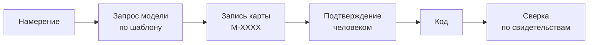

# Карты проекта

Три карты отвечают на вопросы, которых нет в записях процесса: из чего состоит
кодовая база, откуда и куда текут данные, какими путями ходит человек по
экранам. Вместе они дают разрез — от клика до модуля.

Решение и его границы: [adr/0007-maps-lead-code.md](adr/0007-maps-lead-code.md).

## Порядок


```mermaid
flowchart LR
    intent["Намерение"] --> ask["Запрос модели<br/>по шаблону"]
    ask --> record["Запись карты<br/>M-XXXX"]
    record --> approve["Подтверждение<br/>человеком"]
    approve --> code["Код"]
    code --> verify["Сверка<br/>по свидетельствам"]
```

Запрос собирает приложение и отдаёт его модели через Claude Code на этой же
машине ([adr/0008-llm-through-claude-code.md](adr/0008-llm-through-claude-code.md)).
Ответ ложится **черновиком** записи и ждёт человека: карта, которую никто не
читал, ничего не подтверждает.

## Опись файлов

Карта строится не «за один взгляд на проект», а по описи — списку файлов кода
из `sources.code`, у каждого из которых приложение считает отпечаток
содержимого.

Обход уважает `.gitignore` — свой в каждой папке, как и настоящий git: файл
или каталог, который проект сам назвал не своим кодом (`__pycache__/`,
`*.pyc`, `node_modules/`), в опись не попадает вовсе, а не спрашивается у
модели каждый заход только затем, чтобы каждый раз услышать «пропускаю».
`.git/` не видна всегда, даже если о ней никто не написал ни строки. Разбор
`.gitignore` — не полный движок: только имя файла/папки и маска с `*`
(`server/lib/ignore.ts`); правило с путём внутри (`src/generated/`) или
отрицанием (`!keep.txt`) молча пропускается — смолчать безопаснее, чем
исключить не то.

Опись отвечает на три вопроса, и все три раньше висели в воздухе:

| Вопрос | Ответ описи |
|---|---|
| Есть ли что описывать | Файлов нет — проект пуст, и приложение говорит это, не тратя ни одного запроса |
| Что ещё не описано | Файл, которого нет ни в одной подтверждённой карте |
| Что описано неправдой | Файл, чей отпечаток изменился после того, как карта была подтверждена |

**Запрос называет файлы поимённо** — только новые и изменившиеся, а не «разбери
проект». Уже описанное не переописывается: это и есть экономия, ради которой
опись заведена. Удалённые файлы называются отдельно: их надо объявить убранными,
иначе карта останется помнить то, чего нет.

Файлов к описанию больше **порции** — берётся первая порция. Размер порции
задаёт проект: `policy.map_portion_files` в манифесте, по умолчанию 40. Больше —
меньше заходов, но выше риск, что ответ не поместится и модель начнёт частить;
у каждого проекта это по-своему, поэтому число не зашито в код.
Остальное описывается следующим заходом, и на экране видно, сколько осталось:
большой проект описывается за несколько подходов, а не одним ответом, который
всё равно не поместится.

**Отпечатки записываются при подтверждении карты, а не при получении ответа.**
Неподтверждённый черновик не должен «съедать» файлы из очереди: иначе отклонили
черновик — и файлы считаются описанными, хотя их не описал никто.

### Отпечаток считается не всегда

Рядом с отпечатком опись держит размер файла и время изменения. Совпали оба —
содержимое не читается вовсе, берётся прошлый отпечаток: перечитывать тысячу
файлов ради ответа «ничего не изменилось» — та самая лишняя работа, которой
опись и должна избегать.

Размер и время — **ориентир, а не доказательство**: их можно подделать, и при
переносе проекта они меняются сами. Решает всё равно отпечаток — просто
считается он только там, где ориентир разошёлся.

Проход сохраняет посчитанное сразу, а не в конце: прервали на середине —
уцелеет то, что успели, и следующий проход продолжит, а не начнёт заново.

## Ответ не прошёл схему

Схема закрыта, и это правильно: карта, собранная из полей «на вкус модели»,
перестаёт быть общим языком. Но выбрасывать разбор сорока файлов из-за одного
лишнего ключа — расточительство, а не строгость.

Поэтому у неудачи есть второй ход: **«Попросить поправить»**. Приложение
отправляет модели её же ответ и претензии схемы дословно — и просит вернуть
исправленные блоки. Файлы заново не разбираются: работа уже сделана, чинится
только форма.

Правка формы — не смягчение проверки. Ответ проверяется той же схемой и так же
отвергается, если снова не сошёлся. Приложение по-прежнему не переписывает ответ
само: правит модель, проверяет приложение, подтверждает человек.

Не помогло и со второго раза — значит дело не в опечатке: сузьте порцию или
опишите руками. Ответ никуда не девается, он на экране.

## Опись теряет силу вместе с картой

Опись копится добавлением: подтвердили карту — файлы отметились описанными
навсегда. Если карту потом пометили `superseded`, отметка не снимается сама —
опись продолжает считать эти файлы описанными, хотя их описание больше не
входит ни в какую картину.

Так файл может застрять: он не в картине (карта, которая его описывала,
заменена), но и не в очереди (опись всё ещё помнит его описанным). Без починки
такой файл не попадёт модели на глаза никогда снова.

Кнопка **«Пересчитать опись»** возвращает файлам честное состояние: описанным
считается только то, что покрыто **действующими** подтверждёнными картами.
Всё остальное возвращается в очередь — как будто описания и не было.

Это не удаление данных: сами карты остаются в `docs/development` без
изменений, пересчитывается только опись — расходный кэш в `.docdd`. Файл,
который какая-то другая подтверждённая карта по-прежнему покрывает,
описанным и останется.

## Не всё попадает в карту

Картинка, файл ресурсов, тема, заготовка теста — не модули. Модель их в карту
не кладёт, и правильно делает: `colors.xml` ничего не описывает, а PNG тем
более.

Но опись раньше знала только два состояния — «описан» и «ждёт очереди», — и
такой файл возвращался в очередь бесконечно: приложение называло его, модель
молча пропускала, в карте его не было, опись ставила его обратно. Круг замыкался
и не размыкался ничем.

Поэтому у ответа есть четвёртый блок:

````
```docdd-skipped
{ "files": [ { "path": "app/src/main/res/values/colors.xml", "why": "ресурс, не модуль" } ] }
```
````

**Причина обязательна.** Файл уходит из очереди не потому, что его пропустили, а
потому, что по нему принято решение — и решение это записано словами, которые
человек читает вместе с картой.

Отметка ставится **при подтверждении карты**, как и у описанного: пока карту не
приняли, ничьё мнение о файлах ничего не меняет.

Файл потом изменился — возвращается в очередь, как и описанный: содержимое
другое, и прежнее решение могло устареть.

На экране это третья цифра: **описано / не в карте / ждут очереди**. За каждой —
список, а у «не в карте» ещё и причина.

### Что лежит в описи

```json
{
  "version": 1,
  "files":     { "app/src/a.kt": { "size": 1234, "mtime": 1756718400000, "hash": "9f2c…" } },
  "described": { "app/src/a.kt": "9f2c…" }
}
```

Два раздела с разным смыслом. `files` — кэш отпечатков: ускоряет проход и
больше ни на что не влияет. `described` — что было описано и с каким отпечатком
**на момент подтверждения карты**.

Опись лежит в `.docdd` и потому расходная: удалили — следующий заход перечитает
всё заново. Потеряется только экономия, не правда: правда живёт в подтверждённых
записях.

Прерывания ведут себя по-разному, и путать их нельзя:

| Что прервали | Что уцелело |
|---|---|
| Проход и подсчёт отпечатков | Всё, что успели посчитать: следующий проход продолжит |
| Запрос к модели, отмена, отклонённый черновик | В `described` не попадает ничего — файлы остаются в очереди |
| Приняли карту | Отмечены её файлы, и только они |

## Запись карты

Одно изменение — одна запись типа `map` в папке `maps/`. В ней сразу все три
структуры: читается целиком, подтверждается одним действием, в git даёт один
дифф.

```markdown
---
id: M-0007
type: map
title: Вынести веса модели клёва в документ знаний
status: review
created: 2026-08-31
updated: 2026-08-31
---

# Вынести веса модели клёва в документ знаний

Что меняется в устройстве и почему именно так.

## Кодовая база

```docdd-codemap
{ "added": { "modules": [...], "imports": [...] }, "removed": { "imports": [...] } }
```

## Потоки данных

```docdd-dataflow
{ "added": { "sources": [...], "flows": [...] } }
```

## Пользовательские пути

```docdd-userflow
{ "added": { "screens": [...], "transitions": [...], "calls": [...] } }
```
```

Блок, которого нет, означает «эта структура не меняется». Пустой блок и
отсутствующий — одно и то же; писать `{}` ради полноты не нужно.

Задача объявляет карту связью `affects`. Обратную строит приложение, поэтому на
экране задачи карта видна рядом, а на экране карты — задачи, которые её меняют.

## Свидетельство

Каждое ребро несёт путь, строку и фрагмент текста, из которого сделан вывод:

```json
{ "path": "server/lib/cache.ts", "line": 34, "fragment": "writeFileSync(path" }
```

Утверждение без свидетельства картой не считается — это мнение. Строка
однобайтовая условность, поэтому сверка ищет фрагмент **в указанной строке или в
трёх соседних**: сдвиг на пару строк не должен ронять карту, а переезд в другой
файл — должен.

## Сверка

| Когда | Что проверяется |
|---|---|
| Карта `approved`, задача не закрыта | Ничего. Карта описывает намерение, кода ещё нет — это план, а не расхождение |
| Задача `done` | Объявленное добавленным — есть в коде. Объявленное убранным — отсутствует |
| Карту не меняет ни одна задача | Сверяется сразу — то же самое, что и после `done` |

Второе важнее первого: удалить строку и забыть про карту легче, чем добавить.

### Карта нового проекта: намерение без единой задачи

Третья строка таблицы — не про «код уже есть», а про честный пробел: если
задач с `affects` на карту ещё нет вовсе, сверять как будто нечему мешать —
опасное упрощение. Ровно так ловится карта, заведённая заранее для проекта,
которого ещё нет в коде: подтвердили карту раньше первой задачи — и тут же
получили ошибки `map_evidence_missing` по каждому объявленному модулю,
хотя ничего не сломано, просто до кода очередь не дошла.

Для этого случая у записи `map` есть необязательное поле `intent: true`.
Пока оно стоит, сверка не запускается вовсе, независимо от задач — карта
остаётся планом. Убрать поле (или поставить `false`) — значит заявить «код
уже есть, сверяйте»: обычная правка front matter, тем же способом, что и
любая другая. Отдельной кнопки для этого пока нет — правка через внешний
редактор ([04-ui.md](04-ui.md)).

Карта, заведённая через «Обновить карты» по уже существующему коду, поле не
ставит вовсе — она и так описывает то, что уже есть, сверка ей нужна сразу.

### На экране: полупрозрачность вместо тишины

Первые две строки таблицы «Сверка» раньше были видны только по счётчику
`unverified` и списку нарушений — само узлы и рёбра карты на экране
(`app/pages/projects/[id]/maps.vue`) выглядели неотличимо от давно
устоявшихся. Теперь узел или ребро, объявленное картой, которая ещё не
устоялась (стоит `intent: true`, либо задача с `affects` на неё не закрыта),
рисуется с прозрачностью 0.5 — и в 2D, и в 3D режиме диаграммы. Карточка при
клике называет причину словами: «не совпадает с кодовой базой — карта ещё не
устоялась» у узла, «сверка не запущена: карта ещё не устоялась» у ребра
(`MapInspector.vue`). Это то же самое понятие `pending`, что уже несёт
`settled()` в `checkMaps` (server/lib/rules.ts) и в экране одной записи
(server/api/projects/[id]/records/[recordId].get.ts) — здесь оно применено к
сложенной картине всего проекта (`server/lib/maps.ts`, `annotatePending`), а
не к одной карте.

Кнопка **«Завести задачу-реализацию»** рядом с сохранённым черновиком карты
(экран «Карты») заводит задачу того же вида, что уже требует правило
`task_maps_unapproved`: `change: feature`, связь `affects` на новую карту,
статус `draft`. Она не подтверждает ни карту, ни задачу сама — обе ждут
человека порознь, — а только избавляет от похода на экран задач за той же
самой связью, которую иначе пришлось бы набирать руками.

## Структуры

### Кодовая база

| Что | Поля |
|---|---|
| `modules` | `id` — уникальный идентификатор (путь или логическое имя), `title`, `layer` — слой на усмотрение проекта, `path` — файл, где модуль определён, `summary` — что делает, `api` — публичный интерфейс |
| `imports` | `from`, `to`, `evidence` |
| `groups` | `id`, `title`, `summary`, `parent`, `paths`, `modules`, `capability`, `links` — подсистемы над модулями, без `evidence` ([«Группы»](#группы-уровень-над-модулями)) |

Отвечает на: из чего состоит проект, что на что опирается, где циклы и куски, на
которые никто не ссылается.

`id` — не обязательно путь: dotted-имя пакета (`gastrograf.catalog.usda`) читается
не хуже, если проект так называет свои модули. А вот `path`, когда он есть, —
всегда буквальный путь от корня проекта, без исключений: по нему экран открывает
файл (04-ui.md, «Карты»), и придуманный путь откроет не то или ничего.
Агрегату из нескольких файлов, внешнему пакету или модулю, у которого один явный
файл и так следует из `id`, поле не нужно вовсе.

**`layer` не обязателен, и без него слой не пропадает.** Модуль, которого
карта не описала (он назван только в импорте) или описала без `layer`, получает
слой **по папке файла**: `modules`, `widgets`, `entities`, `shared`, `pages` —
так же прямо, как проект сам называет слои описанных модулей. Файлы `index.ts`
и `__init__.py` — это сама их папка, поэтому берётся папка над ней
(`modules/access/__init__.py` → `modules`, `widgets/concept-card/index.ts` →
`widgets`); у dotted-имени пакета — предпоследний сегмент (`gastrograf.catalog.usda`
→ `catalog`). Слой, объявленный в карте, всегда сильнее. Название «без слоя»
остаётся только там, где папки нет вовсе: файл в корне проекта или голое имя
без разделителей. Слой по папке — подсказка экрана, считается заново
(`server/lib/layers.ts`) и в карту не записывается.

`summary` и `api` — необязательные, но именно они делают узел на диаграмме
полезным без похода в файл: `summary` в двух-трёх предложениях говорит, зачем
модуль в проекте, а `api` — список того, что из него импортируют: `name`, `kind`
(`class`, `function`, `type`, `const`, `component`), `summary` в одну фразу и
`signature` — входы и выход одной строкой. Это не сверяется с кодом построчно,
как `evidence` у связи, — это то же обещание, что и `title`: человек прочитал
файл и записал, за что тот отвечает. Карточка узла (04-ui.md, «Карты»)
показывает `summary` и `api` рядом с файлом.

#### Крупная кодовая база

Сотни модулей и тысячи связей mermaid и рисует, и раскладывает — но не
бесплатно: полная перерисовка на плотном графе ощутимо подвешивает вкладку,
а результат — стена пересекающихся линий, в которой не разглядеть ни одной
подписи. Свидетельство и слой у модуля от этого не перестают быть нужны —
меняется только то, что показано на экране по умолчанию: свыше 150 модулей
диаграмма стартует с одним, самым маленьким слоем, а не со всеми разом
(04-ui.md, «Карты»). Это чисто экранное решение, не про формат: сама карта
по-прежнему описывает все модули и связи целиком, чипы слоёв лишь решают,
что из уже подтверждённого показать на диаграмме сейчас. Порог в 150 модулей
считается внутри группы, а не по всему проекту (следующий раздел).

#### Группы: уровень над модулями

Слой режет проект горизонтально: «ядро», «интерфейс», «маршруты» — и в каждом
лежат модули всех подсистем. На четырёхстах модулях диаграмма остаётся стеной
линий, потому что показывает один, самый нижний уровень — модуль и его импорт.
Нужен уровень выше, где узел означает подсистему целиком: «Граф знаний»,
«Аккаунт», «AI-gateway». Это **группа**. Она говорит на языке функциональной
карты, а не файловой системы, и слой не отменяет: слой остаётся осью внутри
группы.

Группа — сущность со своим описанием, а не ярлык на модуле:

| Поле | Что значит |
|---|---|
| `id` | Уникальный идентификатор. У автогруппы — сам префикс пути |
| `title` | Как подсистему называют люди |
| `summary` | Зачем подсистема проекту — два-три предложения |
| `parent` | `id` группы-родителя. Формат допускает вложенность, как у возможностей |
| `paths` | Префиксы путей: в группу входят модули, чей путь с одного из них начинается |
| `modules` | `id` модулей поимённо — исключения и то, что префиксом не поймать |
| `capability` | `id` возможности функциональной карты, которую группа реализует |
| `links` | Подписи к связям с другими группами: `to` — `id` группы, `summary` — «читает граф знаний». Необязательны |

У группы нет `evidence`. «Эти файлы — одна подсистема» — суждение, как `layer`
и `summary`: сверять его со строкой кода нечем, поэтому его подтверждает
человек, как обычную запись.

**Откуда берётся состав.** Модуль попадает в группу тремя путями, они работают
вместе и перечислены по убыванию силы:

1. **Поимённо** — его `id` назван в `modules` группы.
2. **По префиксу** — совпал самый длинный из `paths` среди всех групп. Новый
   файл в каталоге попадает в группу сам: переобъявлять сотни модулей не надо.
3. **Автоматически** — по пути, правилом ниже. Модуль, которого не поймали
   первые два способа, без группы не остаётся.

Назван поимённо в двух группах — побеждает объявленная последней, так же как
побеждает последнее повторное объявление любого элемента карты.

**Автогруппа.** Путь модуля — его `path`; нет `path`, а `id` похож на путь
(есть `/`) — `id`; иначе — `id` как есть, у dotted-имени пакета. Последний
сегмент (имя файла или модуля) отбрасывается, из остатка берутся первые два:

| Модуль | Группа |
|---|---|
| `server/lib/maps.ts` | `server/lib` |
| `app/pages/projects/[id]/tasks.vue` | `app/pages` |
| `gastrograf.catalog.usda` | `gastrograf.catalog` |
| `nuxt.config.ts` | `Прочее` |

Если после отбрасывания ничего не осталось — группа `Прочее`. Автогруппы не
хранятся: их считает та же чистая функция `server/lib/groups.ts`, что и всё
остальное про группы, и на экране они помечены «авто». Поэтому обзор работает
сразу на любом проекте и без правки уже подтверждённых карт — формат на первом
шаге не меняется.

**Объявленные группы** лежат в `groups` блока `docdd-codemap`, тем же
способом, что остальные элементы: `added.groups` объявляет, `removed.groups`
убирает по `id`, повторное объявление уточняет (побеждает последнее).
Объявленные и автоматические группы существуют вместе: что объявленные не
взяли, остаётся в автогруппах. Группа без единого модуля не показывается.

**Вложенность.** Модуль входит в самую узкую группу, а через `parent` — и во
всех её предков. Родитель, которого в карте нет, или круг из `parent` читаются
как «верхний уровень», как неизвестный `parent` у возможности. На экране пока
один уровень: узел обзора — группа верхнего уровня, вложенная считается внутри
неё. Формат закладывает вложенность заранее, чтобы не переделывать карты,
когда экран ею воспользуется.

**Связи между группами не придумываются, а считаются.** Все импорты между
модулями двух групп сворачиваются в одну стрелку с числом — «12 импортов».
Импорт внутри группы стрелкой не становится. Раскрытие стрелки показывает
исходные импорты с их свидетельствами, поэтому сверка не теряется. Вердикт
стрелки — худший из свёрнутых: `ok` только когда все `ok`; не сошёлся хоть один
(`stale`, `missing`) — стрелка тоже; иначе, если есть `pending`, — `pending`.
Понятная функциональная подпись («читает граф знаний») — это необязательное
`summary` в `links` группы-источника; без него у стрелки остаётся число.

Циклы между группами (A → B → … → A) подсвечиваются на обзоре: внутри модулей
цикл часто случаен, а между подсистемами это архитектурная проблема, которую
на плоской диаграмме не разглядеть.

**Порты и публичная поверхность.** Модуль, у которого есть импорт через границу
своей группы (в любую сторону), — **порт** группы. **Публичная поверхность**
группы — те порты, которые импортируют снаружи: «что подсистема отдаёт
остальным». Обе величины считаются из импортов и нигде не хранятся.

**Потоки данных используют те же группы.** Кодовые группы берутся из кодовой
карты: `from` потока, совпавший с `id` или `path` модуля, относится к его
группе, остальные — к `Прочее`. Источники сворачиваются по `kind` (база данных,
очередь, HTTP, …) либо по необязательному `group` у источника — своему названию
свёртки вместо `kind`. Обзор получается «группы ↔ хранилища и внешние
системы»: кто читает и пишет где. Внутри группы остаётся нынешняя детализация.

**Чего в группах нет.** Правила границы — «между группами ходят только через
публичные модули» (слой-коннектор) — нет. Это не отображение, а правило: его
нужно проверять и называть нарушением (по образцу `map_evidence_stale`), а
значит, решать, какие модули публичны и кто вправе правило обходить. Это
отдельное решение с правкой [05-validation.md](05-validation.md), и до него
обзор лишь показывает порты и циклы, ничего не запрещая.

### Потоки данных

| Что | Поля |
|---|---|
| `sources` | `id`, `kind`: `file`, `http`, `db`, `queue`, `env`, `memory`; `where` — путь или адрес; `group` — необязательно, своё название свёртки на обзоре вместо `kind` ([«Группы»](#группы-уровень-над-модулями)) |
| `flows` | `from`, `to`, `direction`: `read`, `write`, `both`; `evidence` |

Отвечает на: откуда данные приходят, где лежат, куда уходят и кто их трогает.

### Пользовательские пути

| Что | Поля |
|---|---|
| `screens` | `id` — маршрут, `title`, `file` |
| `transitions` | `from`, `to`, `trigger`, `evidence` |
| `calls` | `from` — экран, `to` — маршрут API, `evidence` |

Отвечает на: какие экраны есть, как между ними ходят, что каждый дёргает.
`calls` и сшивает пользовательские пути с потоками данных.

### Функциональная карта

| Что | Поля |
|---|---|
| `capabilities` | `id` — свободный идентификатор, `title`, `parent` — id родительской возможности, `summary` — что возможность значит на языке предметной области, в двух-трёх предложениях, `status` — состояние реализации, `note` — что сделано и чего не хватает ([«Состояние реализации»](#состояние-реализации)) |
| `relations` | `from`, `to`, `kind`: `depends`, `uses`, `feeds`; `summary` — необязательная подпись ([«Связи между возможностями»](#связи-между-возможностями)) |

Отвечает на: что система умеет на языке предметной области — не код, не поток
данных. `parent` строит дерево, а не список: возможность может дробиться на
под-возможности сколько угодно уровней вглубь.

`summary` — необязательное описание для читателя не из IT: зачем возможность
в системе и что она даёт пользователю, без слов про файлы и модули. Карточка
возможности показывает его так же, как у модуля кодовой карты. Повторное
объявление возможности в новой карте — уточнение, побеждает последнее
(`foldMaps`), поэтому описания дописывают следующей картой с теми же `id`,
а не правкой подтверждённой.

В отличие от первых трёх структур, здесь нет поля `evidence` — ни у одного
элемента. Сверять утверждение «система умеет X» со строкой кода нечем и не
нужно: эта карта подтверждается человеком, как обычная запись, и вес
подтверждения тот же — не меньше, чем у карты, прошедшей построчную сверку
([Сверка](#сверка) выше).

Схемы: [schemas/codemap.schema.json](schemas/codemap.schema.json),
[schemas/dataflow.schema.json](schemas/dataflow.schema.json),
[schemas/userflow.schema.json](schemas/userflow.schema.json),
[schemas/functional.schema.json](schemas/functional.schema.json).

Из четырёх видов только у функциональной карты нет свидетельства — и поэтому
только её можно предложить из разбора входящего: заметка предметной области
код не читает и путь со строкой назвать не может, а здесь этого и не
требуется ([10-inbox.md](10-inbox.md), docs/06-phases.md, фаза 12).

#### Состояние реализации

Карта описывает, что система **должна** уметь, и по ней нельзя было сказать,
что из этого уже есть. У возможности появились два необязательных поля:

| Поле | Значения |
|---|---|
| `status` | `implemented` — «Реализовано»; `partial` — «Частично»; `not_implemented` — «Не реализовано» |
| `note` | Что сделано и чего не хватает — одна-две фразы |

**«Не оценено» — это отсутствие `status`**, а не четвёртое значение, и от
«Не реализовано» оно отличается по смыслу: первое говорит «никто не смотрел»,
второе — «смотрели, кода нет». Склеить их значило бы выдавать незнание за
факт.

**Состояние живёт только у нижних возможностей.** У родителя собственного
состояния нет — оно считается по нижним возможностям ниже него, и на экране
выглядит счётом: «5 из 8 реализовано, 2 не оценено». Иначе у одного и того же
были бы две правды, и они разошлись бы при первой же правке. Если `status`
всё-таки записан у возможности, у которой есть дети, он не считается и не
ошибка: возможность могла быть нижней, когда её отметили, и стала родителем,
когда к ней добавили подпункт — добавление подпункта не должно ломать карту.
Цвет родителя берётся из счёта: все нижние реализованы — «Реализовано»; все
оценены как нереализованные — «Не реализовано»; ни одна не оценена — «Не
оценено»; всё прочее — «Частично». Счёт стоит рядом, поэтому неоценённое не
прячется за цветом.

**Отметка — обычное изменение карты.** Состояние ставит повторное объявление
возможности в новой карте: побеждает последнее, как у любого элемента. Но
повторное объявление **заменяет элемент целиком** (`foldMaps`), поэтому отметка
несёт все поля возможности — `title`, `parent`, `summary` и прежнюю `note`,
если её не меняют, — иначе она молча стёрла бы описание. Снять отметку —
объявить возможность без `status`. Отметки ставятся пачкой и заводят один
черновик (экран: [04-ui.md](04-ui.md), «Функциональная карта»); подтверждает
человек.

#### Связи между возможностями

`relations` — рёбра между возможностями, у которых есть смысл, а не только
вложенность `parent`. У ребра три вида:

| `kind` | Читается | Рисуется |
|---|---|---|
| `depends` | `from` зависит от `to`: без `to` не работает | сплошная стрелка |
| `uses` | `from` пользуется `to`: работает и без него, но хуже | пунктирная |
| `feeds` | `from` передаёт данные в `to` | толстая |

`summary` у связи необязателен: «оплата берёт цену из каталога». Ключ ребра —
тройка `from`, `kind`, `to`: между одними и теми же двумя возможностями
бывает и «пользуется», и «передаёт данные». Как и всё в этом виде, связь без
`evidence`: «возможность A зависит от B» — суждение предметной области, а не
строка кода. Связь с неизвестным `id` на экране не рисуется и называет это
в карточке.

Из связей и состояния считаются две подсказки, нигде не хранящиеся:

- **«Ждёт».** `from` зависит от `to` (`depends`), а `to` реализован не
  полностью (`partial` или `not_implemented`). Неоценённое `to` подсказки не
  даёт: что мы не знаем, мы не утверждаем.
- **Круг.** Возможности, зависящие друг от друга по кругу (A зависит от B, B —
  от A, и длиннее), подсвечиваются: такая зависимость не может быть реализована
  ни в каком порядке.

#### Экран: дерево, а не mindmap — и правится прямо на нём

Первые три вида читает архитектор; эту — доменный специалист, часто не из
IT. Круговая раскладка mermaid (`mindmap`), которой рисовалась функциональная
карта вторым режимом, для такого читателя лишняя — и не только потому, что
требует научиться масштабу и вращению: цвета её веток ничего не значили, а
линии наезжали на названия. Поэтому по умолчанию функциональная карта
рисуется не диаграммой, а сворачиваемым деревом
(`app/components/FunctionalTree.vue`): подпункты прячутся под родителем, глубже
двух уровней — по умолчанию свёрнуто, названия — обычным текстом. Переключатель
над деревом («Дерево» / «Граф») отдаёт **граф состояния** на месте прежнего
`mindmap`: узлы окрашены по состоянию реализации, родители нарисованы рамкой
вокруг своих подпунктов со счётом, между возможностями идут стрелки трёх видов
(выше), в углу — легенда, а карточка узла называет входящие и исходящие связи.
Данные у обоих режимов одни и те же, каждый только по-своему их показывает, и
правка (ниже) есть только у дерева.

Нет свидетельства — значит нет и причины требовать поход к модели, чтобы
добавить одну возможность: на дереве прямо стоят кнопки «добавить»,
«переименовать» и «убрать». Каждое нажатие заводит **новый черновик карты**
(`POST /api/projects/:id/map/capability`, `mapDraftText` тем же способом,
что и черновик от модели) — не правит тело уже подтверждённой карты в обход
человека (`docs/adr/0011-body-editing.md`): черновик появляется в списке
записей и ждёт обычного подтверждения, как любая другая карта.

#### «Проверить по коду» — мнение, не свидетельство

Кнопка над деревом строит запрос по шаблону
(`docs/prompts/functional-check.md`, тем же способом, что «Обновить карты» и
«Сверка с практиками»): модель сама читает код проекта (доступ только на
чтение) и по каждой **нижней** возможности отвечает блоком:

````
```docdd-functional-check
{ "capabilities": [ { "id": "orders.pay", "status": "partial", "note": "оплата картой есть, возврата нет" } ] }
```
````

Ответ — это не свободный текст, как раньше: пока он был текстом, его нечем
было сравнить с тем, что в карте уже отмечено, и «Проверить по коду» оставалось
мнением, которое читают и забывают. Теперь приложение разбирает блок и
показывает таблицу «сейчас → по мнению модели». Возможность, в которой модель
не уверена, она **пропускает**: «не нашла — возможно, ещё не реализовано, а
возможно, названо в коде иначе» честнее уверенного ответа наугад, а пропуск
оставляет прежнюю отметку (или «Не оценено») как есть. Возможность с
подпунктами в блоке не оценивается — её состояние и так считается по нижним.
Неизвестный `id`, недопустимое значение `status` и возможность с детьми
называются в таблице как замечания и не применяются.

Ничего не применяется само: кнопка «Занести отметки» кладёт выбранные строки
в несохранённые отметки на экране, а черновик карты появляется только по
«Сохранить отметки» (раздел «Состояние реализации» выше) и ждёт подтверждения
человека. Сам блок нигде не сохраняется: у этого вида карты нет `evidence`, и
ответ модели им не становится — он остаётся мнением, тем же словом, каким
карта уже называет утверждение без свидетельства («Утверждение без
свидетельства картой не считается — это мнение», раздел «Свидетельство»
выше). Разница лишь в том, что теперь мнение можно сверить с прежней
отметкой одним взглядом, а не перечитывать абзацы.

## Виды — реестр, не тройка

Три первых вида и четвёртый добавлены одним и тем же способом: запись в
реестре `MAP_KINDS` (`server/lib/maps.ts`) — имя, схема, список полей блока
и то, у каких из них есть `evidence`. Разбор, сверка и свод — общий код для
всех видов; он не знает имён `codemap`/`dataflow`/`userflow`/`functional`
и не менялся при добавлении функциональной карты. Вид без единого поля с
`evidence` (как функциональная карта) автоматически никогда не участвует в
сверке — не потому, что для него в коде прописан особый случай, а потому,
что сверять буквально нечего: `evidenceClaims` для такого вида всегда пуст.

Новый вид — это новая запись в `MAP_KINDS` и своя схема; переписывать общий
код для этого не нужно.

Так же добавляются и новые поля существующих видов: `groups` у кодовой карты
и `relations` у функциональной — строки в `fields`, а не правка общего кода.
Ключ элемента (`keyOf`) у группы — `id`, у связи возможностей — тройка
`from`, `kind`, `to`. Сами группы как картина — уже не вид, а **производное**
поверх сложенной карты: объявленные группы приходят из `groups`, автоматические
считаются, связи между группами сворачиваются из импортов, и ничего из этого
отдельно не хранится (`server/lib/groups.ts`).

## Общая карта проекта

Утверждается изменение, а не состояние. Текущая картина — **производное**:
приложение складывает подтверждённые карты в порядке подтверждения, применяя
`added` и `removed`. Её можно удалить и пересобрать; своей копии правды не
заводится.

Отсюда требование к каждой карте: называть не только добавленное, но и
**убранное**. Иначе картина будет только расти, и модуль, удалённый полгода
назад, останется на ней навсегда.

Карты в статусах `draft`, `review` и `dropped` в общую картину не входят: пока
человек не подтвердил, это черновик, а не устройство проекта.

## Запуск работы

| `change` у задачи | Что требуется |
|---|---|
| `feature` | Подтверждённая карта. Нет — задача не уходит в `ready` |
| `fix` | Починка дефекта: карта не требуется |
| `rename` | Переименование внутреннего: карта не требуется |
| `format` | Форматирование и опечатки: карта не требуется |

Без `change` задача не уходит в `ready` вовсе: непонятно, нужна ли карта, и
правило про `feature` молча не сработало бы. Переход говорит об этом прямо
(`change_missing`), а не пропускает задачу, чтобы тут же назвать её нарушителем.

Исключения — те же, что в правиле «документ ведёт код». Разница в том, что здесь
исключение **записано в самой задаче** и видно в дифф и в журнале. Обход остаётся
возможным и перестаёт быть незаметным: правило, которое нельзя обойти, обходят
мимо инструмента.

### Карта-намерение на пачку задач

Задачи приходят пачками — из входящего, из разбиения, руками по десятку сразу —
и почти все новые функции там `feature`. Каждой заводить свою карту и связывать
её руками — та скука, из-за которой правило начинают обходить, а не выполнять:
сорок девять задач упираются в одну и ту же стену «нет карты».

Поэтому приложение заводит **одну общую карту на пачку**, а не по карте на
задачу, — двумя путями:

- **При заведении из входящего** ([10-inbox.md](10-inbox.md)): есть `feature`-задачи
  без `affects` на карту — рядом с ними заводится одна карта, и задачи получают
  `affects` на неё сразу.
- **Кнопкой в отчёте массового действия** ([04-ui.md](04-ui.md)), для задач,
  заведённых раньше: «Завести карту и привязать N задач».

Карта — **черновик** с `intent: true` и без структур: пока кода нет, описывать
в ней нечего, и сверка её не запускает. Заголовок называет пачку и дату, тело
— что это общая карта намерения и какие задачи к ней привязаны. Подтверждает её
человек, как и любую запись: приложение не подтверждает ничего само, и
подтверждение пустой карты — осознанное «да, эти задачи меняют устройство
проекта, карта будет уточнена по коду». Уточняется она обычным способом —
«Обновить карты» или правкой, когда код появился; снять `intent: true` — значит
заявить «код уже есть, сверяйте».

Привязываются только `feature`-задачи без единой `affects`: у задачи, уже
связанной с картой, связь не трогается, а `fix`/`rename`/`format` карты не
требуют. Правится в задачах одно поле front matter — `links.affects`, —
остальное в файле остаётся как было.

## Чего карты не делают

- Не считают метрик: техдолга, дублирования, уязвимостей. Это работа SonarQube и
  подобных.
- Не разбирают синтаксис. Приложение сверяет строки, а не строит AST — поэтому
  язык проекта значения не имеет.
- Не строятся приложением. Оно не обращается к языковым моделям
  ([adr/0003-no-llm-in-app.md](adr/0003-no-llm-in-app.md)).
