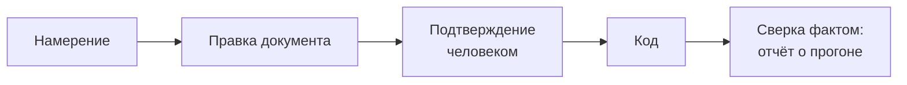

# Как пользоваться

Документ для того, кто открыл приложение впервые и для того, кто заводит в нём
свой проект. Что инструмент делает и чего не делает — в
[00-overview.md](00-overview.md); формат файлов — в
[02-workspace-contract.md](02-workspace-contract.md).

## Круг целиком: от требования до факта

Раздел для того, кто видит приложение впервые. Пример настоящий: те же кнопки,
те же слова на экране, тот же результат в файлах.

Ставим задачу: «прогноз клёва должен считаться без сети».

### Шаг 1. Открыть проект

Экран **Проекты** → поле пути → **Добавить проект**. Путь — к папке, внутри
которой лежит `docs/development/project.yaml`; в Windows это выглядит как
`D:\work\fishForecast`.

Манифеста там нет? Приложение не откажет молча: оно скажет, чего не хватает, и
предложит **Завести формат** — спросит имя и идентификатор проекта, создаст
папки разделов и первую запись-заготовку.

### Шаг 2. Завести требование

Работа начинается не с задачи. Задача без требования никуда не двинется — это
правило, а не придирка: `implements` обязателен, начиная со статуса `ready`.

Экран **Требования** → **Новая запись** → заголовок «Прогноз считается без
сети» → **Создать**.

В проекте появился файл:

```
docs/development/requirements/R-0001-prognoz-schitaetsya-bez-seti.md
```

Внутри — front matter со статусом `draft` и раздел «Журнал» с первой строкой.
Номер выдал сервер: выбрать его нельзя, номера не переиспользуются.

### Шаг 3. Подтвердить требование

Открываем запись (по ссылке из списка). Наверху — карточка **Действия**, в ней
список ролей: выбранная роль станет подписью в журнале.

Нажимаем **Отдать на подтверждение** — статус становится `review`.
Читаем ещё раз, правим текст в своём редакторе, если надо, и нажимаем
**Подтвердить** — статус `approved`.

Что изменилось в файле после каждого нажатия — **три строки**:

```diff
-status: draft
+status: review
-updated: 2026-08-20
+updated: 2026-08-31
+- 2026-08-31 · на подтверждение · architect
```

Тело документа приложение не трогает вовсе: перед каждой записью сторож
сверяет его байт в байт ([02-workspace-contract.md](02-workspace-contract.md)).

### Шаг 4. Сказать, чем это будет проверено

Пока у требования нет проверки, приложение показывает предупреждение
`requirement_unverified`: требование объявлено, но подтвердить его нечем.

Заводим запись типа `verification` — способ убедиться: прогон, ручная проверка,
метрика. Дальше связываем: на экране требования это связь `verified_by`.

Предупреждение не блокирует работу. Оно просто не даёт спутать объявленное с
подтверждённым.

### Шаг 5. Завести задачу

Экран **Задачи** → **Новая запись**:

| Поле | Что выбрать в примере |
|---|---|
| Заголовок | «Считать прогноз из локального кэша» |
| Исполнитель | необязательно |
| Что за изменение | «Новое поведение — потребует карты» |
| Какое требование выполняет | R-0001 |

**Создать**. Задача появилась в статусе `backlog` — в очереди.

### Шаг 6. Попробовать взять её в работу и получить отказ

Открываем задачу. В карточке **Действия** кнопка **Пометить готовой к работе**
неактивна, и **рядом написано, почему**:

> Задача T-0001 объявлена как `feature`, но не меняет ни одной карты. Либо
> свяжите её с картой изменения, либо назовите изменение честнее: `fix`,
> `rename` или `format`.

Это и есть работа инструмента. Кнопкой отказ не обходится — но обход не
запрещён: если это на самом деле починка дефекта, поменяйте «что за изменение»
на «Починка дефекта», и требование карты снимется. Разница в том, что ваш выбор
записан во front matter и виден в дифф.

### Шаг 7. Описать, что меняется в устройстве

Для нового поведения нужна карта. Приложение к языковым моделям не обращается —
карту запрашиваете вы у своей модели по шаблонам из [prompts/](prompts/), а
приложение потом сверяет её с кодом.

Кладёте ответ записью типа `map` в `docs/development/maps/`, открываете её и
нажимаете **Отдать на подтверждение**, затем **Подтвердить**. На экране записи
видно каждое утверждение карты и результат сверки: «сошлось», «файла нет»,
«строки нет».

Связываем задачу с картой связью `affects` — и кнопка **Пометить готовой к
работе** становится активной.

### Шаг 8. Провести задачу до конца

| Кнопка | Статус | Когда нажимать |
|---|---|---|
| **Пометить готовой к работе** | `ready` | Всё подтверждено, можно брать |
| **Запустить в разработку** | `in_progress` | Сели писать код |
| **Отправить на проверку** | `in_review` | Код написан |
| **Закрыть** | `done` | Проверка прошла |

На экране **Обзор** задача переезжает из «Можно брать» в «В работе» — с числом
дней. Если она провисит дольше порога из манифеста, появится предупреждение
`task_stale`: не запрет, а напоминание, что работа стоит.

**Закрыть** не сработает, пока проверка не прошла: `task_done_unverified`.
Закрытая задача без пройденной проверки — обещание, а не факт.

### Шаг 9. Подтвердить фактом

Сборка проекта кладёт отчёт:

```
docs/development/tests/reports/2026-08-31-npm.json
```

С этого момента на экране **Требования** строка R-0001 говорит «подтверждено
прогоном», а не «только объявлено». Разница между этими двумя словами — то,
ради чего всё остальное и написано.

### Что осталось в git

Девять шагов дали несколько файлов и короткие диффы: три строки на смену
статуса, ни одной правки чужого текста. История процесса читается в `git log`
так же, как история кода — потому что это одна история.

## Первый запуск

```bash
npm install
npm run dev
```

Приложение открывается на `http://127.0.0.1:3000` и работает только на вашей
машине: наружу серверная часть не смотрит.

Дальше — «Добавить проект» и путь к папке, **внутри которой** лежит
`docs/development/project.yaml`. Формата там нет? Приложение предложит завести
его на месте: создаст манифест, папки разделов и первую запись-заготовку.
Существующие файлы при этом не трогаются.

## Если документация уже написана

Объявите, где она лежит:

```yaml
sources:
  docs: [app/docs]
```

Экран «Импорт» покажет, что нашлось: путь, размер, заголовок из первого `#`,
предполагаемый тип и **почему он предположен**. Предположение — подсказка, а не
решение: тип правится в каждой строке, лишняя строка выключается галочкой.

Кнопка переносит файлы в папки своих разделов и добавляет front matter. Текст
документов не меняется — ни строки, ни перевода строки. Файл, у которого front
matter уже есть, пропускается с причиной: это запись, а не импорт.

## Ежедневный круг

| Вопрос | Где ответ |
|---|---|
| Что брать сейчас? | Обзор → «Можно брать» |
| Что зависло? | Обзор → «В работе», с числом дней |
| Что мешает? | Нарушения; ошибки сверху |
| Чем подтверждено требование? | Требования → «подтверждено прогоном» против «только объявлено» |
| Как устроен проект? | Карты → кодовая база, потоки данных, пользовательские пути |
| Что на что опирается? | Граф; там же ищутся висящие узлы |

Работа двигается кнопками на экране записи. Недоступная кнопка **всегда
называет причину** — не «нельзя», а «карта M-0007 в статусе `draft`». Кнопкой
ошибку не обойти: правило, которое обходится одним нажатием, перестаёт быть
правилом.

## Семь типов записей

| Тип | Отвечает на вопрос | Признак, что тип выбран верно |
|---|---|---|
| `requirement` | Чего система обязана достичь | Под него можно написать проверку |
| `design` | Как устроено | Живёт долго и правится |
| `decision` | Почему выбрали это и что отвергли | Есть раздел «Отвергнуто» |
| `contract` | Формат обмена | Рядом лежит машиночитаемое: openapi, json-schema |
| `task` | Единица работы | Делается за один заход |
| `verification` | Чем убедиться | Указан `kind`: unit, integration, manual, metric, review |
| `map` | Что меняется в устройстве | Три структуры со свидетельствами ([07-maps.md](07-maps.md)) |

Самая частая ошибка — **требования-задачи**. «Добавить экспорт в PDF» это
задача. Требование звучит иначе: «отчёт выгружается в формат, который
открывается без нашего приложения». Разница не в словах: под задачу нельзя
написать `verified_by`, и на экране требований это видно сразу.

Решения задним числом не переписываются. Передумали — заводите новое и
связывайте `supersedes`. История решений и есть самое ценное, что остаётся от
проекта через год.

## Минимум связей, который делает базу живой

```yaml
links:
  implements: [R-0004]     # у каждой задачи — иначе работа никому не нужна
  documents: [D-0003]      # если задача правит документ
  verified_by: [V-0004]    # чем подтвердится
  affects: [M-0007]        # если change: feature
```

И у каждого подтверждённого требования — способ проверки. Без него оно
объявлено, но не подтверждено, и приложение скажет об этом предупреждением.

Связи ставятся **в одну сторону**. Обратные строит приложение, и на экране
записи они видны отдельно: в файле их нет, придумывать их руками не надо.

## Что за изменение

У задачи есть поле `change`:

| Значение | Что требуется |
|---|---|
| `feature` | Подтверждённая карта изменения. Нет — задача не уйдёт в `ready` |
| `fix` | Починка дефекта: карта не нужна |
| `rename` | Переименование внутреннего: карта не нужна |
| `format` | Форматирование и опечатки: карта не нужна |

Обход не запрещён — он **записан** во front matter и виден в дифф. Это
осознанно: правило, которое нельзя обойти, обходят мимо инструмента.

## Ритм



1. Пишете требование, отдаёте на подтверждение, подтверждаете.
2. Заводите задачу со связью `implements`. Для `feature` — запрашиваете карту у
   модели по шаблону из [prompts/](prompts/), кладёте записью, подтверждаете.
3. Задача уходит в `ready`, потом в работу. Дифф в git после смены статуса —
   три строки: `status`, `updated` и строка журнала.
4. Сборка кладёт отчёт в `tests/reports/<дата>-<runner>.json`. Требование
   становится подтверждённым **фактом**, а не обещанием.

## Карты

Приложение к языковым моделям не обращается
([adr/0003-no-llm-in-app.md](adr/0003-no-llm-in-app.md)). Карту запрашиваете вы
— сами или своим агентом — по шаблонам из [prompts/](prompts/), кладёте ответ
записью типа `map` и подтверждаете. Дальше приложение сверяет каждое ребро с
настоящей строкой файла: путь, номер, фрагмент. Выдуманное ребро не проходит.

Пример, на который можно смотреть, —
[карта этого репозитория](development/maps/M-0001-ustroystvo-docdd-console.md):
61 модуль, 180 свидетельств.

## Проверка в сборке

```bash
npm run check -- D:\work\fishForecast
```

| Код возврата | Что произошло |
|---|---|
| `0` | Ошибок нет; предупреждения могли быть |
| `1` | Есть хотя бы одна ошибка |
| `2` | Проект не прочитан: нет манифеста, чужое поколение контракта |

`--json` — вывод для конвейера. Проверка ничего не пишет: ни файлов, ни кэша.

## Пять ошибок, которых стоит избегать

1. **Один большой документ.** Правится всеми, подтверждается никем. Дробите до
   того, что можно подтвердить целиком.
2. **Переиспользование номеров.** Удалённая запись оставляет дыру, и это
   правильно: ссылка на неё не должна вдруг указать на другое.
3. **Проверки, которые никто не запускает.** Предупреждение
   `verification_never_run` отделяет заявленное от подтверждённого.
4. **Задачи, закрытые «в целом».** `task_done_unverified` не обходится кнопкой.
5. **Правка `docs/development` в обход приложения.** Не запрещена и иногда
   быстрее. Но если так делают всегда — инструмент не нужен, и это честный
   сигнал, а не повод его чинить.

## Сколько записей нормально

Проект на сотню записей — большой. Если требований больше тридцати, скорее всего
часть из них на самом деле задачи. Если задач больше двухсот и половина в
`backlog` — это не база знаний, а свалка намерений; фазы существуют, чтобы её
резать.

Признак, что база живая: её открывают не ради отчётности, а потому что без неё
непонятно, что брать в работу.
