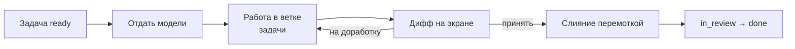

# Выполнение задачи через клиент

Как задача проходит путь от подтверждённого намерения до слитого кода, не
покидая инструмента. Решение и его границы:
[adr/0009-work-through-console.md](adr/0009-work-through-console.md).

Главное правило остаётся прежним и здесь оно сторожится буквально: **код не
начинается раньше подтверждения человеком**.

## Порядок



## Шаг 1. Кнопка доступна не всегда

«Отдать модели» активна только на задаче в `ready`. Это не отдельная проверка, а
та же самая: в `ready` задача попадает, когда есть `implements`, подтверждены
`documents` и `refines`, а для `change: feature` подтверждена карта
([07-maps.md](07-maps.md)).

Задача в `backlog` — кнопка неактивна и называет причину, как все прочие
недоступные действия ([04-ui.md](04-ui.md)).

## Шаг 2. Что уходит в запрос

| Что | Откуда | Зачем |
|---|---|---|
| Текст задачи | Тело записи | Что делаем и чего не делаем |
| Требование | `implements` | Ради чего |
| Документы | `documents`, `refines` | Как должно быть устроено |
| Карта изменения | `affects` | Что меняется в устройстве |
| Сжатая карта проекта | Подтверждённые карты | Где что лежит — без обхода всех файлов |
| Общие практики | `sources.shared` проекта | Не изобретать код-стайл и архитектуру заново на каждой задаче |
| Границы | Этот документ | Чего делать нельзя |

Сжатая карта — это тот же список модулей, что уже подтверждён человеком: около
трёх тысяч знаков вместо трёхсот тысяч исходников. Модель начинает не с нуля и
не с догадок.

Общие практики — текст подключённых `decision`/`design` целиком, а не
пересказ: та же связь, что видна на экране «Практики»
([11-shared-sources.md](11-shared-sources.md)), только доставленная туда, где
пишется код, а не только туда, где на неё смотрит человек. Источников не
подключено — раздела в запросе просто нет, а не пустой заголовок.

## Шаг 3. Работа идёт в ветке задачи

Ветка называется по записи: `docdd/T-0007-vynesti-vesa-modeli`. Рабочее дерево —
`.docdd/worktrees/T-0007`, отдельное от вашего каталога.

Ваш рабочий каталог не трогается. Пока модель работает, вы продолжаете делать
своё; пока вы смотрите дифф — тоже.

В своём дереве модель работает без вопросов о разрешениях — правит файлы,
запускает тесты и сборку. Иначе и нельзя: спросить посреди работы некого, а
задача без права запустить тесты не выполняется. Цена этому — то же, что и
всегда: **дифф читает человек**, и ничего, кроме дерева задачи, работа не
меняет.

Ветка заводится от ветки, на которой стоит проект, и живёт, пока задача не закрыта. Повторный
заход — та же ветка.

Повторный заход **продолжает прошлый разговор**, а не начинается с нуля:
приложение запоминает сессию модели и передаёт её следующему заходу. Сто
шагов разбора кодовой базы не проходятся заново ради одной правки.

Память эта — в `.docdd`, то есть расходная: её удаление ничего не ломает,
следующий заход просто начнётся с чистого листа. Так же поступает приложение,
когда продолжить не вышло: сессии уже нет — заход идёт заново, и об этом
говорится строкой в ленте, а не молча.

Продолжение не отменяет правила: код по-прежнему начинается после
подтверждения, а дифф читает человек. Оно экономит проход по коду, а не
заменяет согласие.

## Шаг 4. Дифф, а не «готово»

Приложение показывает изменения и **не сливает ничего само**. Три ответа
человека:

| Ответ | Что происходит |
|---|---|
| **Принять** | Изменения коммитятся в ветку задачи, ветка сливается в вашу перемоткой |
| **На доработку** | Новый заход в той же ветке; к запросу добавляется, что пошло не так |
| **Отклонить** | Ветка остаётся, изменения не сливаются; разбирать — человеку |

Слияние **только перемоткой**. ваша ветка ушла вперёд — приложение говорит об этом и
не делает ничего: разбирать расхождение вслепую опаснее, чем не разбирать.

## Границы модели

Три правила, которые проверяет приложение, а не обещает.

**Записи процесса не правятся.** В диффе не должно быть изменений внутри
`docs/development`. Есть — слияние отклоняется. Иначе модель подтвердит документ,
по которому работает, и правило станет украшением.

**Только внутри корня проекта.** Та же граница, что у всего остального
([01-architecture.md](01-architecture.md)).

**Ни истории, ни отправки.** Приложение делает три действия с git: заводит ветку,
коммитит принятое, сливает перемоткой. Не переписывает историю, не удаляет ветки,
не отправляет на сервер.

## След в записи

Каждый заход оставляет строку в журнале задачи:

```markdown
- 2026-08-31 · отдана модели · architect
- 2026-08-31 · дифф принят, слито в main · architect
```

По журналу видно, сколько было кругов доработки. Много кругов — не поломка, а
сигнал: задача сформулирована плохо или разбита неудачно.

## Что видно в нарушениях

| Код | Уровень | Когда |
|---|---|---|
| `work_unreviewed` | warning | Задача отдана модели, дифф не разобран |
| `work_branch_orphan` | warning | Задача закрыта или отменена, а ветка задачи осталась |

Оба — предупреждения: они говорят о незавершённом разборе, а не о нарушенном
процессе. Блокировать тут нечего, забыть — легко.

## Сверка кода с практиками

Практики уходят в запрос при каждой задаче — но задачу не заводят специально
ради того, чтобы проверить, не разошёлся ли уже написанный код с тем, что
подключено сейчас: код меняется, практики подключаются заново, а сверять
одно с другим руками — та же работа, которую этот раздел избавляет делать
задним числом на каждой задаче.

Кнопка **«Сверить код с практиками»** на экране «Практики» (04-ui.md)
запускает разовую read-only проверку: модель получает текст подключённых
практик тем же способом, что и при работе над задачей
([verify-plan.md](prompts/verify-plan.md)), и читает код проекта сама —
`Edit`/`Write` ей недоступны, изменить она ничего не может. Источников не
подключено ни у одного (пустые `tags` везде) — кнопка отвечает отказом, не
уходя к модели впустую.

Ответ — предложенная запись `type: verification` с найденными расхождениями
(или с прямым «расхождений не нашла»), заведённая тем же механизмом, что и
разбор «Входящего» (10-inbox.md): черновиком, который подтверждает человек.
Модель эту запись не создаёт сама и ничего в проекте не меняет — решает и
подтверждает по-прежнему человек.

## Чего этот порядок не делает

- Не запускает сборки и тесты. Отчёт о прогоне по-прежнему кладёт сборка
  проекта, а приложение его читает.
- Не отправляет ветки на сервер и не открывает запросов на слияние. Захотите —
  сделаете сами, ветка уже есть.
- Не применяет ответ модели без человека. Ни при каких настройках: это не
  умолчание, а устройство.
