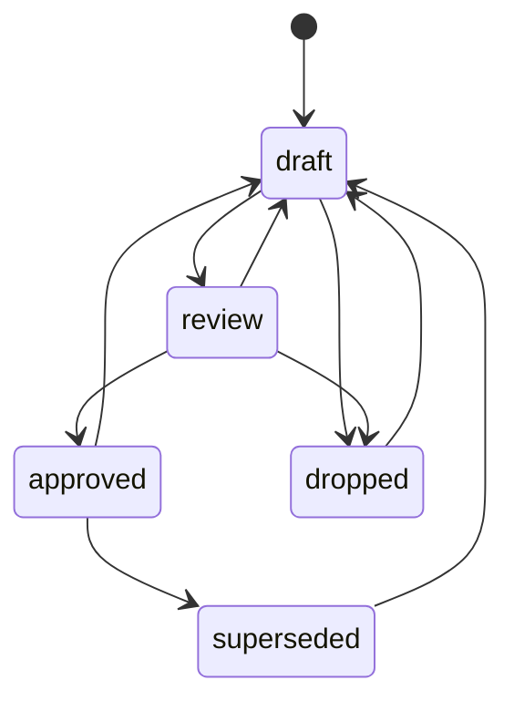
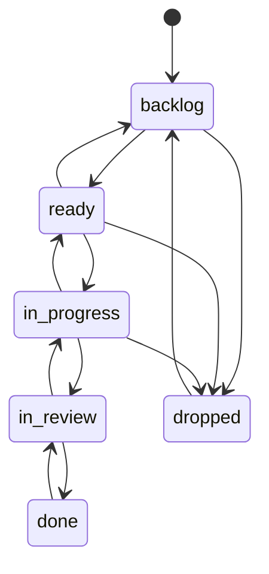

# ADR-0012. Из любого статуса есть путь назад в `draft` или на шаг раньше

- Статус: принято
- Дата: 2026-09-03

## Задача

Схема статусов знала «вперёд» лучше, чем «назад»: `review → draft` и
`in_review → in_progress` были, а `ready → backlog`, `in_progress → ready`
— нет. Хуже того, у пяти статусов не было пути назад вовсе: `approved`,
`superseded`, `dropped`/`rejected`, `done` — экран прямо говорил «из этого
статуса переходов нет». Ошиблись, подтвердили не то, заменили запись
раньше времени, закрыли задачу, которую рано закрывать, — и единственный
путь назад лежал через правку файла руками, мимо приложения и его журнала.

## Решение

Добавляем «шаг назад» на каждом статусе, включая те пять, что были тупиком.

Документы и решения (`requirement`, `design`, `contract`, `decision`, `map`):

(У решений вместо `dropped` — `rejected`, как и раньше.)

Задачи:

Каждый такой переход — обычное действие из «Действия» на экране записи,
не отдельная функция: кнопка, подтверждение, строка в журнале
(«возвращён в черновик», «возвращена в очередь» — те же слова, что уже
были в `JOURNAL_ACTIONS`). Условия для движения вперёд (`taskNoRequirement`,
`taskMapsUnapproved`, `taskDoneUnverified` и подобные) продолжают спрашиваться
там же, где и раньше — назад ничего не разблокирует и не проверяет заново
задним числом, но и вперёд из восстановленного статуса снова спросит то же,
что спросило бы в первый раз.

## Что при этом не меняется

**Подтверждение не становится обратимым молча.** Вернуть `approved` в
`draft` — такое же явное, подтверждённое действие человека, как и любой
другой переход: с журналом, с ролью, без права у модели. `ADR-0011` про
правку тела остаётся в силе без изменений — текст подтверждённой записи
по-прежнему не редактируется, пока она в одном из настоящих статусов; чтобы
его поправить, теперь можно сперва вернуть запись в `draft` явной кнопкой
(это и есть тот самый журнал: видно, что запись переоткрыли, а не что текст
просто тихо стал другим).

**`superseded_without_successor` остаётся в силе.** Правило — про то, что у
заменённой записи должен быть понятный преемник; появление кнопки «назад» не
снимает вопрос «а что читать вместо неё», если запись оставили в `superseded`.
Два пути не спорят друг с другом: один — признать, что замены не будет, и
вернуть статус; другой — дописать `supersedes` у настоящего преемника.

**Модель по-прежнему не предлагает это в плане починки.** `contractDigest()`
(`server/lib/contract-digest.ts`) для `superseded_without_successor`
по-прежнему направляет план к `supersedes` у преемника, а не к развороту
статуса: развернуть подтверждённую запись — решение, которое человек
принимает намеренно и отдельно, не как строку в чужом плане на двадцать
файлов.

## Последствия

- Экран «Действия» больше не говорит «переходов нет» ни для одного статуса,
  кроме `draft` документа/решения без правок и `backlog` задачи — это
  начало пути, и назад из него идти некуда.
- Карта, помеченная `superseded`, получает настоящий путь назад в `draft` —
  честный ответ на «как вернуть содержимое старой карты в силу», без обхода
  правил и без нового кода для карт отдельно (docs/07-maps.md).
- Число валидных переходов у задачи выросло с 8 до 12: тесты на
  `transition_forbidden` расширены, а не переписаны — прежние запреты
  (`backlog → in_progress`, `done → in_progress`) никуда не делись.
